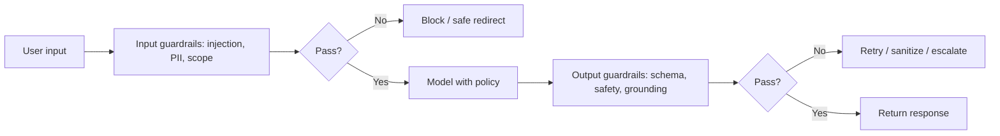

# Guardrails

## Beginner-Friendly Intuition

Guardrails are the safety checks around an LLM that catch bad inputs and bad outputs before they cause harm.
They sit on the way in (block prompt injection, abuse, off-topic requests) and on the way out (block unsafe,
off-policy, or malformed responses). Think of them as the seatbelt and airbags: the model is the engine, but
guardrails keep a failure from becoming a disaster.

## Formal Explanation

Guardrails are validation and policy layers applied to LLM inputs and outputs. Input guardrails: detect and
block prompt injection, jailbreak attempts, PII, and out-of-scope requests. Output guardrails: validate
format (schema conformance), check for unsafe content, verify groundedness and citations, and enforce policy
(no medical or legal advice if disallowed). They can be rules, classifiers, or a separate model. Crucially,
guardrails are deterministic controls layered around a probabilistic model; they do not depend on the model
choosing to behave.

## Why It Matters in Real Jobs

A model alone cannot be trusted to always refuse harmful requests or always produce valid output, because it
is probabilistic. Guardrails provide a reliable layer that does not depend on the model's mood. They are how
you enforce structured output for downstream code, block injection from retrieved content, and keep the
system on policy. In regulated or customer-facing settings, guardrails are often a hard requirement.

## How It Works Step by Step

1. **Validate input:** screen for injection, abuse, PII, and out-of-scope requests.
2. **Constrain the model:** system policy plus structured-output requirements.
3. **Validate output:** schema check, safety check, groundedness and citation check.
4. **Decide on failure:** block, retry, sanitize, or escalate to a human.
5. **Log and monitor:** track block and violation rates to tune the guardrails.

## Real-World Example

A customer assistant must never give financial advice. An input guardrail flags "should I sell my stocks?",
and the system returns a safe templated redirect rather than letting the model answer. An output guardrail
validates that every response is valid JSON with the required fields; malformed outputs are retried, not
shown. When a retrieved document tries to inject instructions, the input guardrail and the generation
contract together neutralize it. The model never had to be trusted to self-police.

## Common Mistakes

- Relying on the model to police itself instead of adding deterministic checks.
- Only output guardrails, leaving the input (injection) surface open.
- No action defined for a guardrail trip (block vs retry vs escalate).
- Guardrails so strict they block legitimate requests, hurting usability.

## Interview Angle

**Question:** What are guardrails and why not just rely on the model's alignment?

**Strong answer:** Guardrails are deterministic input and output checks (injection, PII, schema, safety,
groundedness) layered around the model. Because the model is probabilistic, it cannot be trusted to always
behave; guardrails provide a reliable control with defined actions on failure.

**Weak answer:** "Tell the model not to do bad things in the prompt."

**Follow-up questions:**

- What is the difference between input and output guardrails?
- How do guardrails help against prompt injection?
- What do you do when a guardrail trips?

## Mini Exercise

For an LLM feature, write one input guardrail and one output guardrail, and specify the action taken when
each one trips (block, retry, sanitize, escalate).

## Diagram

---
## Navigation

[⬅ Previous](11-hallucinations.md) | [🏠 Home](../README.md) | [➡ Next](13-fine-tuning-vs-rag.md)
