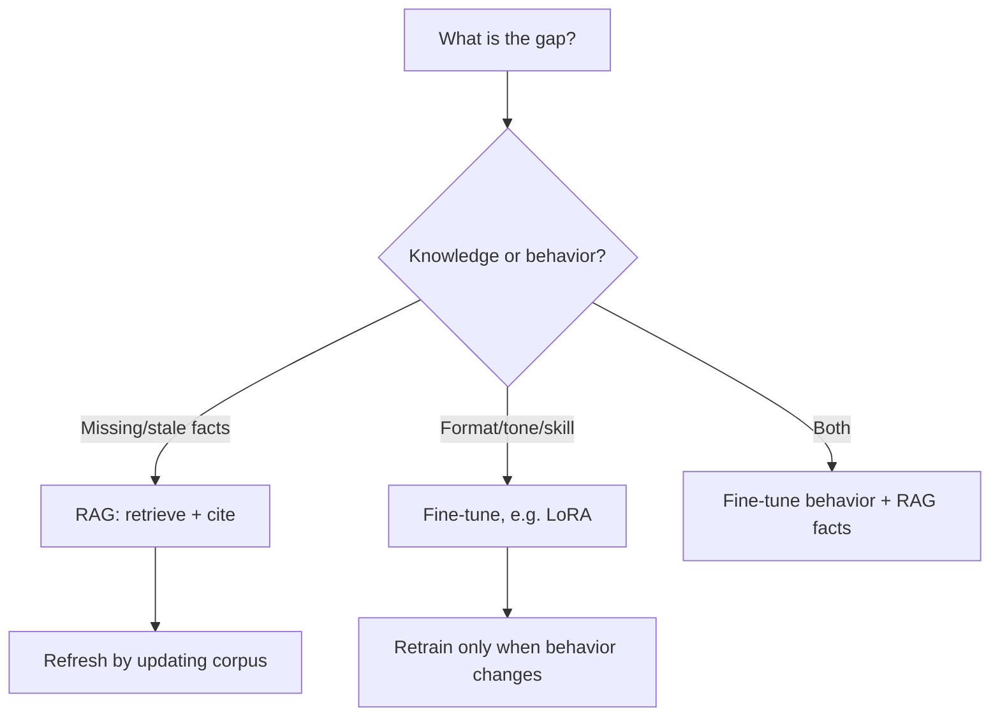

# Fine Tuning vs RAG

## Beginner-Friendly Intuition

This is the most common LLM design fork, and the rule is simple: RAG changes what the model knows, fine-tuning
changes how it behaves. If the problem is missing or changing facts, retrieve them. If the problem is the
wrong format, tone, or task skill, fine-tune on examples. Picking the wrong one leads to endless retraining
or wasted context. Many real systems use both.

## Formal Explanation

RAG injects external evidence into the prompt at inference; weights are unchanged, knowledge updates by
editing the corpus, and answers can be cited. Fine-tuning continues training on input-output pairs, shifting
the model's behavior (style, format, narrow skills) but baking in a knowledge snapshot that goes stale.
Fine-tuning also has variants (full fine-tuning vs parameter-efficient methods like LoRA that train small
adapter weights). The decision rests on whether the gap is knowledge (RAG) or behavior (fine-tune), plus
cost, latency, and update frequency.

**LoRA rank tradeoffs.** LoRA (Hu et al., 2021) inserts low-rank adapter matrices into the model's
linear layers; only the adapters are trained, freezing the base. The rank `r` controls capacity:

- **r = 4-8.** Very efficient (minutes-to-hours of training, megabytes of weights). Good for narrow
  format and tone tuning. Production default for most adaptation tasks.
- **r = 16-32.** More capacity at moderate cost. Helps when the task involves more than format
  (a domain-specific reasoning pattern, a structured workflow).
- **r = 64-128.** Approaches full fine-tuning quality on many tasks; cost grows accordingly.

**QLoRA** trains LoRA adapters on a 4-bit-quantized base, fitting 70B-parameter fine-tunes on a single
80 GB GPU. Standard for cost-constrained adaptation in 2026.

**Hybrid (RAG + fine-tune) cost picture.** When you do both: LoRA-fine-tune the model for behavior plus
operate a RAG corpus for facts. Cost adds up: training cost (one-time per behavior change), serving
cost (LoRA adapter loading per request adds 1-5 ms; retrieval adds 10-50 ms; reranking adds 30-100 ms;
the LLM call itself dominates). Update frequency: behavior updates monthly to quarterly (re-fine-tune);
knowledge updates daily to weekly (re-embed and re-index). Plan the operational cadence before
committing.

**Corpus update economics.** A 1M-document corpus re-embedded with a $0.02/M-token API: roughly $200-400
to fully reindex, plus the time cost (typically a few hours wall-clock). Acceptable for monthly
refreshes. For weekly or daily, consider self-hosted embedding to avoid the API line item, or
incremental indexing (only re-embed changed documents). Index-rebuild compute can dwarf serving compute
in a heavy-update environment.

## Why It Matters in Real Jobs

This choice determines maintenance cost and reliability. Fine-tuning to memorize a changing catalog means
retraining on every change and still risking hallucination between updates, an expensive mistake. Using RAG
to enforce a strict output format wastes context tokens when a small fine-tune would make it reliable.
Senior engineers reach for the narrowest effective tool and often combine: fine-tune behavior, ground facts
with RAG.

## How It Works Step by Step

1. **Diagnose the gap:** is it missing/stale facts, or wrong format/behavior?
2. **Facts or freshness:** build RAG; update the corpus to refresh knowledge.
3. **Style, format, narrow skill:** fine-tune (often LoRA) on examples.
4. **Both:** fine-tune the behavior, ground facts with RAG at inference.
5. **Measure:** confirm the chosen approach fixed the specific failure.

## Real-World Example

A medical-coding assistant must output codes in a strict format (behavior) using the current code set
(knowledge that updates yearly). The team fine-tunes (LoRA) so the format is reliable, and uses RAG to
retrieve the current code definitions so knowledge stays fresh without retraining. Knowledge updates flow
through the corpus; behavior stays stable through the adapter. Neither tool alone would have served both
needs.

## Common Mistakes

- Fine-tuning to store facts that change (endless retraining, still hallucinates).
- Using RAG to fix a format problem that needs examples.
- Assuming fine-tuning reduces hallucination on facts (it does not add live knowledge).
- Treating it as either-or when both together is often correct.

## Interview Angle

**Question:** Our model gives wrong, outdated facts and also formats answers inconsistently. What do you do?

**Strong answer:** Two problems, two tools. RAG for the outdated facts (so knowledge is fresh and cited),
fine-tuning for the inconsistent format (a behavior). I would likely use both: fine-tune behavior, ground
facts with RAG.

**Weak answer:** "Fine-tune the model on all our data."

**Follow-up questions:**

- When would you use both together?
- What is LoRA and why is it attractive?
- Why does fine-tuning not fix factual freshness?

## Mini Exercise

List three LLM problems (one knowledge, one format, one tone). For each, choose RAG, fine-tuning, or both,
and justify it in one line.

## Diagram

---
## Navigation

[⬅ Previous](12-guardrails.md) | [🏠 Home](../README.md) | [➡ Next](14-small-language-models.md)
