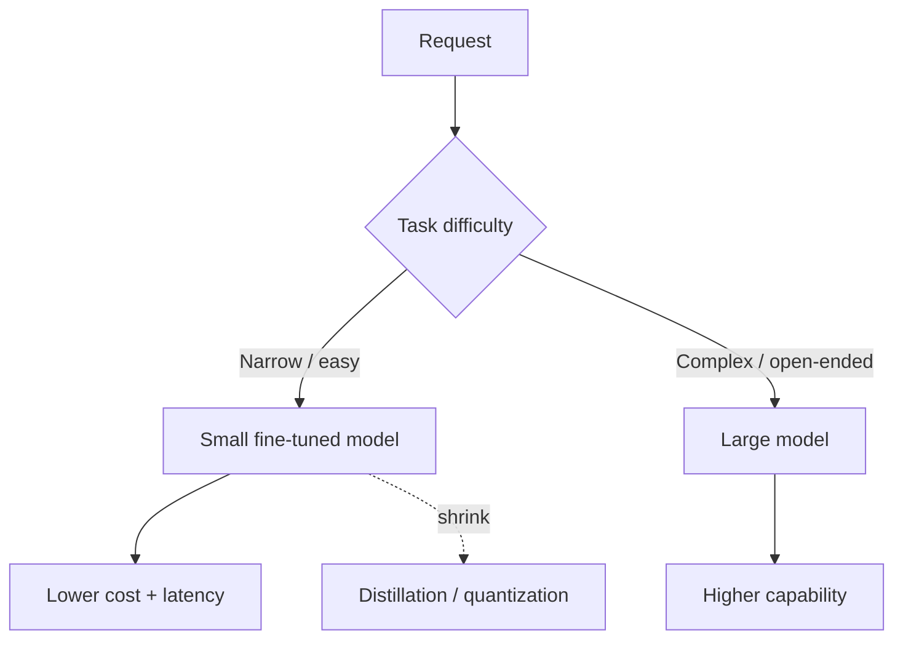

# Small Language Models

## Beginner-Friendly Intuition

Bigger is not always better. Small language models (a few billion parameters or fewer) are cheaper, faster,
and can run on modest hardware or even on-device. For many narrow, well-defined tasks they match or beat a
giant model at a fraction of the cost and latency. The skill is knowing when a small model is enough, often
after fine-tuning it on the specific task.

## Formal Explanation

Small language models trade raw general capability for efficiency: lower inference cost, lower latency,
smaller memory footprint, and the option to run locally for privacy. They tend to underperform large models
on open-ended reasoning and broad knowledge, but a small model fine-tuned on a narrow task (classification,
extraction, routing, a fixed format) can be competitive or superior for that task. Techniques like
distillation (training a small model to mimic a large one) and quantization (reducing weight precision)
further shrink cost. The pattern is often: prototype with a large model, then distill or fine-tune a small
one for production.

## Why It Matters in Real Jobs

Cost and latency at scale are real constraints. Serving a giant model for every request, including trivial
ones, is wasteful. Routing easy or narrow tasks to a small model (or running one on-device for privacy) can
cut cost dramatically while keeping quality. On-device small models also enable offline and privacy-sensitive
use cases. Understanding this lets you design systems that are economical, not just capable.

## How It Works Step by Step

1. **Prototype** with a large model to establish the quality bar.
2. **Identify narrow tasks** suitable for a smaller model.
3. **Fine-tune or distill** a small model on those tasks.
4. **Optionally quantize** to shrink memory and speed up inference.
5. **Route** easy or narrow requests to the small model, hard ones to the large one.

## Real-World Example

A product runs every chat through a large model and the bill is unsustainable. Analysis shows 70 percent of
requests are simple intent classification and FAQ lookups. The team fine-tunes a small model for those,
routes them away from the large model, and reserves the large model for complex open-ended queries. Cost
drops sharply with no quality loss on the easy traffic. A privacy-sensitive on-device feature uses a
quantized small model so data never leaves the device.

## Common Mistakes

- Defaulting to the largest model for every task regardless of cost.
- Expecting a small model to match a large one on open-ended reasoning.
- Skipping fine-tuning, then concluding the small model "is not good enough".
- Ignoring quantization and distillation as cost levers.

## Interview Angle

**Question:** When would you use a small language model?

**Strong answer:** For narrow, well-defined tasks at scale, or on-device for privacy. I prototype with a
large model, then fine-tune or distill a small one for production and route easy traffic to it, reserving the
large model for hard queries. Quantization cuts cost further.

**Weak answer:** "Always use the biggest model for best quality."

**Follow-up questions:**

- What is distillation?
- What does quantization trade off?
- How would you decide the routing cutoff?

## Mini Exercise

For a product with mixed-difficulty requests, propose which tasks go to a small model and which to a large
one, and name one technique (distillation or quantization) you would apply and why.

## Diagram

---
## Navigation

[⬅ Previous](13-fine-tuning-vs-rag.md) | [🏠 Home](../README.md) | [➡ Next](15-llm-serving-and-inference.md)
