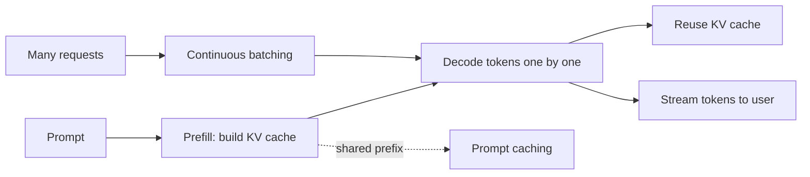

# LLM Serving and Inference

## Beginner-Friendly Intuition

Serving an LLM is about delivering tokens to many users quickly and affordably. Generation is sequential
(one token at a time), so naive serving is slow and expensive. Production serving uses tricks, caching past
computation, batching many requests, and streaming output, to hit latency and cost targets. Understanding
these explains why LLM APIs behave the way they do.

## Formal Explanation

The two phases of inference are prefill (process the whole prompt at once) and decode (generate tokens one
at a time). Key techniques: the KV cache stores past keys and values so each new token attends against the
cache instead of recomputing, turning per-token cost from quadratic to roughly linear. Continuous batching
packs many requests through the GPU together to raise throughput. Streaming sends tokens as they are
generated, cutting perceived latency. Other levers: quantization (smaller, faster weights), speculative
decoding, and prompt caching for shared prefixes. Metrics are time-to-first-token, tokens-per-second, and
cost per request.

**Speculative decoding** uses a small "draft" model to predict the next 4-8 tokens; the large "target"
model verifies them in a single forward pass and accepts the prefix that matches its own distribution.
On accepted tokens you got several decodes for the cost of one large-model forward pass; on rejection the
target model emits the next token normally. Typical 2-3x decode-throughput improvement when the draft
model is fast and reasonably aligned with the target. Standard in modern serving stacks (vLLM, TensorRT-LLM).

**Batch size tuning** is the throughput-vs-latency lever. Two regimes:

- **Latency-bound** (low traffic, strict per-request time). Small batch (1-4); each request gets nearly
  full GPU. Cost-per-request high.
- **Throughput-bound** (high traffic, fixed budget). Large batch (32-128 with continuous batching);
  GPU saturated; per-request latency rises but cost-per-token drops 5-20x.

**Prefill-decode separation** is a 2024+ pattern: schedule prefill (CPU-bound, parallel, high arithmetic
intensity) and decode (memory-bandwidth-bound, sequential) on different replicas tuned for each phase.
This raises overall GPU utilization and lets you size hardware differently for each. Vendors: vLLM,
SGLang, NVIDIA Triton with TensorRT-LLM, AWS Bedrock under the hood.

**Hardware choice.** A100 80GB for general-purpose serving; H100 for higher throughput and FP8 support;
L4/L40S for cost-optimized smaller models; AMD MI300X as an emerging alternative. The price-performance
gap can be 5-10x; benchmark before committing.

## Why It Matters in Real Jobs

Latency and cost make or break an LLM product. A chat that takes 9 seconds to start responding loses users;
streaming the first token in under a second feels instant even if the full answer takes longer. Batching and
caching are the difference between an affordable service and an unsustainable bill. Engineers who understand
serving can diagnose "it is too slow or too expensive" instead of just blaming the model.

## How It Works Step by Step

1. **Prefill** the prompt, building the KV cache.
2. **Decode** tokens one at a time, reusing the KV cache.
3. **Batch** concurrent requests for GPU throughput.
4. **Stream** tokens to the user to cut time-to-first-token.
5. **Optimize cost:** quantize, cache shared prompt prefixes, and route to smaller models.

## Real-World Example

A chat assistant has 9-second perceived latency. Profiling shows most time is decoding a long answer.
Enabling streaming drops time-to-first-token to under a second, so the user sees the answer forming
immediately. Adding prompt caching for the long static system instruction cuts prefill cost, and continuous
batching raises throughput under load. The model did not change; the serving did, and the experience and
bill both improved.

## Common Mistakes

- Not streaming in a chat UI, so users stare at a spinner.
- Ignoring the KV cache and prefill/decode distinction when reasoning about latency.
- Serving one request at a time instead of batching.
- Blaming the model for latency that is really a serving configuration issue.

## Interview Angle

**Question:** A chat feature is slow and expensive. What serving levers do you pull?

**Strong answer:** Stream tokens to cut time-to-first-token, use the KV cache and continuous batching for
throughput, cache the static prompt prefix, and route easy requests to a smaller or quantized model. I would
measure time-to-first-token, tokens-per-second, and cost per request.

**Weak answer:** "Use a faster model," with no serving techniques.

**Follow-up questions:**

- What is the KV cache and why does it matter?
- What is the difference between prefill and decode?
- How does streaming change perceived latency?

## Mini Exercise

For a slow chat assistant, list three serving optimizations and the metric each one improves
(time-to-first-token, throughput, or cost per request).

## Diagram

---
## Navigation

[⬅ Previous](14-small-language-models.md) | [🏠 Home](../README.md) | [➡ Next](16-llm-system-design.md)
