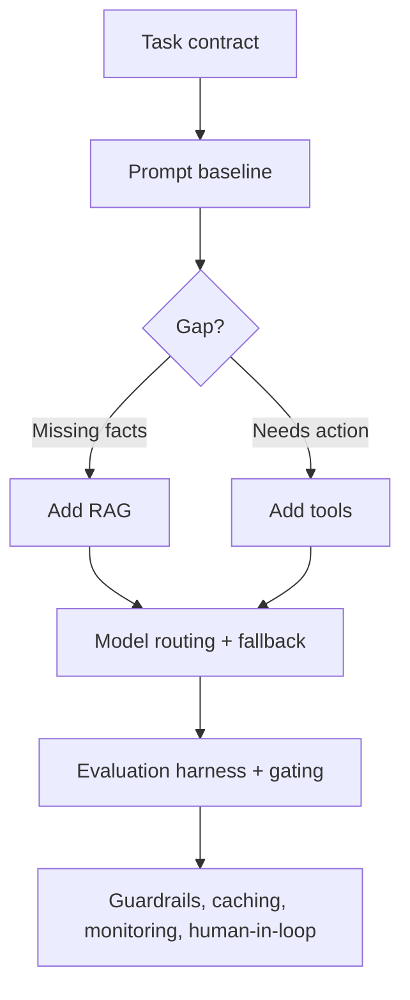

# LLM System Design

## Beginner-Friendly Intuition

Designing an LLM system means everything around the model call: the task contract, whether you need
retrieval or tools, how you evaluate quality, how you handle cost, latency, and safety, and what happens
when the model fails. The model is one box in a larger diagram. Strong design starts from the user decision
and adds only the complexity that a measured problem requires.

## Formal Explanation

An LLM system design specifies: the task and output contract, the context strategy (prompt, RAG, tools,
memory), the model choice and routing, an evaluation harness (metrics, eval set, regression suite), and
production controls (caching, fallbacks, retries, guardrails, monitoring, human-in-the-loop). It also
addresses cost and latency budgets and security (injection, PII, data handling). The discipline is to choose
the narrowest effective intervention for each requirement, justified by evidence, rather than reaching for
the largest model.

## Why It Matters in Real Jobs

This is the core AI-engineer interview and the core real build. The hard parts are not calling the API; they
are grounding facts, evaluating quality, controlling cost and latency, and failing safely. A design that
stops at "prompt the model and return the text" ignores hallucination, cost, evaluation, and failure
handling. Demonstrating the full system, with controls and evaluation, is what separates strong candidates.

## How It Works Step by Step

1. **Define the contract:** user, decision, output format, and cost of errors.
2. **Choose context strategy:** prompt baseline, add RAG for facts, tools for actions, memory if needed.
3. **Pick and route models:** small for easy traffic, large for hard, with fallbacks.
4. **Build evaluation:** metrics, eval set, regression suite, gating changes.
5. **Operate:** caching, retries, guardrails, monitoring, and human-in-the-loop for high stakes.

## Real-World Example

Designing a customer-support assistant: the contract is "draft a grounded reply, never auto-send". A prompt
baseline ships first, then RAG grounds answers in the help center with citations, easy intents route to a
small model, and a guardrail blocks policy violations. Evaluation tracks faithfulness and edit rate with a
regression suite; caching and streaming control cost and latency; account actions require human approval. The
model is central but surrounded by controls that make it trustworthy.

## Common Mistakes

- Designing only the happy path, ignoring evaluation, cost, and failure handling.
- Starting with fine-tuning or the largest model instead of a measured baseline.
- No grounding for factual answers, inviting hallucination.
- No monitoring, fallback, or human gate for high-stakes outputs.

## Interview Angle

**Question:** Design an LLM-powered feature end to end.

**Strong answer:** Start from the output contract, ship a prompt baseline, add RAG or tools where a measured
gap requires, build an evaluation harness, route models for cost, and add guardrails, caching, fallbacks,
monitoring, and human-in-the-loop. Add complexity only where evidence justifies it.

**Weak answer:** "Send the prompt to a big model and return the answer."

**Follow-up questions:**

- How do you decide between prompt, RAG, and fine-tuning here?
- How do you control cost and latency?
- What happens when the model fails or is uncertain?

## Mini Exercise

Pick an LLM feature and sketch its system: contract, context strategy, model routing, evaluation, and two
production controls (for example caching and a human gate).

## Diagram

---
## Navigation

[⬅ Previous](15-llm-serving-and-inference.md) | [🏠 Home](../README.md) | [➡ Next](17-llm-interview-patterns.md)
