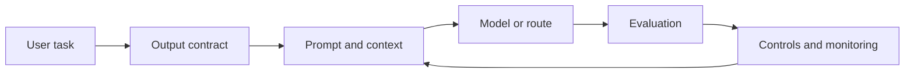

# LLM Interview Patterns

## Beginner-Friendly Intuition

LLM interviews test whether you can use language models as system components rather than magic
answer boxes. A strong answer names the user task, the context available to the model, the output
contract, the evaluation method, and the controls that prevent unsupported or unsafe behavior.

The recurring pattern is to compare prompting, retrieval, fine-tuning, tools, and smaller models
against a baseline. You should be able to say what each option improves, what it costs, and what new
failure mode it introduces.

## Formal Explanation

An LLM system answer should specify:

- **Task contract:** input, output, allowed actions, refusal behavior, and quality bar.
- **Context strategy:** prompt instructions, examples, retrieved evidence, conversation state, tool
  results, and token budget.
- **Model strategy:** baseline model, larger model, smaller model, fine-tuned model, or routed model
  mix.
- **Evaluation:** golden sets, rubric checks, pairwise comparisons, human review, automated judges,
  hard examples, and regression tests.
- **Production controls:** latency, cost, rate limits, caching, prompt injection defense, privacy,
  logging, fallback, and monitoring.

## Why It Matters in Real Jobs

LLM products often fail at boundaries: the model lacks evidence, follows malicious instructions,
uses stale context, calls the wrong tool, produces an unverifiable answer, or costs too much at
scale. The engineering work is to make those boundaries explicit.

Interviewers want to see that you can reason about quality and safety while still building something
useful. They expect you to know when a prompt is enough, when RAG is needed, when fine-tuning helps,
when a tool should be constrained, and when a human should approve the result.

## How It Works Step by Step

1. **Clarify the product action.** Is the model drafting, answering, classifying, planning, or
   changing state through a tool?
2. **Define the output contract.** Specify format, citations, uncertainty, refusals, and escalation.
3. **Build a baseline.** Start with a prompt, template, rules, or retrieval-only search experience.
4. **Choose the improvement path.** Add RAG for external knowledge, fine-tuning for style or stable
   behavior, tools for actions, routing for cost, or guardrails for policy.
5. **Evaluate with hard cases.** Include ambiguity, missing evidence, adversarial prompts, stale
   data, long context, and high-risk user segments.
6. **Operate the system.** Monitor quality, latency, cost, refusal rate, tool errors, citation
   faithfulness, and user feedback.

## Real-World Example

For a customer-support drafting assistant, the baseline could retrieve relevant help-center articles
and generate a draft response with citations. The output contract should require source links,
uncertainty markers, and escalation when account-specific action is needed. Fine-tuning might help
tone, but it should not replace retrieval for changing policies. Tool calls for refunds or account
changes need permission checks and human approval.

The evaluation should include answer faithfulness, policy compliance, resolution rate, edit rate,
latency, cost, and high-risk examples where the correct behavior is refusal or escalation.

## Common Mistakes

- Treating model choice as the whole system design.
- Using fine-tuning to memorize knowledge that changes often.
- Adding RAG without measuring retrieval recall and citation faithfulness.
- Letting the model call tools without schemas, permissions, and approval rules.
- Reporting average helpfulness without hard examples or safety cases.
- Logging sensitive prompts or documents without a privacy plan.
- Ignoring latency and cost until after the product design is fixed.

## Interview Angle

Interviewers use LLM prompts to test system judgment under uncertainty.

**Question:** How would you improve an LLM assistant that gives plausible but unsupported answers?

**Strong answer:** Define unsupported answer rate, add retrieval with source constraints if the
answer depends on external knowledge, evaluate retrieval recall and citation faithfulness, require
the model to abstain when evidence is missing, add hard examples, and monitor user feedback and
regressions.

**Weak answer:** Use a larger model and hope hallucinations decrease.

**Follow-up questions:**

- When would you choose RAG over fine-tuning?
- What should happen when retrieved evidence conflicts?
- How would you evaluate an LLM-as-judge?
- How would you reduce cost without reducing quality?

## Mini Exercise

Pick an LLM feature from this repository. Write the task contract, context strategy, baseline,
primary metric, two hard examples, one security risk, and one fallback. Then decide whether the next
improvement should be prompt changes, retrieval, fine-tuning, tools, routing, or evaluation.

## Diagram

---
## Navigation

[⬅ Previous](16-llm-system-design.md) | [🏠 Home](../README.md) | [➡ Next](../vector-databases/01-what-is-a-vector-database.md)
