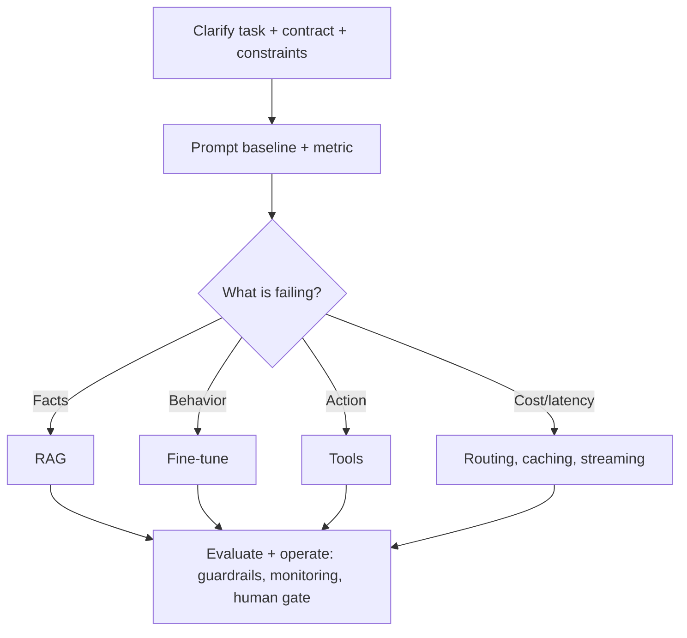

# LLM Interview Patterns

## Beginner-Friendly Intuition

LLM interviews reward one instinct above all: pick the narrowest tool for the measured problem. Whatever the
prompt, you score by clarifying the task, shipping a prompt baseline, choosing prompt vs RAG vs fine-tuning
vs tools based on the actual failure, defining evaluation, and covering cost, latency, and safety. Candidates
who default to "use the biggest model and fine-tune it" lose points.

## Formal Explanation

The recurring frame for any LLM prompt:

- **Clarify:** the user, the output contract, constraints (latency, cost, privacy), and the cost of errors.
- **Baseline:** a clear prompt with a defined output format, so you have a measurable reference.
- **Diagnose and choose:** missing facts -> RAG; wrong behavior/format -> fine-tuning; needs action ->
  tools; cost/latency -> routing, caching, streaming.
- **Evaluate:** task metric, eval set, regression suite, calibrated judge.
- **Operate:** guardrails, fallbacks, monitoring, and human-in-the-loop for high stakes.

## Why It Matters in Real Jobs

These patterns are how real LLM systems are built and debugged. The engineer who asks "what is actually
failing?" before reaching for fine-tuning fixes problems faster and cheaper. The interview is a proxy for
that judgment: can you reason from a measured failure to the smallest effective fix, and can you make the
system safe and affordable?

## How It Works Step by Step

1. **Restate and clarify** the task, contract, and constraints.
2. **Propose the prompt baseline** and the evaluation metric.
3. **Diagnose the failure** and pick the matching intervention.
4. **Justify** why that is narrower and better than a bigger model.
5. **Close with operations:** guardrails, cost, latency, monitoring, and human gates.

## Real-World Example

Asked to "improve our LLM feature that gives wrong answers", a strong candidate clarifies whether the
problem is facts or behavior, finds it is stale facts, adds RAG with cite-or-abstain rather than fine-tuning,
defines a faithfulness metric and regression suite, and adds caching and monitoring. A weak candidate
immediately proposes fine-tuning on company data and stalls on "but the facts change weekly".

## Common Mistakes

- Reaching for the biggest model or fine-tuning by default.
- Conflating knowledge problems (RAG) with behavior problems (fine-tuning).
- No evaluation plan, so improvements are unproven.
- Ignoring cost, latency, and safety.

## Interview Angle

**Question:** The interviewer says "the answers are wrong, fix it". What is your move?

**Strong answer:** Diagnose first: are the facts wrong (add RAG) or is the format/behavior wrong (fine-tune)?
Ship a prompt baseline, choose the narrowest fix for the measured failure, and prove it with a faithfulness
metric and regression suite.

**Weak answer:** "Fine-tune the model," with no diagnosis or evaluation.

**Follow-up questions:**

- How do you decide prompt vs RAG vs fine-tuning?
- How do you evaluate the fix?
- How do you control cost and latency?

## Mini Exercise

Take one mock prompt (for example "design an LLM assistant for X"). Write a twelve-line answer using the
clarify, baseline, diagnose-and-choose, evaluate, operate frame, naming one cost and one safety control.

## Diagram

---
## Navigation

[⬅ Previous](16-llm-system-design.md) | [🏠 Home](../README.md) | [➡ Next](../vector-databases/01-what-is-a-vector-database.md)
