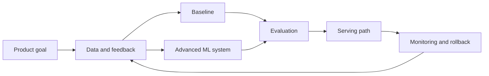

# Design A Real Time Inference System

## Beginner-Friendly Intuition

Design A Real Time Inference System is about turning an ML idea into a reliable system. A model is only one part of the design.
The full system must collect data, train or retrieve useful signals, serve results, monitor quality,
handle failures, protect sensitive information, and support iteration.

Think of the design as a set of promises: what the user gets, how quickly they get it, how the system
stays correct, and what happens when the model is uncertain or wrong.

## Formal Explanation

An ML system design should define functional requirements, non-functional requirements, data flow,
model or retrieval architecture, serving path, evaluation strategy, reliability controls, security
boundaries, and observability. The design is successful when it connects model quality to product
behavior under realistic constraints.

Important dimensions:

| Dimension | Design Question |
| --- | --- |
| Product goal | What decision or workflow does the system support? |
| Data | What data is available, fresh, reliable, and permitted? |
| Model path | What baseline and advanced approaches are justified? |
| Serving | Is the system batch, online, streaming, or hybrid? |
| Operations | How are drift, failures, cost, and latency monitored? |

## Why It Matters

Interviewers use ML system design to test engineering judgment. Real teams need engineers who can
balance model quality with latency, cost, privacy, reliability, and product impact. A strong design
does not only name an algorithm. It explains why the architecture fits the user need and how the team
would operate it after launch.

## How It Works

1. Clarify the user, product goal, constraints, and failure cost.
2. Define input data, labels, feedback, privacy boundaries, and freshness requirements.
3. Propose a simple baseline that can be evaluated quickly.
4. Add the advanced model, retrieval, ranking, or agent architecture only where needed.
5. Design serving, caching, model registry, feature or embedding pipelines, and fallbacks.
6. Define offline metrics, online metrics, guardrails, monitoring, and rollback.
7. Explain bottlenecks, tradeoffs, and future extensions.

## Real-World Example

A product team may want a system that ranks items, detects fraud, evaluates LLM outputs, or supports
a copilot. The system must ingest data, produce a useful response, and improve with feedback. If the
design ignores data quality, low-confidence handling, or monitoring, the model can appear strong in a
notebook and still fail in production.

## Common Mistakes

- Starting with a complex model before defining the product decision.
- Ignoring training-serving skew, leakage, delayed labels, or feedback loops.
- Treating offline metrics as sufficient proof of production quality.
- Forgetting privacy, authorization, audit logs, and abuse cases.
- Missing cost, latency, rollback, and human escalation paths.

## Interview Angle

**Question:** Design this system for a product team and explain the major tradeoffs.

**Strong answer:** Clarifies requirements, starts with a baseline, separates offline and online
paths, defines metrics and guardrails, discusses failure modes, and explains monitoring and rollback.

**Weak answer:** Lists models without data flow, evaluation, reliability, security, or operational
ownership.

**Follow-up questions:**

- What is the simplest baseline?
- What changes if latency must be below 100 milliseconds?
- How would you detect drift or quality regression?
- What data should not be logged?
- How would you handle low-confidence outputs?

## Mini Exercise

Draw the first version of this system on one page. Include data sources, feature or embedding
generation, model or retrieval path, serving layer, monitoring, and human review. Then write one
paragraph explaining the biggest tradeoff.

## Diagram

---
## Navigation

[⬅ Previous](08-design-an-llm-evaluation-system.md) | [🏠 Home](../README.md) | [➡ Next](10-design-an-ai-copilot-platform.md)
