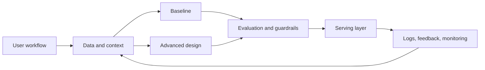

# Design an AI Copilot Platform

## Beginner-Friendly Intuition

Design an AI Copilot Platform is about designing a reliable workflow for knowledge workers using an AI assistant inside an existing product workflow. The model is only one part of the design.
The system must collect trustworthy data, produce the expected output (draft, recommendation, tool action, or explanation with citations and approval state), serve it within
constraints, monitor quality, handle failures, and give the team a way to improve or roll back.

Think of the design as a set of promises: what the user gets, how quickly they get it, how the system
stays correct, and what happens when the model is uncertain or wrong.

## Formal Explanation

An ML system design should define functional requirements, non-functional requirements, data flow,
model or retrieval architecture, serving path, evaluation strategy, reliability controls, security
boundaries, and observability. The design is successful when it connects model quality to product
behavior under realistic constraints.

Important dimensions:

| Dimension | Design Question |
| --- | --- |
| Product goal | What decision or workflow does the system support? |
| Data | What data is available, fresh, reliable, permitted, and logged? |
| Baseline | What simple design creates the first measurable reference point? |
| Serving | Is the system batch, online, streaming, or hybrid? |
| Operations | How are drift, failures, cost, and latency monitored? |

## Requirements to Clarify

- User and decision: knowledge workers using an AI assistant inside an existing product workflow.
- Expected output: draft, recommendation, tool action, or explanation with citations and approval state.
- Latency, throughput, freshness, privacy, and cost constraints.
- Error cost, human review policy, and rollback expectations.
- Data access rules, audit requirements, and abuse cases.

## Capacity and Data Assumptions

- Start with realistic traffic and latency assumptions, then state how the design scales.
- Data includes user context, documents, UI state, permissions, tool results, prompts, traces, and feedback.
- Labels or feedback may be delayed, biased by what the system showed, or missing for rare failures.
- Offline training data must be separated from online serving data by time and availability.

## Why It Matters

Interviewers use ML system design to test engineering judgment. Real teams need engineers who can
balance model quality with latency, cost, privacy, reliability, and product impact. A strong design
does not only name an algorithm. It explains why the architecture fits the user need and how the team
would operate it after launch.

## How It Works

1. Clarify the user, product goal, constraints, and failure cost.
2. Define input data, labels, feedback, privacy boundaries, and freshness requirements.
3. Propose a simple baseline that can be evaluated quickly.
4. Add the advanced model, retrieval, ranking, or agent architecture only where needed.
5. Design serving, caching, model registry, feature or embedding pipelines, and fallbacks.
6. Define offline metrics, online metrics, guardrails, monitoring, and rollback.
7. Explain bottlenecks, tradeoffs, and future extensions.

## API Contract

POST /copilot/actions accepts context and intent and returns suggestion, evidence, tools, and trace id.

The response should include enough metadata to debug production behavior: model or index version,
feature or prompt version, latency, fallback status, and trace id.

## Data and Feature Design

Store raw events separately from derived features, chunks, rankings, predictions, traces, and labels.
Version every artifact that can change. For online systems, enforce point-in-time correctness so the
training path does not use information that would not exist at serving time.

## Baseline and Advanced Design

| Layer | First version | Stronger version |
| --- | --- | --- |
| Decision logic | retrieval-backed suggestions with templates and human confirmation | context orchestration, tool use, permissions, policy checks, evaluation, and feedback learning |
| Evaluation | Offline metric and hand-inspected failures | Slices, hard examples, online tests, and guardrails |
| Operations | Logs and simple alerts | Versioned rollouts, drift monitoring, ownership, and rollback |

## Real-World Example

A realistic first version would ship retrieval-backed suggestions with templates and human confirmation. The team would measure task completion, acceptance rate, edit rate, groundedness, unsafe action rate, latency, and cost, inspect failures,
and only then move toward context orchestration, tool use, permissions, policy checks, evaluation, and feedback learning. This keeps the design honest: model complexity is justified by
a measured miss, not by preference for a sophisticated architecture.

## Scaling, Reliability, and Cost

- Separate offline computation from online serving where possible.
- Cache stable features, embeddings, candidates, or responses when freshness allows.
- Use canaries, shadow traffic, and rollback for risky releases.
- Define fallback behavior for missing features, model timeouts, provider errors, and low confidence.
- Track cost per request, expensive dependencies, and the point where batching or precomputation pays off.

## Observability and Security

- Log inputs, versions, outputs, latency, fallback status, and user feedback with privacy controls.
- Monitor task completion, acceptance rate, edit rate, groundedness, unsafe action rate, latency, and cost plus technical health such as error rate, queue depth, and p95 latency.
- Enforce authorization before retrieval, scoring, or tool action when sensitive data is involved.
- Redact private data, limit retention, and make audit trails available for high-impact decisions.

## Bottlenecks and Failure Modes

The primary failure to plan around is the assistant suggests or performs an action outside user intent, policy, or permissions. Other common bottlenecks include delayed labels,
feature freshness, expensive inference, unowned alerts, biased feedback, and silent data pipeline
changes.

## Common Mistakes

- Starting with a complex model before defining the product decision.
- Ignoring training-serving skew, leakage, delayed labels, or feedback loops.
- Treating offline metrics as sufficient proof of production quality.
- Forgetting privacy, authorization, audit logs, and abuse cases.
- Missing cost, latency, rollback, and human escalation paths.

## Interview Angle

**Question:** Design this system for a product team and explain the major tradeoffs.

**Strong answer:** Clarifies requirements, starts with a baseline, separates offline and online
paths, defines metrics and guardrails, discusses failure modes, and explains monitoring and rollback.

**Weak answer:** Lists models without data flow, evaluation, reliability, security, or operational
ownership.

**Follow-up questions:**

- What is the simplest baseline?
- What changes if latency must be below 100 milliseconds?
- How would you detect drift or quality regression?
- What data should not be logged?
- How would you handle low-confidence outputs?
- How would you defend the design if traffic or data volume increased ten times?

## Mini Exercise

Draw the first version of this system on one page. Include data sources, feature or embedding
generation, model or retrieval path, serving layer, monitoring, and human review. Then write one
paragraph explaining the biggest tradeoff.

## Diagram

---
## Navigation

[⬅ Previous](09-design-a-real-time-inference-system.md) | [🏠 Home](../README.md) | [➡ Next](../ethics-safety/01-ai-ethics-overview.md)
