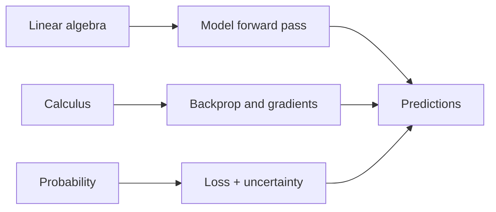

# Why Math Matters for ML

## Beginner-Friendly Intuition

You can use ML libraries without deep math, but you cannot debug them or design new methods without it. Three branches do almost all the work: linear algebra moves data through models (a layer is a matrix multiply), calculus tells you which way to nudge parameters to reduce error (the gradient), and probability lets you reason about uncertainty and write losses as likelihoods.

## Formal Explanation

The minimum useful math for ML practice covers vectors and matrices, eigen-decomposition, partial derivatives and the chain rule, gradient descent, basic probability, expectation, common distributions (Gaussian, Bernoulli, multinomial), Bayes' rule, and information-theoretic quantities (entropy, cross-entropy, KL divergence). You do not need every proof, but you should know what each tool computes and when it applies.

## Why It Matters in Real Jobs

When a model fails, math tells you why. A loss that does not decrease points to a vanishing gradient or wrong learning rate. A retrieval system with bad recall points to a distance metric that does not match how embeddings were trained. A regression that cannot extrapolate points to a basis that is too narrow. Engineers who know the math diagnose these in minutes.

## How It Works Step by Step

1. Read code with math in mind: spot the matrix shapes, the loss, the gradient flow.
2. When a model misbehaves, write the equation for what it should be doing and compare.
3. Use small numerical experiments to confirm your math intuition before scaling up.
4. Keep a one-page cheat sheet for the formulas you re-derive most often.

## Real-World Example

A team's deep model trains fine on small data but loss explodes on full data. Doing the math, batch norm statistics differ between modes; gradients through the normalization explode at high LR. The fix is gradient clipping plus warmup. Without the math nobody would know which knob to turn.

## Common Mistakes

- Treating ML as plug-and-play; you cannot debug what you cannot describe with math.
- Memorizing formulas without intuition for what each piece does.
- Skipping linear algebra in favor of code, then getting stuck on shape mismatches.
- Avoiding probability and so writing classification metrics that do not handle calibration.

## Interview Angle

**Question:** Which areas of math do you actually use day to day in ML, and where has math helped you debug a real problem?

**Strong answer:** Name linear algebra (shapes, projections, decompositions), calculus (gradients, chain rule), and probability (likelihoods, Bayes). Give one debugging story: a vanishing gradient, a metric mismatch, an embedding similarity issue, a calibration fix.

**Weak answer:** Claim the libraries handle the math, with no example of using math to debug or design.

**Follow-up questions:**

- What is the gradient of softmax cross-entropy with respect to logits?
- Why does cosine similarity behave differently from dot product on normalized vectors?
- What does the Hessian tell you that the gradient does not?
- Why is KL divergence asymmetric and what does that imply?

## Mini Exercise

Take a recent training failure or weird metric. Write down in math what should be happening and where the actual run diverges. If you cannot, that is the gap to close.

## Diagram

---
## Navigation

[⬅ Previous](../fundamentals/10-end-to-end-ml-workflow.md) | [🏠 Home](../README.md) | [➡ Next](02-linear-algebra-vectors.md)
