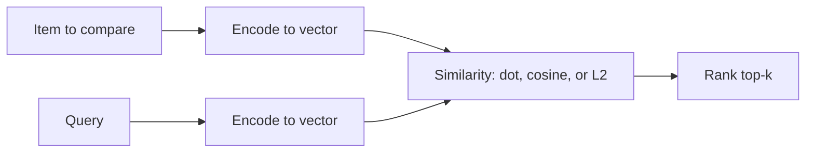

# Linear Algebra: Vectors

## Beginner-Friendly Intuition

A vector is an arrow with a length and a direction; in ML, it is also a list of numbers that represents an example, a feature, or a hidden state. Operations on vectors (add, scale, dot product) are how models combine information. If you can picture two vectors and their angle, you can picture most of what early ML layers do.

## Formal Explanation

A vector in `R^n` is an n-tuple of real numbers. Key operations: addition (`u + v`), scalar multiplication (`αv`), dot product (`u · v = Σ u_i v_i`), L2 norm (`||v||₂ = sqrt(v · v)`), cosine similarity (`u · v / (||u|| ||v||)`). The dot product equals `||u|| ||v|| cos θ`, so it measures alignment. Normalization (`v / ||v||`) puts vectors on the unit sphere, which is what most embedding models do before similarity search.

## Why It Matters in Real Jobs

Embeddings are vectors. Tokens are vectors. Hidden layers are vectors. Searching by meaning is dot product or cosine on vectors. Almost every modern ML system reduces to: turn things into vectors, compare them, combine them, transform them. You cannot reason about embedding quality, retrieval, or attention without the vector picture.

## How It Works Step by Step

1. Confirm the dimension and norm of vectors you handle.
2. Decide whether to use dot product, cosine, or Euclidean (match how the model was trained).
3. Normalize when comparing direction, not magnitude.
4. Use orthogonality to think about independence: orthogonal directions carry independent information.
5. Visualize in 2D or 3D first; the intuition usually transfers to higher dimensions.

## Real-World Example

A retrieval system stores 1024-dim embeddings of documents. A query is encoded into the same space. Top-k is found by largest dot product. Recall drops on long documents because the embedding norm grows with length and biases the score. Normalizing both query and documents (cosine similarity) fixes the bias and improves recall.

## High-Dimensional Intuition: Random Vectors Become Orthogonal

A counterintuitive fact: as dimension grows, two random vectors become almost perpendicular. The expected absolute cosine of two i.i.d. Gaussian vectors scales roughly as `1 / sqrt(d)`. A rough sense of the typical cosine magnitude:

| Dimension `d` | Typical |cos θ| between two random vectors |
| --- | --- |
| 2 | ~0.5 |
| 10 | ~0.25 |
| 100 | ~0.08 |
| 1000 | ~0.025 |

So in 1000-dim embedding space, two arbitrary vectors are essentially orthogonal. This is why high-dimensional embeddings can pack many "near-independent" directions, but it is also why distances become less informative at very high dimension (the curse of dimensionality): every point looks roughly equally far from every other.

## Why Attention Uses Scaled Dot Product, Not Cosine

Transformer attention scores are `Q K^T / sqrt(d_k)`, not the cosine `Q K^T / (||Q|| ||K||)`. Two reasons. First, normalization would force the model to encode importance and similarity in different places (the model often wants the score's magnitude to encode how strongly a token should attend, which cosine destroys). Second, computational: the `sqrt(d_k)` scaling is enough to keep the variance of the score bounded as `d_k` grows, so softmax does not saturate, without requiring the per-vector norm computation that cosine needs at every step.

## Common Mistakes

- Using Euclidean distance when the embedding model was trained for cosine.
- Forgetting to normalize when length should not matter.
- Confusing the dot product (a scalar) with element-wise multiplication.
- Treating vectors of different dimensions as comparable.
- Ignoring that high dimensions distort distances (curse of dimensionality).

## Interview Angle

**Question:** Explain dot product, cosine similarity, and L2 distance, and when you would use each.

**Strong answer:** Dot product captures alignment scaled by lengths. Cosine ignores lengths and measures direction. L2 measures geometric distance. Use cosine when length is meaningless (text embeddings); dot product when training defined it; L2 when geometric distance is meaningful (image features in some setups).

**Weak answer:** Treat them as interchangeable or quote definitions without saying when to pick which.

**Follow-up questions:**

- Why do high-dimensional random vectors tend to be near orthogonal?
- What is the relationship between cosine similarity and L2 on normalized vectors?
- How would you index vectors for fast nearest-neighbor search at scale?
- Why is dot product faster than cosine in practice for normalized vectors?

## Mini Exercise

Take 5 random unit vectors in 2D. Compute dot products. Repeat in 100D using random sampling. Note how often the dot product is close to zero in 100D and explain why.

## Diagram

---
## Navigation

[⬅ Previous](01-why-math-matters-for-ml.md) | [🏠 Home](../README.md) | [➡ Next](03-matrices-and-matrix-multiplication.md)
