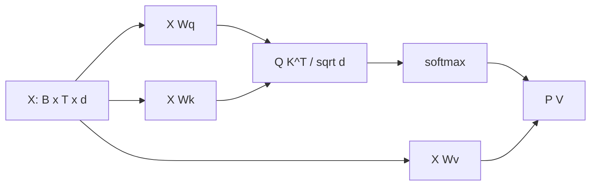

# Matrices and Matrix Multiplication

## Beginner-Friendly Intuition

A matrix is a stack of vectors arranged in a grid. Multiplying a matrix by a vector applies a linear transformation: rotate, scale, project, or mix. A neural network layer is exactly this operation followed by a non-linearity. If you can read shapes and trace where each row and column goes, you can read most ML code.

## Formal Explanation

If `A` is `m x n` and `B` is `n x p`, then `C = A B` is `m x p` with `C[i,j] = Σ_k A[i,k] B[k,j]`. Cost is roughly `m n p`. Matrix multiplication is associative but not commutative. Special matrices: identity `I`, diagonal `D`, orthogonal (`Q^T Q = I`), symmetric (`A = A^T`), positive definite. Transpose flips rows and columns. The inverse `A^{-1}` exists only for square non-singular matrices.

## Why It Matters in Real Jobs

Every dense layer, attention head, and embedding lookup is a matrix multiplication. Optimized matmul on GPUs is what makes deep learning practical. Reading shapes and choosing batch dimensions decide whether your model fits in memory and how fast it runs.

## How It Works Step by Step

1. Always check the shape sequence in a forward pass: `(B, T, d) @ (d, h) -> (B, T, h)`.
2. Pick the batch dimension that maximizes GPU utilization without OOM.
3. Use einsum or einops for clarity when shapes get hairy.
4. Watch for transposes; a single missing `.T` wrecks accuracy and you may not notice.
5. Profile matmul time: it usually dominates training and inference.

## Real-World Example

Attention does `Q K^T` (scores) then `softmax(scores) V`. With sequence length `T` and head dim `d`, the cost is `O(T^2 d)`. Doubling sequence quadruples compute. Engineers who track these shapes know exactly why long context is expensive and where tricks like flash attention save time.

## Why Divide By `sqrt(d_k)`

The dot product of two random `d_k`-dim vectors with i.i.d. unit-variance entries has mean 0 and variance `d_k`. Without scaling, scores grow with `d_k`. For a head of dimension 64, the raw dot product has standard deviation 8. Pushed through softmax, an 8-magnitude logit is already saturating: `softmax([8, 0]) ≈ [0.9997, 0.0003]`. The gradient through that softmax is near zero and training stalls. Dividing by `sqrt(d_k)` keeps the variance at 1, so logits stay in the regime where softmax has useful gradient. The exact `sqrt(d_k)` (rather than `d_k`) comes from variance scaling: `Var(x/c) = Var(x)/c^2`, so dividing by `sqrt(d_k)` brings variance back to 1.

## Flash Attention in One Line

Flash attention computes the same `softmax(QK^T / sqrt(d_k)) V` but tiles the computation so the full `T x T` score matrix never lands in HBM. It uses an online softmax pass over blocks plus recomputation in the backward, trading a small amount of FLOPs for a large reduction in memory traffic. Result: same math, much faster wall-clock at long context, with no approximation.

## Batched Matmul Shapes

In modern frameworks, a forward pass like `(B, T, d) @ (d, h) -> (B, T, h)` broadcasts the leading batch dim. The library treats this as `B * T` independent dot products of size `d`, packed into a single matmul of shape `(BT, d) @ (d, h) -> (BT, h)` and reshaped. GPUs prefer the packed form because their throughput depends on contiguous tiles. When a shape error sneaks in, broadcasting often hides it: `(B, T, d)` accidentally becomes `(T, B, d)` and the model still runs but produces nonsense. Always print shapes after every reshape.

## Common Mistakes

- Confusing element-wise multiply with matrix multiply.
- Wrong order in chained multiplications: `A B != B A` in general.
- Forgetting that batch dim is implicit; broadcasting hides shape errors.
- Computing `A^T A` when `A A^T` is what you needed (different shapes, different meaning).
- Storing dense matrices that should be sparse or factored.

## Interview Angle

**Question:** Walk through the shapes of a transformer attention block.

**Strong answer:** `X` is `(B, T, d)`. Three projections produce `Q, K, V` each `(B, T, h, d_h)`. Scores are `Q K^T / sqrt(d_h)` of shape `(B, h, T, T)`. Softmax over last axis, then `attn @ V` gives `(B, T, h, d_h)`, reshaped back to `(B, T, d)`. A residual and feed-forward follow. Cost is `O(T^2 d)`; that quadratic is why context length is expensive.

**Weak answer:** Hand-wave the shapes or skip the `T^2` cost discussion.

**Follow-up questions:**

- How does flash attention reduce memory cost?
- Why do we divide by `sqrt(d_k)` in attention?
- What is the cost difference between dense and low-rank matrix multiply?
- Why are GPUs much faster than CPUs at matmul?

## Mini Exercise

Pick any transformer layer. Trace shapes for batch 8, sequence 1024, hidden 768, 12 heads. Estimate FLOPs for one forward pass.

## Diagram

---
## Navigation

[⬅ Previous](02-linear-algebra-vectors.md) | [🏠 Home](../README.md) | [➡ Next](04-dot-products-projections-and-similarity.md)
