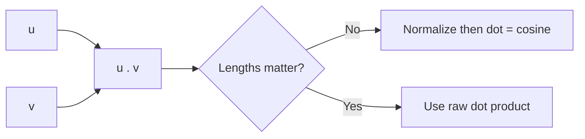

# Dot Products, Projections, and Similarity

## Beginner-Friendly Intuition

The dot product measures how much two vectors point in the same direction, weighted by their lengths. Project a vector onto another and you keep only the component aligned with that direction. Similarity scores in ML are almost always built from this idea: alignment in some learned vector space.

## Formal Explanation

`u · v = Σ u_i v_i = ||u|| ||v|| cos θ`. The projection of `v` onto `u` is `(v · u / u · u) u`. Cosine similarity is `u · v / (||u|| ||v||)`. On normalized vectors, dot product equals cosine. The dot product is linear in each argument, which is why it composes well with linear models.

**Where the projection formula comes from.** The projection is the scalar multiple of `u` that is closest to `v`. Write the projection as `α u`. The error vector `v - α u` should be perpendicular to `u`, otherwise we could shrink the error along `u`. So `(v - α u) · u = 0`, which gives `v · u = α (u · u)`, hence `α = (v · u) / (u · u)`. When `u` is unit-norm, this simplifies to `α = v · u` and the projection is `(v · u) u`. That is also the geometric content of orthogonal decomposition: `v = projection along u + component perpendicular to u`.

**Cauchy-Schwarz** says `|u · v| <= ||u|| ||v||`, with equality iff `u` and `v` are parallel. This is why cosine similarity always lies in `[-1, 1]`: dividing by `||u|| ||v||` cannot exceed 1 in magnitude. Cauchy-Schwarz also bounds the variance of linear combinations of features and underlies many proofs you see in ML theory.

## Why It Matters in Real Jobs

Retrieval, attention, recommender scoring, and contrastive losses are all dot products in disguise. Whether to normalize, what dimension to use, and whether to scale by `sqrt(d)` change quality and stability. These are not exotic choices; they show up in every embedding system.

## How It Works Step by Step

1. Normalize when length should not matter.
2. Scale by `sqrt(d)` when dimensions differ to keep variance comparable.
3. Use dot product (faster) when vectors are already normalized.
4. Project to remove a direction you do not want (debiasing embeddings).
5. Confirm the metric matches how the model was trained.

## Real-World Example

An image embedding model returns 512-dim vectors with average norm 5. A new model trained with cosine has unit norms. Mixing them in one index without re-normalizing produces wildly biased scores. Re-encoding everything with the same normalization fixes recall.

## Debiasing an Embedding by Projection

Suppose you suspect a word embedding picked up a "gender direction" `g` (the unit-norm vector roughly pointing from "she" toward "he" in embedding space). To remove that direction from a word vector `w`, subtract its projection onto `g`:

```
w_debiased = w - (w · g) g
```

Numeric example with two-dim vectors. Let `g = (1, 0)` and `w = (0.6, 0.8)`. The projection of `w` onto `g` is `(w · g) g = 0.6 * (1, 0) = (0.6, 0)`. The debiased vector is `(0.6, 0.8) - (0.6, 0) = (0, 0.8)`. The component along `g` is gone; only the orthogonal part survives. Real debiasing uses a list of word pairs to estimate `g` (Bolukbasi et al., 2016), and the same projection step removes the direction from the entire vocabulary. The technique generalizes: project out any direction you do not want a downstream model to pick up.

## Common Mistakes

- Forgetting that dot product favors longer vectors when lengths vary.
- Comparing vectors from different models without sanity-checking norms.
- Computing cosine on already-normalized vectors and paying for the extra divisions.
- Using projection without checking the projector is unit-norm.

## Interview Angle

**Question:** Why might a retrieval system using dot product perform worse than one using cosine on the same embeddings?

**Strong answer:** Dot product is sensitive to vector length. If embedding norm correlates with frequency or length, longer items dominate. Cosine removes length and ranks by direction. The fix is to normalize, or to switch to cosine. Either way, match the metric the model was trained for.

**Weak answer:** Claim they are always equivalent.

**Follow-up questions:**

- When is dot product preferred to cosine for performance?
- How do you debias an embedding by projecting out a direction?
- What does Cauchy-Schwarz tell you about dot products?
- Why do attention scores divide by `sqrt(d_k)`?

## Mini Exercise

Take 100 random vectors with varying norms. Rank them by dot product to a query and by cosine. Show the top-10 lists differ and explain why.

## Diagram



---
## Navigation

[⬅ Previous](03-matrices-and-matrix-multiplication.md) | [🏠 Home](../README.md) | [➡ Next](05-eigenvalues-eigenvectors-and-pca-intuition.md)
