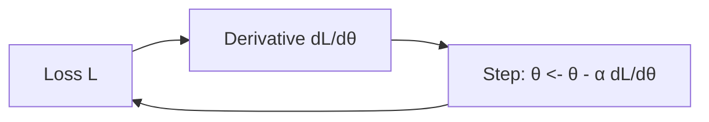

# Calculus and Derivatives

## Beginner-Friendly Intuition

A derivative tells you how a function changes when you nudge its input a little. In ML, that nudge is a small change to a parameter, and the function is the loss. If the derivative is positive, raising the parameter raises the loss; you should lower it. Gradient descent is this idea, repeated.

## Formal Explanation

For `f: R -> R`, the derivative is `f'(x) = lim h->0 (f(x+h) - f(x)) / h`. It is the slope of the tangent line. For composite functions, the chain rule gives `(f ∘ g)'(x) = f'(g(x)) g'(x)`. Common derivatives: `(x^n)' = n x^{n-1}`, `(e^x)' = e^x`, `(log x)' = 1/x`, `(sin x)' = cos x`. The second derivative tells you about curvature: positive means convex, negative means concave.

## Why It Matters in Real Jobs

Every learning algorithm uses derivatives, directly or through autograd. Understanding them lets you read training logs, design custom losses, and reason about why a particular step blows up or stalls. The chain rule is the spine of backpropagation.

## How It Works Step by Step

1. Identify the function whose value you want to minimize (the loss).
2. Compute or autograd the derivative with respect to each parameter.
3. Move each parameter in the direction that lowers the loss.
4. Pick a step size small enough not to overshoot.
5. Watch the loss curve to confirm you are decreasing.

## Real-World Example

Linear regression with squared error has a closed-form solution because its loss is a quadratic with a derivative we can solve directly. Logistic regression has no closed form because its derivative is nonlinear in parameters. Both use the same idea: set the derivative to zero or follow it down.

## Common Mistakes

- Confusing the gradient (a vector) with a single derivative.
- Forgetting the chain rule when composing functions.
- Trusting numerical derivatives without checking step size.
- Computing gradients by hand for a function autograd already handles.

## Interview Angle

**Question:** Derive the gradient of the binary cross-entropy loss with respect to the logits.

**Strong answer:** With logit `z`, prediction `p = σ(z)`, label `y in {0,1}`, the loss is `-y log p - (1-y) log(1-p)`. Using `dσ/dz = σ(1-σ) = p(1-p)` and the chain rule, the loss splits into two pieces: `dL/dp = -y/p + (1-y)/(1-p)`. Multiply by `dp/dz = p(1-p)`:

```
dL/dz = (-y/p + (1-y)/(1-p)) * p(1-p)
      = -y(1-p) + (1-y)p
      = p - y
```

The reason this is so clean is that BCE is the natural loss for a sigmoid output: BCE plus sigmoid is the canonical link from generalized linear models, and the gradient of the negative log-likelihood with respect to the natural parameter equals (predicted mean - observed value). The same algebraic miracle gives `softmax + cross-entropy` a gradient of `p - y` as well, where `y` is now a one-hot vector. Numerical stability tip: implement `BCEWithLogitsLoss` (combined sigmoid + BCE) rather than the separate pieces; the combined version uses the log-sum-exp trick to avoid overflow when logits are large in magnitude.

**Weak answer:** Confuse cross-entropy with squared error or skip the chain rule.

**Follow-up questions:**

- What does the second derivative tell you about convergence?
- What happens at points where the derivative is zero?
- How is automatic differentiation different from numerical differentiation?
- Why do ReLU networks have non-differentiable points and is that a problem?

## Mini Exercise

Pick any loss function in your code. Compute its derivative by hand for one parameter. Compare to what autograd produces.

## Debugging Custom Gradients with Finite Differences

When you implement a custom op or a custom loss, autograd will compute whatever you write, even if it is wrong. The cheapest sanity check is a finite-difference comparison. For each parameter `θ_i`, the approximate derivative is `(L(θ_i + h) - L(θ_i - h)) / (2 h)` for a small `h` (typically `1e-5` for double precision, `1e-3` for float32). Compare to your analytic or autograd gradient. The relative error `|grad_numeric - grad_analytic| / max(|grad_numeric|, |grad_analytic|, 1e-8)` should be below `1e-4` for double, `1e-2` for float32. PyTorch ships `torch.autograd.gradcheck` which runs this against your custom autograd Function. Run it once after writing the op, and again whenever you change the backward.

## Diagram



---
## Navigation

[⬅ Previous](05-eigenvalues-eigenvectors-and-pca-intuition.md) | [🏠 Home](../README.md) | [➡ Next](07-gradients-and-partial-derivatives.md)
