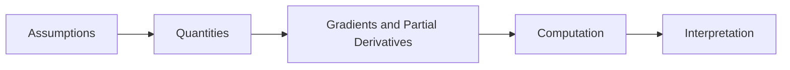

# Gradients and Partial Derivatives

## Beginner-Friendly Intuition

Gradients and Partial Derivatives is part of the larger skill of using data to make better decisions. At a beginner level,
think of it as a disciplined way to describe models with numbers, shapes, rates of change, and optimization. The concept becomes easier when you ask
three questions: what information enters the system, what transformation happens, and how do we know
the result is useful?

The practical mental model is: data comes in, assumptions shape the method, the method produces a
score, prediction, explanation, or artifact, and evaluation tells you whether to trust it. If you can
describe those pieces in plain language, you already understand the center of the topic.

## Formal Explanation

In formal ML work, gradients and partial derivatives should be described through inputs, outputs, assumptions, and an
objective. For this lesson, the core definition is: explain gradients and partial derivatives as a practical concept that connects data, model behavior, evaluation, and deployment. A rigorous explanation also names the
data distribution, the parameters or rules being learned, and the metric used to judge generalization.

Key pieces:

- Core idea: explain gradients and partial derivatives as a practical concept that connects data, model behavior, evaluation, and deployment.
- Input: the data, assumptions, or constraints that make gradients and partial derivatives meaningful.
- Learning signal: the target, objective, comparison, feedback, or evidence used to improve the system.
- Evaluation: the measurement that tells you whether the idea works outside a toy example.
- Operational boundary: the point where the concept meets latency, cost, reliability, privacy, or user trust.

## Why It Matters in Real Jobs

In real teams, this concept matters because practitioners need to debug why training is unstable, why embeddings behave oddly, and why a metric changes. Hiring managers
care less about whether you can recite terminology and more about whether you can apply it under
messy constraints: incomplete data, unclear requirements, shifting metrics, latency budgets,
stakeholder disagreement, and production failures.

When you use gradients and partial derivatives at work, you should be able to explain what can go wrong, what you would
measure first, and what simple baseline you would build before spending time on a complex system.

## How It Works Step by Step

1. Write the objects as vectors or functions.
2. Identify the quantity being optimized.
3. Track dimensions.
4. Compute the update.
5. Interpret the result geometrically.

At each step, keep a written record of assumptions. Good ML engineering is often less about one
perfect algorithm and more about reducing uncertainty in a controlled way.

## Real-World Example

A recommendation model compares user and item vectors. Dot products, norms, and gradients explain why one item ranks above another. In that setting, gradients and partial derivatives helps the team move from a vague request to a
testable system. A junior implementation might stop at a notebook metric. A production-ready
implementation also checks input quality, failure cases, monitoring, retraining triggers, and whether
the result changes the real workflow.

## Common Mistakes

- Using gradients and partial derivatives because it sounds advanced instead of because it matches the problem.
- Evaluating on data that leaks future information or duplicates training examples.
- Ignoring the baseline, which makes improvement impossible to quantify.
- Reporting a metric without explaining what user or business decision it supports.
- Memorizing the definition of gradients and partial derivatives without being able to trace the data flow.

## Interview Angle

Interviewers use gradients and partial derivatives to test whether you understand fundamentals rather than memorized
phrases.

**Question:** Explain gradients and partial derivatives to a product manager and then to a senior ML engineer.

**Strong answer:** Start with the plain-language purpose, define the inputs and outputs, mention the
main assumption, describe the metric, and discuss one failure mode.

**Weak answer:** Give only a formula or only a buzzword definition without data, evaluation, or
deployment context.

**Follow-up questions:**

- What baseline would you compare against?
- What metric would you use and why?
- How could data leakage appear here?
- What would you monitor after deployment?

## Mini Exercise

Pick a product you use every week. Write down one place where gradients and partial derivatives could appear. Define
the input data, the output, the baseline, one metric, and one failure mode. Then explain the idea in
five sentences as if your audience has never studied machine learning.

## Diagram

---
## Navigation

[⬅ Previous](06-calculus-derivatives.md) | [🏠 Home](../README.md) | [➡ Next](08-chain-rule-and-backpropagation-intuition.md)
