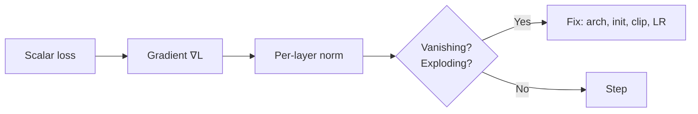

# Gradients and Partial Derivatives

## Beginner-Friendly Intuition

When the input is a vector (every parameter in your model is one slot of a big vector), the derivative becomes a vector too: the gradient. The gradient points in the direction of steepest increase. Stepping in the opposite direction is gradient descent, the workhorse of ML training.

## Formal Explanation

For `f: R^n -> R`, the partial derivative `∂f/∂x_i` measures change in `f` when only `x_i` moves. The gradient `∇f = (∂f/∂x_1, ..., ∂f/∂x_n)` stacks them into a vector. The directional derivative in unit direction `u` is `∇f · u`, maximized when `u = ∇f / ||∇f||`. For matrix-valued parameters, gradients are matrices of the same shape.

## Why It Matters in Real Jobs

Every backward pass is a gradient. Training stability, learning rate choice, and gradient clipping all depend on gradient magnitude. Vanishing or exploding gradients explain a huge fraction of training failures in deep learning.

## How It Works Step by Step

1. Confirm the loss is a scalar; gradients are taken with respect to it.
2. Use autograd to compute gradients for each parameter.
3. Inspect gradient norms across layers; large or zero norms point to problems.
4. Clip gradients when norms blow up.
5. Scale the learning rate to gradient magnitude (LR finder, warmup).

## Real-World Example

An RNN training run shows training loss not decreasing. Plotting gradient norms shows the deepest time-step gradients are near zero: vanishing gradient. Switching to LSTM with gating, or to a transformer, fixes the problem because both let gradient flow more directly.

## Common Mistakes

- Computing the gradient of the wrong scalar (e.g., sum vs mean changes scale).
- Not zeroing gradients between batches (PyTorch accumulates by default).
- Confusing parameter gradients with input gradients.
- Ignoring gradient norm when debugging training failures.
- Forgetting that some operations are non-differentiable; you may need a surrogate.

## Interview Angle

**Question:** What is the gradient and how would you debug a model that has training loss not decreasing?

**Strong answer:** The gradient is the vector of partial derivatives of the loss with respect to each parameter. To debug a stuck loss, check learning rate, gradient norms, layer-by-layer activations, and whether gradients flow back through every layer. Look for vanishing or exploding gradients, wrong loss formulation, or data issues.

**Weak answer:** Just lower the learning rate without checking the symptoms.

**Follow-up questions:**

- What is gradient clipping and when do you use it?
- Why does ReLU help with vanishing gradients?
- How is the Jacobian related to the gradient?
- What is the gradient with respect to the input used for?

## Mini Exercise

Train any deep model and log gradient norms per layer. Identify which layer has the smallest norm and explain why.

## Diagram

---
## Navigation

[⬅ Previous](06-calculus-derivatives.md) | [🏠 Home](../README.md) | [➡ Next](08-chain-rule-and-backpropagation-intuition.md)
