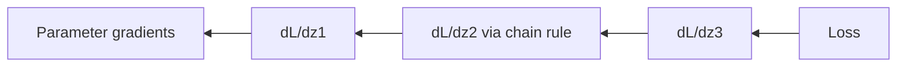

# Chain Rule and the Intuition Behind Backpropagation

## Beginner-Friendly Intuition

Backpropagation is the chain rule applied to a computational graph. Each operation in the forward pass has a known local derivative; the backward pass multiplies these together from the loss back to each parameter. You do not need to derive the whole gradient by hand; you just need to know the local derivative of each piece and let the chain rule combine them.

## Formal Explanation

For composed functions `y = f(g(x))`, `dy/dx = f'(g(x)) g'(x)`. For computational graphs, each node has a local Jacobian; the gradient with respect to any input is the product of local Jacobians along the path from output to input, summed over all paths. Reverse-mode automatic differentiation computes this in time roughly equal to the forward pass, which is why deep networks are trainable.

## Why It Matters in Real Jobs

Every modern model trains by backprop. Knowing how it works tells you why some architectures train easily (residuals keep gradients alive), why others fail (long product chains lose signal), and what to change when training stalls.

## How It Works Step by Step

1. Trace the computational graph from inputs and parameters to the loss.
2. For each op, know the local derivative (autograd handles standard ones).
3. Compute the loss in the forward pass.
4. Run the backward pass, multiplying local derivatives along edges.
5. Aggregate gradients at parameters and step.

## Real-World Example

A residual block computes `y = x + f(x)`. The gradient flowing back is `dy/dx = I + df/dx`. The identity term ensures gradient does not vanish even if `df/dx` is small. That is why ResNets train deeper than plain stacks.

## Forward vs Reverse Mode Autodiff

Both modes compute the same gradients but in different orders. Forward mode walks the graph from inputs to output, propagating tangents (small input perturbations) and computing one column of the Jacobian per pass. Cost: one forward pass per input dimension. Reverse mode walks from output back to inputs, propagating cotangents (gradients of the loss) and computing one row of the Jacobian per pass. Cost: one backward pass per output dimension. For ML, the loss is a single scalar (one output) and there are millions of parameters (many inputs), so reverse mode is dramatically cheaper: one backward pass gives every parameter's gradient. That is why every deep learning framework uses reverse mode by default.

## Non-Differentiable Ops and the Straight-Through Estimator

When a forward pass contains an op with no useful derivative (argmax, sampling from a categorical, hard rounding), the chain rule cannot pass a gradient through. The **straight-through estimator (STE)** is a workaround: pretend the op is the identity in the backward pass. Forward, you discretize. Backward, you copy the upstream gradient through unchanged. STE is biased, but it works well enough to train models with discrete latents (VQ-VAE codebooks, binary networks). For sampling, the **Gumbel-softmax** trick is a smoother alternative: replace the categorical with a temperature-controlled softmax over Gumbel-perturbed logits, recover discrete behavior as temperature goes to zero, and let autograd flow through the soft path.

## Gradient Checkpointing

Reverse-mode autodiff stores the activations of every op in the forward pass so the backward can use them. That memory cost grows linearly with depth. **Gradient checkpointing** trades compute for memory: store only a few "checkpoint" activations during the forward, and recompute the missing ones during the backward. A typical checkpoint every `sqrt(depth)` layers brings memory down by a factor of `sqrt(depth)` while adding roughly 33 percent to training time. This is what makes 1B+ parameter models trainable on a single accelerator without out-of-memory errors.

## Common Mistakes

- Believing autograd is magic; it is just the chain rule applied carefully.
- Forgetting that any non-differentiable op breaks the chain at that point.
- Computing gradients through a detached tensor and getting zeros.
- Implementing custom ops without testing the backward against numerical gradients.

## Interview Angle

**Question:** Explain how backpropagation works and why residual connections help with deep networks.

**Strong answer:** Backprop applies the chain rule on the computational graph: each node has a local derivative, and gradients of inputs are products of local derivatives along paths to the output. Residual connections add an identity path, so the gradient has an `I + ...` form. The identity keeps the gradient from vanishing even if the rest is small, which lets very deep networks train.

**Weak answer:** Recite that backprop computes gradients without explaining how.

**Follow-up questions:**

- What is reverse-mode versus forward-mode autodiff?
- Why is checkpointing useful for memory in long backward passes?
- How does layer normalization help gradient flow?
- What happens if a non-differentiable op (argmax) sits in the middle of the graph?

## Mini Exercise

Pick a small two-layer MLP. Derive the gradient of the loss with respect to the first layer weight by hand. Confirm it matches autograd.

## Diagram

---
## Navigation

[⬅ Previous](07-gradients-and-partial-derivatives.md) | [🏠 Home](../README.md) | [➡ Next](09-optimization-gradient-descent.md)
