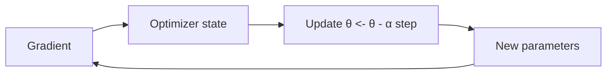

# Optimization and Gradient Descent

## Beginner-Friendly Intuition

Gradient descent is a simple loop: compute the gradient of the loss, take a small step in the opposite direction, repeat. The size of the step (learning rate) is the most important knob. Too small and you wait forever; too large and you bounce around or diverge.

## Formal Explanation

Update rule: `θ_{t+1} = θ_t - α ∇L(θ_t)`. Stochastic variants estimate `∇L` from minibatches. Momentum accumulates a velocity (`v_{t+1} = μ v_t + ∇L`, then `θ <- θ - α v`) to dampen oscillations. Adam scales each parameter by an estimate of the gradient's second moment, giving an effective adaptive learning rate per parameter. AdamW decouples weight decay from the adaptive update.

## Why It Matters in Real Jobs

Optimization choice affects whether training converges, how fast, and how well. The learning rate, schedule, batch size, optimizer, and weight decay are levers an engineer must understand. The default is rarely optimal; the LR especially needs care.

## How It Works Step by Step

1. Pick the optimizer that fits the model (Adam/AdamW for deep, SGD for some convex or large-batch regimes).
2. Find a learning rate (LR finder, warmup-then-decay schedules).
3. Tune weight decay separately from L2.
4. Watch the loss curve and gradient norms; adjust LR or schedule based on what you see.
5. Use early stopping to avoid wasting compute and overfitting.

## Real-World Example

A team trains a transformer with Adam at LR 1e-3 and the loss explodes after a few hundred steps (gradient norm spikes, then NaN). Lowering to 1e-4 with no warmup gets the loss to plateau at a high value. Adding linear warmup over 1000 steps and cosine decay to 1e-5 trains stably. Schematically, the three loss curves look like:

- LR 1e-3, no warmup: loss drops for ~500 steps, then spikes to NaN.
- LR 1e-4, no warmup: loss drops, plateaus at 3.2, refuses to improve.
- Warmup-then-cosine starting at 1e-4 peaking at 5e-4 then decaying: smooth descent to 2.1.

The model architecture did not change; only the optimizer schedule did. Warmup matters because Adam's running variance estimate is unreliable in the first few hundred steps, and a high LR during that window produces wild updates. Cosine decay matters because late training benefits from smaller steps to fine-tune around a local minimum.

## Decoupled Weight Decay (the AdamW fix)

Standard L2 regularization adds `lambda * w` to the loss, so the gradient becomes `grad + lambda * w`. With Adam, the adaptive per-parameter scaling rescales this penalty by the inverse of the second-moment estimate, so weights with large historical gradients get much less regularization than weights with small gradients. That coupling is rarely what you want; weight decay should be uniform, not gradient-dependent. **AdamW** decouples weight decay: it applies `w <- w - eta * lambda * w` as a separate step, after the Adam update. The decay is uniform and predictable. In transformer training, AdamW with `weight_decay = 0.01` to `0.1` consistently generalizes better than Adam with the same nominal `lambda` in the loss.

## Linear Scaling Rule for Batch Size and LR

When you increase batch size by `k`, the gradient becomes a more accurate estimate of the true gradient (less noise). The classical heuristic, the **linear scaling rule**, says: scale the learning rate by `k` to keep the effective update size the same. So a model that trains well at batch 256 with LR 1e-4 will often train similarly well at batch 1024 with LR 4e-4. The rule breaks at very large batch sizes (warmup over more steps becomes essential, and a square-root scaling sometimes works better above batch 8K), but it is a strong default for the typical 2x to 8x batch increase you might do when porting to a bigger GPU.

## Common Mistakes

- Using a single LR for the whole training without warmup.
- Treating Adam as 'best by default' without reasoning about generalization or memory.
- Forgetting that batch size and LR interact (large batch usually wants higher LR).
- Not clipping gradients in models prone to spikes (RNNs, transformers without normalization).
- Confusing decreasing training loss with successful learning when validation is flat.

## Interview Angle

**Question:** Compare SGD, Adam, and AdamW and when you would pick each.

**Strong answer:** SGD with momentum is simple and often generalizes well, but is sensitive to LR and batch size. Adam adapts per-parameter LR via gradient second moments and trains fast, sometimes generalizing slightly worse. AdamW separates weight decay from the adaptive update and tends to be the strongest default for transformers. Pick by training stability and what generalizes best on validation.

**Weak answer:** Default to Adam without comment, or claim one optimizer dominates always.

**Follow-up questions:**

- Why does Adam sometimes generalize worse than SGD?
- What is a learning rate schedule and why do warmup + cosine decay help?
- What is gradient accumulation and when do you need it?
- What is the relationship between batch size, LR, and training noise?

## Mini Exercise

Train a small model with three different LRs (1e-2, 1e-3, 1e-4). Plot training and validation loss. Identify which LR is too high, too low, and good, and explain why.

## Diagram

---
## Navigation

[⬅ Previous](08-chain-rule-and-backpropagation-intuition.md) | [🏠 Home](../README.md) | [➡ Next](10-convex-vs-non-convex-optimization.md)
