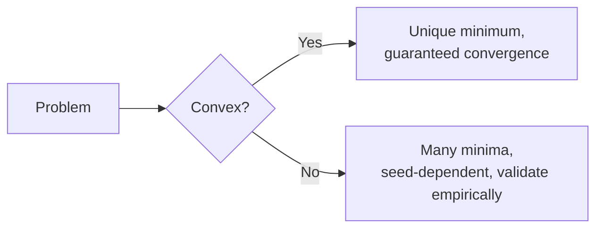

# Convex vs Non-Convex Optimization

## Beginner-Friendly Intuition

A convex loss surface is a bowl: any local minimum is the global minimum. A non-convex surface has hills, valleys, and saddle points; different starts lead to different solutions. Linear and logistic regression are convex; neural networks are not. Knowing which regime you are in changes how you optimize and how you trust the result.

## Formal Explanation

The **Hessian** of a function `f: R^n -> R` is the matrix of second partial derivatives `H[i,j] = ∂²f / ∂θ_i ∂θ_j`. It captures local curvature: how the gradient changes as you move in each direction. A symmetric matrix `H` is **positive semi-definite (PSD)** if `x^T H x >= 0` for every vector `x`, equivalently if all its eigenvalues are non-negative. Geometrically, PSD means the function curves upward (or is flat) in every direction.

A function is **convex** if its Hessian is PSD everywhere. Convex problems have a unique minimum (or a connected set of equivalent minima) and first-order methods provably converge. Non-convex problems can have many minima, saddle points (where the Hessian has both positive and negative eigenvalues, so the surface goes down in some directions and up in others), and flat regions. Deep network losses are non-convex but in practice SGD finds solutions that generalize well, partly because of implicit regularization.

## Why Initialization Matters: Preserving Variance Through Layers

Bad initialization breaks training before the optimizer can do anything useful. Two standard initializations:

- **Xavier (Glorot) initialization** for tanh and sigmoid networks: sample weights from a distribution with variance `2 / (fan_in + fan_out)`. The motivation: if you assume the input to a layer has variance 1 and you want the output to also have variance 1 (so signal does not blow up or vanish through layers), the weight variance must be `1 / fan_in` for a linear unit; averaging the forward and backward constraint gives `2 / (fan_in + fan_out)`.
- **He (Kaiming) initialization** for ReLU networks: variance `2 / fan_in`. ReLU zeros out half the activations, which halves the output variance compared to a linear unit, so the weight variance must be doubled to compensate.

The result of either choice: activations and gradients keep roughly constant variance through dozens of layers, training is stable from the first step. Wrong-scale initialization (e.g., Xavier in a ReLU network, or all weights set to 0.1) typically shows up as gradients vanishing in the first few epochs or activations saturating to zero or one.

## Saddle Points Dominate in High Dimensions

In low dimensions, intuition says training gets stuck in local minima. In high dimensions, that intuition is wrong. For a random function in `n` dimensions, the probability that all `n` Hessian eigenvalues at a critical point have the same sign drops exponentially with `n`. So almost every critical point in a deep network is a **saddle point**, not a minimum. Training does not get stuck at saddles in practice because SGD's noise pushes it off them quickly. The minima it does find are often connected by low-loss paths and are roughly equivalent in quality, which is one explanation for why different seeds give different but similarly-performing models.

## Why It Matters in Real Jobs

If the problem is convex, you can guarantee convergence and trust the solution. If non-convex, you must rely on multiple seeds, careful initialization, and good heuristics. This affects how you scope projects, how you debug, and how confident you can be in 'best' models.

## How It Works Step by Step

1. Check whether your loss is convex (linear/logistic regression with convex loss is yes; neural nets are no).
2. If convex, use deterministic optimizers (L-BFGS) on small data, SGD on large.
3. If non-convex, use SGD/Adam, multiple seeds, and good initialization (Xavier, He).
4. For non-convex, evaluate by validation and treat the optimum as approximate.
5. Use techniques like batch norm and residuals to smooth the loss landscape.

## Real-World Example

Two teams train the same neural network with different random seeds and get models with the same training loss but very different predictions on hard cases. That is non-convexity in action. Ensembling reduces variance from this; reporting only one seed hides it.

## Common Mistakes

- Trusting a single non-convex run as the 'best' model.
- Using convex optimization theory to reason about deep network training.
- Confusing convergence to a local minimum with finding the truth.
- Forgetting that initialization strongly biases where non-convex training lands.

## Interview Angle

**Question:** Why can deep networks train despite being non-convex, and what does that mean for reproducibility?

**Strong answer:** Despite the loss being non-convex, SGD finds solutions that generalize because of architectural choices (residuals, normalization), data scale, and implicit regularization from noisy gradients. For reproducibility, fix random seeds, data shuffling, and library versions, and report results across multiple seeds because two runs may differ.

**Weak answer:** Treat the local minimum as 'the' minimum or assume non-convex training is hopeless.

**Follow-up questions:**

- What is a saddle point and why is it less of a problem in high dimensions than minima?
- How does initialization affect non-convex optimization?
- Why does SGD often beat second-order methods for deep models?
- What does it mean that loss landscapes have many equally good minima?

## Mini Exercise

Train the same network with three different seeds. Compare training and validation loss. Then ensemble the three. Note the gap between best single run and ensemble.

## Diagram

---
## Navigation

[⬅ Previous](09-optimization-gradient-descent.md) | [🏠 Home](../README.md) | [➡ Next](11-information-theory-entropy-cross-entropy-kl-divergence.md)
