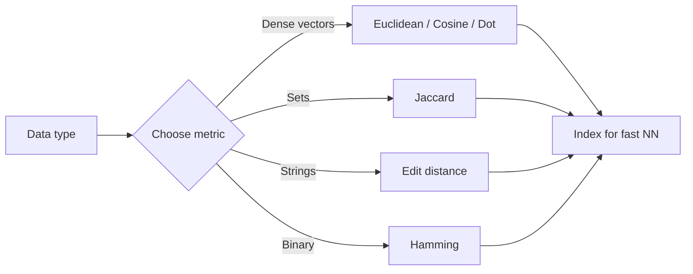

# Distance Metrics

## Beginner-Friendly Intuition

A distance metric is a way to say how different two things are. The choice changes which neighbors look closest, which clusters form, and which retrieval results win. Different geometries match different data: Euclidean for continuous features, cosine for normalized embeddings, Hamming for binary, edit distance for strings.

## Formal Explanation

Common metrics:

- **Euclidean (L2):** `||u - v||₂`.
- **Manhattan (L1):** `Σ |u_i - v_i|`.
- **Cosine distance:** `1 - cos θ = 1 - u·v / (||u|| ||v||)`.
- **Dot product (similarity):** `u · v`. Larger is closer.
- **Hamming:** number of positions where two binary strings differ.
- **Jaccard:** `|A ∩ B| / |A ∪ B|` for sets.
- **Edit distance:** minimum edits to convert one string to another.

A formal metric must be non-negative, zero iff identical, symmetric, and obey the triangle inequality. Cosine similarity is not a metric; cosine distance often almost is.

## Why It Matters in Real Jobs

Retrieval, clustering, recommenders, and many ML systems hinge on distance choice. The metric must match how features were trained or scaled, or results are misleading. Mixing metrics across models is a common production bug.

## How It Works Step by Step

1. Identify the data type: dense numeric, binary, set, sequence, embedding.
2. Pick a metric that matches that type and how the model was trained.
3. Normalize features so no single dimension dominates (or use a metric robust to scale).
4. Index for fast nearest-neighbor lookup if the data is large (HNSW, IVF-PQ).
5. Validate by spot-checking nearest neighbors on real queries.

## Real-World Example

A team builds a duplicate-detection system on text. Switching from edit distance to cosine on transformer embeddings catches paraphrases that edit distance misses. They use both: cosine for semantic similarity and edit distance for near-exact duplicates. Combining both gives the best precision and recall.

## Cosine vs Dot Product: When Scale Carries Information

The most common metric question is "do I use cosine or dot product?" Decide by what scale (norm) means in your data.

- **Use cosine when norm is noise.** Text embeddings often have norm correlated with document length or token count, which is irrelevant to meaning. Cosine ignores it. Most sentence-transformer models are trained with cosine, and inference must match.
- **Use dot product when norm carries information.** In recommender systems trained with `score = user_emb · item_emb`, the model is free to encode "this item is broadly popular" as larger norm and "this item is niche" as smaller norm. Cosine throws that signal away. Two-tower retrieval models are typically trained with dot product for exactly this reason.

Numeric example. User embedding `u = (1, 0)`. Two items: `a = (1, 0)` (popular, aligned) and `b = (5, 0)` (very popular, aligned). Cosine similarity is `1.0` for both: identical direction, no preference. Dot product is `1` and `5`: item `b` wins. If you trained with dot product, switching to cosine at retrieval flattens popularity. If you trained with cosine, switching to dot product at retrieval introduces a length bias the model never saw. Match the metric to training.

## Mahalanobis Distance in One Sentence

The Mahalanobis distance between `x` and `y` is `sqrt((x - y)^T Σ^{-1} (x - y))` where `Σ` is the covariance matrix of the data; it is Euclidean distance after whitening (rotating and rescaling so all features have unit variance and zero correlation), and it is the right metric for anomaly detection on correlated multivariate features because it down-weights movement along high-variance correlated directions and up-weights movement against the data's natural structure.

## Common Mistakes

- Using Euclidean on raw text or one-hot data without justification.
- Comparing cosine similarity scores across embedding spaces from different models.
- Forgetting that distance changes meaning when features are not scaled.
- Using a non-metric in algorithms that require triangle inequality.
- Not matching the metric to how the embedding model was trained.

## Interview Angle

**Question:** How would you choose a distance metric for a new retrieval problem?

**Strong answer:** Look at the data type and how the embedding (if any) was trained. Use cosine for normalized text embeddings, dot product when training specified it, Euclidean when geometric distance is meaningful, Hamming or Jaccard for set-like data. Validate empirically on a small holdout: are the top neighbors actually similar?

**Weak answer:** Default to Euclidean without considering the embedding training or feature scaling.

**Follow-up questions:**

- Why is L2 sensitive to feature scale and L1 less so?
- What is Mahalanobis distance and when do you want it?
- How does distance behave in high dimensions?
- When is the triangle inequality important for retrieval data structures?

## Mini Exercise

Take a small text dataset. Compute pairwise similarities with cosine on TF-IDF and on transformer embeddings. Compare the top-5 neighbors of 5 queries. Discuss the differences.

## Diagram

---
## Navigation

[⬅ Previous](11-information-theory-entropy-cross-entropy-kl-divergence.md) | [🏠 Home](../README.md) | [➡ Next](../statistics/01-probability-basics.md)
