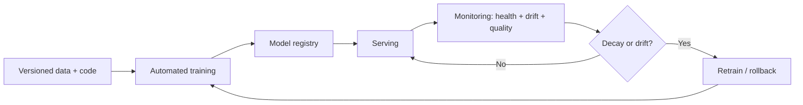

# What Is MLOps

## Beginner-Friendly Intuition

MLOps is everything that keeps a model useful after the notebook. Training a good model is one thing;
deploying it, serving predictions reliably, noticing when it degrades, and retraining it safely is another.
MLOps is the engineering discipline (tools and practices) that makes the whole model lifecycle repeatable
and trustworthy, the way DevOps does for software, but with the extra twist that data and models change.

## Formal Explanation

MLOps applies software-engineering rigor to the machine-learning lifecycle: versioning data, code, and
models; tracking experiments; automating training and deployment (CI/CD); serving predictions; and
monitoring for drift and decay. The extra challenge over DevOps is that ML systems depend on data, which
shifts over time, so a model that was correct can silently become wrong without any code change. MLOps adds
the controls (monitoring, retraining triggers, rollback) that handle this.

## Why It Matters in Real Jobs

Most production ML incidents are not modeling failures; they are lifecycle failures: a model that decayed
unnoticed, a result nobody could reproduce, or features computed differently in training and serving. MLOps
is what prevents these. As soon as a model serves real users, the question shifts from "is it accurate" to
"can we reproduce, monitor, and recover it", and that is MLOps.

## How It Works Step by Step

1. **Version** data, features, code, and models so any run is reproducible.
2. **Automate** training and deployment with tested pipelines (CI/CD).
3. **Serve** predictions in the right mode (batch, online, streaming).
4. **Monitor** operational health, drift, and quality.
5. **Retrain and roll back** safely via triggers, gates, and a registry.

## Real-World Example

A fraud model ships and works well. Three months later its catch rate has quietly dropped and chargebacks
rose, but nobody noticed because there was no drift monitoring. With MLOps in place, drift alerts would have
fired, the model would roll back to a registered prior version in minutes, and a retrain would trigger
automatically. The difference between a silent multi-month failure and a same-day recovery is MLOps.

## Common Mistakes

- Treating deployment as the finish line, with no monitoring.
- Shipping from a notebook with no versioning, so nothing is reproducible.
- Ignoring data drift until users or finance notice the decay.
- Computing features differently in training and serving.

## Production Concerns

SLOs and error budgets translate ML systems into operations
language. Pick 2-3 user-facing SLIs (prediction-availability,
latency p95, accuracy on a labeled stream); set a target (e.g., 99
percent of predictions return within budget); the gap between target
and reality is the error budget that allows risk-taking. Retraining
triggers are a policy decision: scheduled (every N days), drift-
based (PSI threshold), performance-based (AUC drop). Each trigger
has a latency expectation: detection-to-deployed-fix should fit in a
documented window (4 hours for high-stakes, 1 week for low-stakes).
Rollback SLA matters: P1 rollback in 5 minutes, P2 in 30. Without a
documented SLA, rollback turns into an ad-hoc emergency every time.
Cost is an SLI too: cost per prediction has a target; alerts fire on
overrun.

## Interview Angle

**Question:** What is MLOps and why is it different from DevOps?

**Strong answer:** It applies engineering rigor to the ML lifecycle: versioning, automation, serving,
monitoring, and safe retraining. The added challenge over DevOps is that models depend on shifting data, so
a correct model can decay silently, requiring drift monitoring and retraining controls.

**Weak answer:** "MLOps is deploying machine learning models."

**Follow-up questions:**

- Why can a model degrade with no code change?
- What do you version in an ML system?
- What catches a silent model failure?

## Mini Exercise

For a model you can imagine in production, list one thing you would version, one thing you would monitor,
and what would trigger a retrain.

## Diagram

---
## Navigation

[⬅ Previous](../recommender-systems/08-recommender-system-case-study.md) | [🏠 Home](../README.md) | [➡ Next](02-reproducibility.md)
