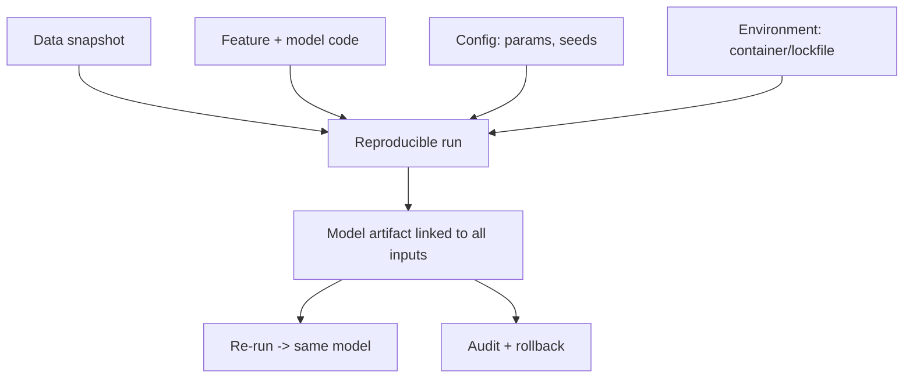

# Reproducibility

## Beginner-Friendly Intuition

Reproducibility means you can run the same training again and get the same model, and you can trace any
prediction back to exactly the data, code, and config that produced it. If a model behaves strangely and you
cannot recreate how it was built, you cannot debug it or trust it. Reproducibility is the foundation that
makes every other MLOps practice possible.

## Formal Explanation

A reproducible ML run pins every input: the exact data snapshot, the feature code, the model code, the
hyperparameters, the library versions, and the random seeds. Given those, re-running produces the same (or
statistically equivalent) model. Sources of non-reproducibility include unversioned data, nondeterministic
operations, unpinned dependencies, and hidden environment differences. Reproducibility is what lets you
audit a model, compare experiments fairly, and roll back to a known-good build.

## Why It Matters in Real Jobs

When a model in production gives a surprising result, the first question is "how was this built?" Without
reproducibility there is no answer, and no way to roll back to a trustworthy version. Regulated domains
require it for audit. It also prevents the demoralizing "it worked last week and we cannot recreate it"
situation that stalls teams. Reproducibility turns ML from artisanal to engineered.

## How It Works Step by Step

1. **Version the data:** snapshot or hash the exact dataset used.
2. **Version the code:** commit feature and model code together.
3. **Pin configuration:** hyperparameters, seeds, and library versions.
4. **Capture the environment:** container or lockfile for dependencies.
5. **Record the link:** tie each model artifact to its data, code, and config.

## Real-World Example

An auditor asks how a loan-decision model was trained six months ago. Because the team pinned the data
snapshot, committed the code, and stored the config and environment with the model artifact, they recreate
the exact model and show the training data and parameters. A team without reproducibility would be unable to
answer, which in a regulated setting is a serious problem, not just an inconvenience.

## Common Mistakes

- Training on a live table that changes, so the data is not snapshotted.
- Not pinning library versions or random seeds.
- Storing a model with no link to the data and code that made it.
- Assuming "the code is in git" is enough without data and environment.

## Production Concerns

Automated reproducibility tests catch decay early: a CI job retrains
the production model from its pinned inputs and compares the new
artifact against the registered one (weight diff or eval-metric
diff). Drift beyond tolerance fails the build. At scale, exact
reproducibility is rarely achievable; what matters is statistical
equivalence on the eval set. Document the tolerance and test
against it. Dependency drift is silent: a transitive library bump
can change tokenizer behavior or numerical precision. Lockfiles
plus container hash pinning plus a periodic re-build catch this.
Hardware drift (different GPU generations) introduces small numeric
differences; for high-stakes systems, pin the hardware too. Auditors
appreciate one-command reproduction: a script that takes a model
version and re-trains end-to-end is the gold standard.

## Interview Angle

**Question:** What makes an ML training run reproducible?

**Strong answer:** Pinning every input: a versioned data snapshot, committed feature and model code, fixed
hyperparameters and seeds, and a captured environment, all linked to the model artifact. Then re-running
reproduces the model and any prediction is traceable.

**Weak answer:** "Keep the code in version control."

**Follow-up questions:**

- Why is versioning code not enough?
- What are common sources of non-reproducibility?
- How does reproducibility enable rollback and audit?

## Mini Exercise

List the five things you would pin to reproduce a training run, and name one source of non-reproducibility
you would have to control.

## Diagram

---
## Navigation

[⬅ Previous](01-what-is-mlops.md) | [🏠 Home](../README.md) | [➡ Next](03-data-versioning.md)
