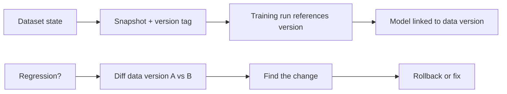

# Data Versioning

## Beginner-Friendly Intuition

Code has git; data needs the same thing. Data versioning means you can point to the exact dataset a model
was trained on, even months later, and recover it. Because data changes constantly (rows added, definitions
edited, sources updated), a model trained "on the customer table" is meaningless unless you can say which
version of that table. Data versioning gives data a commit history.

## Formal Explanation

Data versioning tracks immutable snapshots of datasets, identified by a hash or version tag, so a training
run references a specific frozen state. Tools like DVC, lakeFS, or Delta Lake handle this for large data by
versioning metadata and pointers rather than copying everything. Versioning covers raw data, processed
features, and labels. It enables reproducibility (recreate the exact training set), debugging (diff what
changed between two model versions), and rollback (retrain on a prior data state).

## Why It Matters in Real Jobs

Most "the model got worse and we do not know why" mysteries are data changes: a schema edit, a backfill, a
shifted label definition. Without data versioning you cannot diff the data between a good model and a bad
one. With it, you compare snapshots and find the culprit. It is also required to reproduce and audit any
model, and to retrain safely on a known data state.

## How It Works Step by Step

1. **Snapshot** each dataset state with a version tag or hash.
2. **Reference** the specific version in every training run.
3. **Version features and labels,** not just raw data.
4. **Diff** versions to investigate what changed between models.
5. **Roll back** to a prior data version when a new one causes regressions.

## Real-World Example

A demand model degrades after a routine data pipeline update. The team diffs the current data version
against the one behind the last good model and finds a unit change (liters to gallons) introduced by an
upstream backfill. Because both data states were versioned, the diff took minutes. Without versioning, they
would have been guessing across the entire pipeline.

## Common Mistakes

- Training on mutable live tables with no snapshot.
- Versioning raw data but not the engineered features or labels.
- Copying full datasets instead of using metadata-based versioning at scale.
- No way to diff data between two model versions.

## Interview Angle

**Question:** Why and how do you version data in ML?

**Strong answer:** Because data changes and a model is meaningless without the exact dataset state. I
snapshot datasets (including features and labels) with version tags, reference them in training runs, and
diff versions to debug regressions and enable rollback. Tools like DVC version pointers, not full copies.

**Weak answer:** "Save a copy of the CSV somewhere."

**Follow-up questions:**

- How do you version terabytes of data efficiently?
- How does data versioning help debug a regression?
- What besides raw data should be versioned?

## Mini Exercise

Describe how you would investigate "the model got worse this week" using data versioning. What would you
diff, and what kind of change might you find?

## Diagram

---
## Navigation

[⬅ Previous](02-reproducibility.md) | [🏠 Home](../README.md) | [➡ Next](04-experiment-tracking.md)
