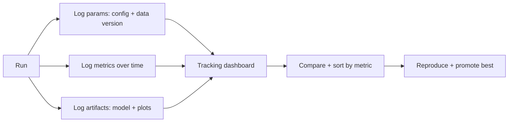

# Experiment Tracking

## Beginner-Friendly Intuition

Training models is a lot of trial and error: different features, hyperparameters, and architectures.
Experiment tracking records each run, what you changed, and what score you got, so you can compare them and
remember which one was best. Without it, you end up with a folder of mystery model files and no idea which
produced the good result. With it, every experiment is a searchable, comparable record.

## Formal Explanation

An experiment tracking system logs, for each run: parameters (hyperparameters, feature set, data version),
metrics (accuracy, loss, AUC over training), artifacts (the model, plots), and metadata (code version,
timestamp, environment). Tools like MLflow or Weights and Biases store these and provide dashboards to
compare runs, sort by metric, and reproduce the best. Tracking turns model development from ad hoc into a
systematic, comparable process and links directly to reproducibility.

## Why It Matters in Real Jobs

Teams run hundreds of experiments; memory and spreadsheets do not scale. Experiment tracking answers "which
configuration gave the best validation AUC, and can we reproduce it?" instantly. It prevents lost results,
enables fair comparison, and provides the record needed to promote a model to production with confidence. It
is the difference between systematic improvement and random tinkering.

## How It Works Step by Step

1. **Log parameters:** hyperparameters, feature set, and data version per run.
2. **Log metrics:** track training and validation metrics over time.
3. **Log artifacts:** the model file, plots, and evaluation outputs.
4. **Compare runs:** sort and filter by metric in a dashboard.
5. **Promote the best:** reproduce and register the winning run.

## Real-World Example

A team tries 40 feature and hyperparameter combinations over a week. With experiment tracking, they sort all
runs by validation AUC, see that run 27 won, and read exactly which features and parameters it used, then
reproduce and promote it. A team relying on filenames and memory would struggle to identify the best run or
recreate it, and might ship a worse model by mistake.

## Common Mistakes

- Not logging the data version, so a run cannot be reproduced.
- Tracking only the final metric, not the configuration that produced it.
- Comparing runs by memory or spreadsheet instead of a system.
- Logging metrics but not the model artifact.

## Interview Angle

**Question:** Why use an experiment tracking tool?

**Strong answer:** To record each run's parameters, metrics, and artifacts so experiments are comparable and
reproducible. It answers which configuration won and lets you reproduce and promote it, replacing memory and
spreadsheets with a systematic record.

**Weak answer:** "To save the model files."

**Follow-up questions:**

- What should you log per run?
- How does tracking support reproducibility?
- How do you decide which run to promote?

## Mini Exercise

For a tuning sweep you might run, list the parameters, metrics, and artifacts you would log per run, and how
you would pick the run to promote.

## Diagram

---
## Navigation

[⬅ Previous](03-data-versioning.md) | [🏠 Home](../README.md) | [➡ Next](05-feature-stores.md)
