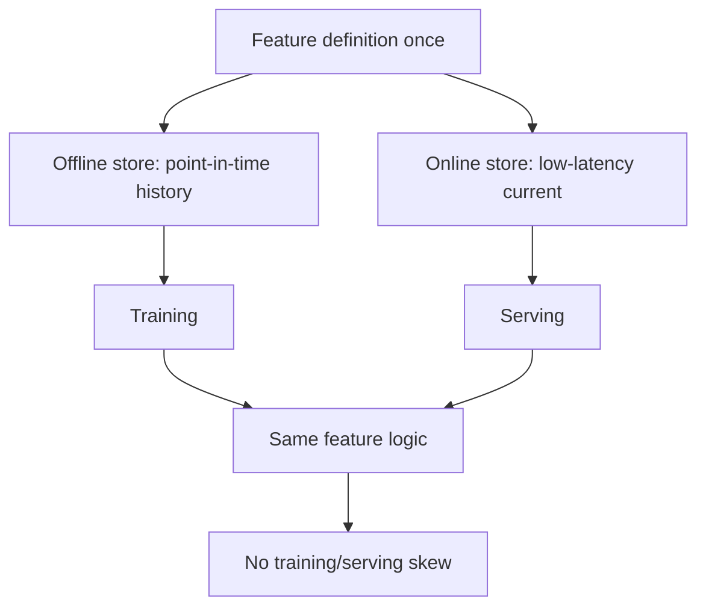

# Feature Stores

## Beginner-Friendly Intuition

A feature store is a central place to define, compute, and serve features so that training and serving use
exactly the same logic. The classic bug it prevents: a feature computed one way in your training notebook
and a slightly different way in the production service, so the model sees different inputs live than it
trained on. The feature store makes "the average order value over 30 days" mean one thing everywhere.

## Formal Explanation

A feature store has two synchronized paths: an offline store (historical feature values for training,
point-in-time correct to avoid leakage) and an online store (low-latency current feature values for serving).
Features are defined once and materialized to both. This solves training/serving skew (same logic both
places), enables feature reuse across teams and models, and supports point-in-time joins so training never
sees future data. Examples include Feast and managed cloud feature stores.

## Why It Matters in Real Jobs

Training/serving skew is one of the most common and damaging production ML bugs: the model performs well
offline and poorly live because its inputs differ. A feature store eliminates this by construction. It also
prevents teams from re-implementing the same features inconsistently and supports correct point-in-time
training that avoids leakage. For organizations with many models, it is a major reliability and productivity
gain.

## How It Works Step by Step

1. **Define a feature once** with its computation logic.
2. **Materialize offline:** point-in-time-correct historical values for training.
3. **Materialize online:** fresh values in a low-latency store for serving.
4. **Serve consistently:** training and inference read the same feature logic.
5. **Reuse and govern:** share features across models with documentation and ownership.

## Real-World Example

A recommendation model performs worse online than offline. The cause: the offline pipeline computed "items
viewed last 7 days" inclusively while the online service computed it slightly differently. After moving the
feature into a feature store, training and serving use identical logic and the gap disappears. The store also
lets a new fraud model reuse the same user-activity features without reimplementing them.

## Common Mistakes

- Computing features separately for training and serving (skew).
- Ignoring point-in-time correctness, leaking future data into training.
- Building a feature store when a couple of simple models would not benefit (overkill).
- No ownership or documentation, so shared features become a mystery.

## Interview Angle

**Question:** What problem does a feature store solve?

**Strong answer:** Training/serving skew, by defining features once and serving the same logic to both an
offline store (point-in-time-correct training) and an online store (low-latency serving). It also enables
reuse and prevents leakage.

**Weak answer:** "A database for features."

**Follow-up questions:**

- What is training/serving skew and why is it dangerous?
- What is point-in-time correctness?
- When is a feature store overkill?

## Mini Exercise

Describe a feature that could be computed differently in training and serving, and explain how a feature
store would guarantee they match.

## Diagram

---
## Navigation

[⬅ Previous](04-experiment-tracking.md) | [🏠 Home](../README.md) | [➡ Next](06-model-registries.md)
