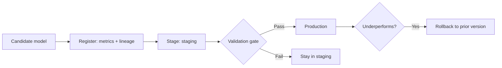

# Model Registries

## Beginner-Friendly Intuition

A model registry is the catalog of your trained models: every version, its metrics, its stage (staging,
production, archived), and a link to how it was built. It is how you know which model is live, promote a new
one through a gate, and roll back instantly if the new one misbehaves. Without it, "which model is in
production?" becomes a dangerous guessing game.

## Formal Explanation

A model registry stores versioned model artifacts with metadata: training metrics, the data and code
versions that produced them, and a lifecycle stage. It supports controlled transitions (promote from staging
to production only after a validation gate), provides a single source of truth for what is deployed, and
enables one-step rollback to a previous version. Tools like MLflow Model Registry or cloud equivalents
integrate with serving so deployment references a registry version, not a loose file.

## Why It Matters in Real Jobs

When a new model underperforms in production, you need to roll back immediately to a known-good version. A
registry makes that a single action. It also enforces that only validated models reach production (via stage
gates), and it answers audit questions about what is deployed and how it was built. It is the control point
between experimentation and production.

## How It Works Step by Step

1. **Register** each candidate model with its metrics and lineage.
2. **Stage:** mark versions as staging, production, or archived.
3. **Gate promotion:** require validation checks before moving to production.
4. **Deploy by reference:** serving points at the production registry version.
5. **Roll back:** repoint serving to the previous version in one step.

## Real-World Example

A team promotes a new ranking model to production, but online metrics dip within an hour. Because serving
references the registry, they roll back to the previous production version with one action while they
investigate. Later, an auditor asks which model handled requests last quarter; the registry shows the exact
version, its metrics, and the data and code that built it. Both the recovery and the audit were trivial
because of the registry.

## Common Mistakes

- Deploying loose model files with no version control or lineage.
- No validation gate before promoting to production.
- No defined rollback path when a new model fails.
- Losing the link between a registered model and its training data and code.

## Interview Angle

**Question:** What does a model registry give you?

**Strong answer:** A versioned source of truth for models with stages and lineage, a validation gate before
production promotion, and one-step rollback. Serving references a registry version, so deployment and
recovery are controlled rather than ad hoc.

**Weak answer:** "A place to store models."

**Follow-up questions:**

- How does a registry enable rollback?
- What gate would you require before production promotion?
- What lineage should a registered model carry?

## Mini Exercise

Describe the lifecycle of a model from candidate to production to rollback using a registry, naming the gate
and the rollback action.

## Diagram

---
## Navigation

[⬅ Previous](05-feature-stores.md) | [🏠 Home](../README.md) | [➡ Next](07-model-serving.md)
