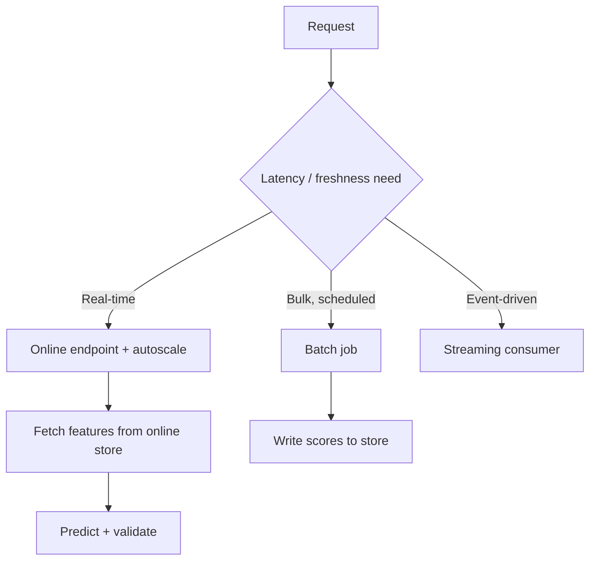

# Model Serving

## Beginner-Friendly Intuition

Model serving is how a trained model actually answers requests in production. A model file on disk does
nothing; serving wraps it so applications can send inputs and get predictions, reliably and fast. The main
choices are how predictions are delivered (a live API, a scheduled batch job, or a stream) and how you keep
that endpoint fast, scalable, and healthy under real traffic.

## Formal Explanation

Serving exposes a model for inference. Online serving runs the model behind a low-latency endpoint (REST or
gRPC) that scales with traffic, for use cases needing fresh, per-request predictions. Batch serving scores
large datasets on a schedule and writes results to a store. Concerns include latency (p95), throughput,
autoscaling, the feature lookup path (often from an online feature store), versioning (which model is live),
and graceful degradation. The serving layer must match the application's latency and freshness needs.

## Why It Matters in Real Jobs

A model is only valuable when it serves predictions where they are needed, within the latency the product
allows. Serving choices drive cost and user experience: an over-engineered real-time endpoint for a job that
could run nightly wastes money; an under-provisioned endpoint fails under load. Serving is also where
training/serving skew, version mistakes, and latency problems surface, so it is a frequent source of
incidents and interview questions.

## How It Works Step by Step

1. **Pick a mode:** online endpoint, batch job, or streaming, based on latency and freshness needs.
2. **Wrap the model:** load it behind an API or job with input validation.
3. **Fetch features:** from the online feature store for consistency.
4. **Scale:** autoscale the endpoint to meet throughput and p95 targets.
5. **Version and degrade gracefully:** reference the registry, and handle failures safely.

## Real-World Example

A recommendation endpoint must respond in under 50 ms at p95 for live page loads, so it runs online with
precomputed user embeddings fetched from the feature store and autoscaling behind a load balancer. A churn
score, by contrast, is only needed daily for a campaign, so it runs as a nightly batch job writing scores to
a table. Matching the serving mode to the need keeps both fast and cost-effective.

## Common Mistakes

- Building a real-time endpoint for a job that could be a nightly batch.
- Ignoring p95 latency and autoscaling until the endpoint falls over.
- Computing features in the serving path differently than in training.
- No graceful degradation when the model or a dependency fails.

## Interview Angle

**Question:** How would you serve this model?

**Strong answer:** Match the mode to the need: online endpoint for low-latency per-request predictions,
batch for scheduled bulk scoring. I would fetch features from the online store for consistency, autoscale to
the p95 target, reference the registry for versioning, and degrade gracefully on failure.

**Weak answer:** "Put the model behind an API," with no latency, feature, or mode reasoning.

**Follow-up questions:**

- When is batch serving better than online?
- How do you hit a strict latency budget?
- How do you avoid training/serving skew in the serving path?

## Mini Exercise

For two use cases you can imagine (one latency-sensitive, one not), choose a serving mode for each and
justify it with the latency and freshness needs.

## Diagram

---
## Navigation

[⬅ Previous](06-model-registries.md) | [🏠 Home](../README.md) | [➡ Next](08-batch-vs-online-inference.md)
