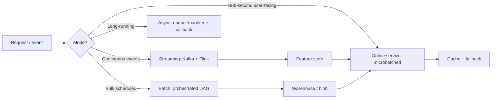

# Batch vs Online Inference

## Beginner-Friendly Intuition

Batch and online inference are the two fundamental serving modes for
ML models. Batch processes large groups of inputs on a schedule;
online responds to one request at a time as it arrives. The frame
that matters: serving mode is a product decision, not a technical
preference. Get it wrong and you either pay 100x in cost or miss the
SLA by orders of magnitude.

The intuition: a fraud-scoring service that returns a decision in 50
ms is online. A nightly job that re-scores 10 million users for an
email campaign is batch. A recommendation system that pre-computes
top items every hour and serves them from a cache is hybrid (batch
training-and-precompute, online serving).

This file covers the decision criteria, the operational characteristics
of each mode, the hybrid patterns that show up in practice, and the
SLA / scaling concerns that drive the choice.

## Formal Explanation

### Defining the modes

- **Batch inference.** Inputs accumulated; processed together on a
  schedule (hourly, daily) or on demand. High throughput, latency
  measured in minutes to hours, cost optimized by hardware
  utilization (large GPU jobs, off-peak compute).
- **Online inference.** Each request processed as it arrives.
  Latency measured in milliseconds; throughput measured in
  queries per second; SLA is the contract.
- **Streaming inference.** A continuous flow of events, processed
  with low latency but as a stream rather than per-request.
  Used for telemetry, anomaly detection, real-time
  personalization. Sits between batch and online.
- **Asynchronous inference.** Request submitted, work queued, result
  returned via callback or polling. For long-running inference
  (large generation, video) where blocking the user is unacceptable
  but synchronous online is too expensive.
- **Microbatching.** Online infrastructure that groups arriving
  requests into small batches (e.g., 10-50ms window) before sending
  to the GPU. The user-facing API is online; the internal compute
  is batched. The standard pattern for LLM serving.

### Decision criteria

Pick the mode by these axes:

- **Latency requirement.** Sub-second user-visible response =
  online. Batch is fine when the consumer can wait minutes to
  hours. Asynchronous fits in between.
- **Freshness requirement.** A recommendation that should reflect
  the user's last click within seconds = online or streaming. A
  weekly engagement segment = batch.
- **Throughput.** Millions of inputs per day at predictable times =
  batch. Spiky variable load with low average but high peak =
  online with autoscaling.
- **Cost sensitivity.** Batch utilizes hardware fully; per-prediction
  cost is far lower. Online pays for idle capacity for SLA
  reliability.
- **Input availability.** If the input is not known until the
  user requests, online. If you can pre-compute against a
  user table, batch.

### Operational characteristics

**Batch.**

- **Job orchestration.** Airflow, Dagster, Argo, Kubeflow Pipelines.
  DAGs with retries, alerting, dependencies.
- **Compute.** Large jobs on shared clusters; autoscaling Spark or
  Dask; spot/preemptible instances acceptable because retries are
  cheap.
- **Output.** Written to a durable store (warehouse, feature store,
  blob storage); downstream consumers read.
- **Failure mode.** Job failure = stale outputs; alert and retry.
- **Backfill.** Re-running over historical data is straightforward;
  the same job, different time window.
- **Cost model.** Spend dominated by the periodic compute job; tune
  hardware and cadence for cost.

**Online.**

- **Service.** Stateless prediction service behind a load balancer.
  Health checks, autoscaling, multi-region for resilience.
- **Latency budget.** End-to-end SLA decomposed: network, queue,
  preprocessing, model, postprocessing. Each component has a
  budget. p50, p95, p99 tracked.
- **Capacity.** Provisioned for peak; autoscaling to handle bursts;
  reserved capacity for SLA guarantees.
- **Failure mode.** Outage = user-facing error; circuit breakers,
  fallbacks, retries.
- **Cost model.** Spend dominated by idle capacity for tail
  reliability; per-request cost higher than batch.

**Streaming.**

- **Pipeline.** Kafka / Pub/Sub / Kinesis ingest; Flink / Spark
  Streaming / custom consumer; output to a state store or
  downstream service.
- **Latency budget.** Seconds to minutes; lower than batch, higher
  than online.
- **Failure mode.** Backpressure, lag, message loss. Monitoring on
  consumer lag is essential.
- **State management.** Stateful operators (windowed aggregates,
  joins) require checkpointing.

**Asynchronous online.**

- **Pattern.** Submit -> queue -> worker -> result store -> callback
  / poll. Often used for LLM long-form generation, video
  processing, large document analysis.
- **Latency.** Often 10s of seconds to minutes, sometimes hours.
- **Failure mode.** Stuck jobs, lost callbacks. Idempotency on
  submit is essential.

### Hybrid patterns

Most production systems blend modes:

- **Batch + cache.** Pre-compute predictions in batch; cache for
  online lookup. Recommendation systems, search ranking.
- **Online with batch fallback.** Online serves the freshest
  prediction when available; batch fills in for tail users.
- **Streaming + online.** Streaming updates a feature store
  continuously; online uses the freshest features at request time.
- **Online + asynchronous.** Online for fast paths; async for
  long-running work.

The right pattern depends on freshness, latency, and cost.

### LLM serving specifics

LLMs add wrinkles:

- **Microbatching is essential.** Per-token throughput on a GPU
  scales with batch size; serving one request at a time wastes
  90+ percent of the GPU.
- **Continuous batching / iteration-level batching.** Mid-flight
  batching of variable-length sequences; vLLM, TensorRT-LLM,
  inference servers like Triton.
- **KV-cache memory.** The dominant memory consumer for long
  contexts; batch size limited by KV memory, not compute.
- **Prefill vs decode.** Prefill is compute-bound; decode is
  memory-bandwidth-bound. Different scaling profiles; some teams
  separate prefill and decode pools.
- **Streaming generation.** Even for "online", responses stream
  token-by-token; TTFT (time-to-first-token) is the user-facing
  latency, not full-response latency.

### Cost comparison (illustrative)

For a typical classifier scoring 10 million records:

- **Batch.** $10-50 in compute on a few GPUs for an hour. Per-
  prediction cost ~$1e-6 to $1e-5.
- **Online.** $500-5000/month for the always-on service plus
  per-request cost. Per-prediction cost 10-100x higher.

The 100x cost ratio is the rule of thumb: prefer batch when
freshness allows it.

### Failover and graceful degradation

Both modes need plans:

- **Batch failure.** Last-good output served; alert; rerun.
- **Online failure.** Cached fallback (last-good prediction);
  default rule (e.g., score = 0.5); reduced-quality fallback model;
  upstream queue for retry.
- **Mode switching.** Some products fall back from online to a
  batch-cached prediction during incidents.

## Why It Matters in Real Jobs

Three production reasons. First, **the cost difference is dramatic**.
A team that defaults to online for a use case that batch would
serve pays 10-100x more than necessary. Second, **the SLA
implications are different**. Online SLAs are user-facing and
contractual; batch SLAs are internal and forgiving. Choosing the
right mode determines what monitoring matters. Third, **mixing
modes wrong creates silent bugs**. A feature pipeline batched
nightly while features are served online from a stale cache leads
to training-serving skew that takes weeks to diagnose.

## How It Works Step by Step

1. **Define the SLA.** User-facing latency, throughput, freshness.
2. **Estimate volumes.** QPS at peak; daily input count; growth
   curve.
3. **Pick the mode.** Online for sub-second user-facing; batch for
   bulk/scheduled; streaming for continuous events; async for
   long-running.
4. **Design the contract.** Inputs, outputs, freshness guarantee,
   error contract.
5. **Build the pipeline.** Orchestration for batch; service for
   online; consumer for streaming.
6. **Monitor.** Latency p95/p99, throughput, error rate, freshness,
   cost per prediction.
7. **Plan for failure.** Fallback, cached degradation, alerting.
8. **Iterate.** Mode can change as the product evolves.

## Real-World Example

A team builds a fraud-scoring service for a payment platform.

Decision tree:

- **Latency.** Sub-second decision required (the payment is held
  pending the score). Online.
- **Volume.** 5K QPS at peak; 80M predictions/day.
- **Freshness.** Features must reflect the user's activity in the
  last few minutes. Online plus a streaming feature pipeline.

Architecture:

- **Online inference service.** Behind a load balancer, autoscaling
  on QPS. p50 35ms, p95 80ms, p99 120ms. SLA: 99 percent of
  requests under 150 ms.
- **Streaming feature pipeline.** Kafka consumes payment events;
  Flink updates per-user aggregates; written to an online feature
  store with sub-second freshness.
- **Batch retraining.** Daily job retrains the model on the last 90
  days of data; deployed via canary the next morning.
- **Asynchronous secondary scoring.** For payments flagged as
  borderline, an async deeper-model scoring runs in 10s and
  triggers a manual review queue.
- **Fallback.** If the online service fails, the system falls back
  to a simpler rule-based score; payments still process, with a
  flag that triggers offline review.

Cost: $30K/month for online infrastructure plus $5K/month for the
batch retraining job. The team considered serving from a batch-
predicted score table refreshed every 5 minutes; rejected because
freshness must be sub-minute (a fraudulent user can rack up
hundreds of fraud attempts in 5 minutes).

## Common Mistakes

- Defaulting to online for everything. Cost spirals.
- Defaulting to batch for things that need freshness. Stale
  predictions miss the use case.
- No microbatching for LLM serving. GPU utilization 5-10 percent;
  cost 10x what it should be.
- No fallback path for online. Outage = user-facing error.
- No backfill plan for batch. Historical re-runs are scary.
- Streaming without consumer-lag monitoring. Lag accumulates
  invisibly until predictions are hours stale.
- Mixing modes without consistency contract. Training-serving skew.
- Capacity planned for average, not peak. Online drops requests at
  the moment of greatest need.
- Async without idempotency. Duplicate requests cause duplicate
  side effects.
- Batch run as cron without orchestration. Failures unnoticed for
  hours.

## Interview Angle

**Question:** You are designing a recommendation system. Should it
serve predictions online or batch? Walk through the decision.

**Strong answer:** The answer depends on freshness, latency,
volume, and cost; the right system is usually hybrid.

**Step 1: define the SLA.** Time-to-first-recommendation: is it
sub-second user-facing (online required) or asynchronous (batch
acceptable)? Freshness: must the recommendation reflect the user's
last action within seconds (online or streaming) or is hourly
freshness fine (batch precompute)?

**Step 2: volume and shape.** How many users, how many items, how
often is each user scored? If 100 million users scored once per day,
batch is far cheaper. If each user scored on every page load with
contextual features, online is the only option.

**Step 3: feature shape.** Some features change slowly (user
demographics) and can be batched. Some change fast (last item viewed)
and must be served online. The hybrid pattern: batch the slow
features into a daily snapshot; stream the fast features into an
online store; combine at inference time.

**Step 4: pick the mode.**

- **Pure batch.** Precompute top-K per user nightly; serve from a
  cache. Freshness 24 hours; cheap; works for slow-changing
  recommendations.
- **Pure online.** Compute on each request; freshest; expensive at
  scale.
- **Hybrid.** Precompute candidate set in batch (top 1K per user);
  rerank online with fresh features and context (top 10 from the
  1K). Best of both: cheap retrieval, fresh ranking.
- **Streaming-augmented.** Streaming pipeline updates the feature
  store with recent activity; online reranker uses the fresh
  features.

**Step 5: design the failure modes.** Online reranker outage =>
serve the precomputed top-10 (degraded but not broken). Batch job
failure => yesterday's precompute still serves. Streaming lag =>
online sees stale features but continues; lag alert.

**Step 6: estimate cost.** Per-prediction cost online vs batch:
typically 50-100x. The hybrid pattern keeps online cost contained
while delivering freshness.

**Step 7: monitor.** Online: p95/p99 latency, error rate, QPS.
Batch: job duration, output freshness, success rate. Streaming:
consumer lag, throughput. End-to-end: prediction freshness,
cache hit rate, fallback rate.

**Step 8: iterate.** As the product matures, the mix shifts. New
features may push online; cost pressure may push batch.

The senior instinct: **hybrid is the answer for most production
recommendation systems**. Pure online is too expensive at scale;
pure batch is too stale for engagement. Decompose the problem into
the slow path (batch / precompute) and the fresh path (online /
streaming) and combine.

**Weak answer:** "Use online so it's fresh." Misses cost; misses
the hybrid pattern; loses the interview.

**Follow-up questions:**

- What is microbatching and why does it matter for LLM serving?
- How would you design fallback for an online inference outage?
- What is training-serving skew?
- How does asynchronous inference fit?

## Mini Exercise

Pick an ML feature you have used. Identify the inference mode. Now
imagine the freshness requirement doubles or halves; describe how
the architecture would change.

## Diagram

---
## Navigation

[⬅ Previous](07-model-serving.md) | [🏠 Home](../README.md) | [➡ Next](09-monitoring-drift-and-alerting.md)
