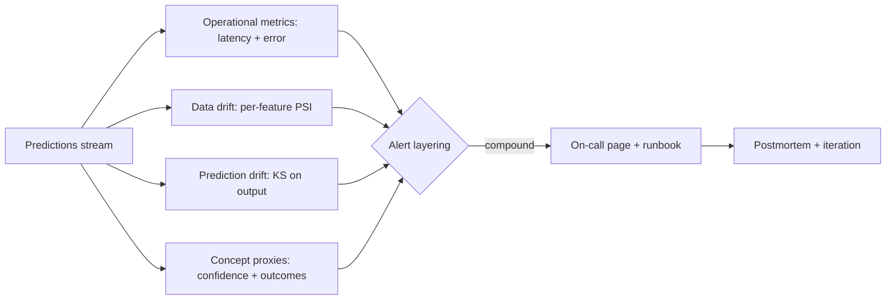

# Monitoring Drift and Alerting

## Beginner-Friendly Intuition

ML systems silently degrade. The model that scored 0.92 AUC at
launch may score 0.78 six months later because the world changed,
not because the code did. Monitoring drift and alerting is the
discipline of detecting that degradation early, distinguishing
real drift from noise, and routing alerts to a human who can act.
The team that does not monitor drift learns about it from
customer complaints; the team that does catches it within days.

The intuition: classical software monitoring (CPU, memory, error
rate) catches when the system is broken. ML monitoring catches when
the system is wrong while still appearing healthy. The model is
returning predictions, the API is responding, but the predictions
are no longer trustworthy. New monitoring categories are needed.

This file covers the drift taxonomy, the statistical tests that
detect each kind, alert design that avoids both noise and missed
incidents, and the runbooks that turn an alert into a remediation.

## Formal Explanation

### Drift taxonomy

Three kinds of drift, often layered:

- **Data drift (covariate shift).** The distribution of inputs
  changes. New users with different demographics; a partner sends
  different data; an upstream pipeline changes. Model still produces
  predictions but the inputs are out-of-distribution.
- **Prediction drift.** The distribution of model outputs changes.
  Could be caused by data drift, a model bug, or a change in
  upstream features.
- **Concept drift (label drift).** The relationship between inputs
  and outputs changes. Users who looked like fraud last year are
  legitimate now (or vice versa). The hardest to detect because
  fresh labels are slow.

Each requires a different signal. Data drift is detected on inputs;
prediction drift on outputs; concept drift requires fresh labels
or proxies (user feedback, downstream outcomes).

### Statistical tests for drift

- **PSI (Population Stability Index).** Per-feature; bins the
  feature, compares train vs production distribution. Standard
  thresholds: <0.1 stable, 0.1-0.25 monitor, >0.25 significant
  drift. The most common in industry.
- **KL divergence.** Information-theoretic distance between
  distributions. Sensitive but harder to interpret.
- **Kolmogorov-Smirnov test.** Continuous variables; tests
  cumulative distribution functions. Statistical significance plus
  effect size.
- **Chi-squared.** Categorical variables.
- **Wasserstein / Earth Mover's distance.** Continuous; less
  sensitive to bin choice; good for ordered features.
- **Maximum Mean Discrepancy (MMD).** Multivariate; tests joint
  distribution rather than per-feature.

The right test depends on the feature type and the team's
analytical preference. PSI is widely used because its thresholds
are well-calibrated by industry experience.

### Detecting concept drift without labels

Labels are slow (fraud labels take weeks; loan default takes years).
Proxy signals:

- **Prediction confidence shift.** The model is less confident on
  new data; calibration drifts.
- **Disagreement with a reference model.** A simple, stable
  reference model disagrees with the production model more
  often. Disagreement rate is a drift signal.
- **User-feedback signals.** Thumbs-down rate, edit rate, refund
  rate, churn-after-prediction.
- **Downstream outcome shift.** Conversion rate of recommended
  items changes.

These are noisier than direct label-based monitoring; they trigger
investigation rather than instant rollback.

### Operational metrics vs ML metrics

Distinguish two layers:

- **Operational.** Throughput, p50/p95/p99 latency, error rate,
  saturation, cost per prediction. The classical SRE layer.
- **ML quality.** Accuracy, precision, recall, AUC, fairness
  metrics, calibration. Requires labels or proxies.
- **Drift.** PSI per feature, prediction drift, concept drift
  proxies.
- **Business.** Conversion, revenue per prediction, retention.

Each layer has its own dashboards, thresholds, and alert
recipients. Ops alerts go to SRE on-call; ML quality alerts go to
the model owner; business alerts go to product. Routing matters.

### Alert design

A good alert design avoids two failure modes: alert fatigue (too
many noisy alerts ignored) and missed incidents (real problems
unalerted).

- **Threshold calibration.** Set thresholds based on historical
  variance, not arbitrary numbers. p95 latency over 200 ms is
  meaningless without baseline; threshold should be 2-3 standard
  deviations above the trailing 7-day median.
- **Hold-down windows.** A spike for 30 seconds is noise; sustained
  for 5 minutes is real. Alert only after the window.
- **Compound conditions.** PSI > 0.25 alone is noisy; PSI > 0.25
  AND prediction drift AND error-rate uptick is high-confidence.
- **Severity tiers.** P1 wakes someone up at 3 a.m.; P2 emails the
  on-call; P3 creates a ticket for triage. Calibrate by impact.
- **Escalation paths.** Alert to first responder, escalate after
  N minutes if unacknowledged.
- **Runbook link.** Every alert points to a runbook. No alert
  fires without a documented response.

### Drift response runbook

Standard structure:

- **What just happened.** Specific feature(s), magnitude, time
  window.
- **Possible causes.** Upstream pipeline change, partner data
  format change, real-world shift, instrumentation bug.
- **Diagnostic steps.** Check upstream pipeline, check feature
  ingestion, look at distribution shape, check downstream metrics.
- **Decision tree.** Per cause, the action: fix the pipeline,
  request the partner fix, retrain the model, accept the new
  baseline.
- **Communication.** Who to notify (data owners, downstream
  consumers, customer if SLA-impacting).
- **Closure.** What evidence indicates the issue resolved; how to
  re-verify.

Without runbooks, every alert becomes an investigation; with them,
common cases close in minutes.

### Sampling and aggregation

Volume is a constraint. Approaches:

- **Sample for drift detection.** PSI on a 1 percent sample is
  usually sufficient; full population is wasteful.
- **Aggregation windows.** 1-hour windows for fast drift; 24-hour
  for slow.
- **Per-segment monitoring.** Drift on one segment can hide in
  the aggregate. Monitor key segments separately.

### Logging the right things

For drift detection, log:

- **Inputs.** All input features (or a sufficient sample).
- **Predictions.** Per-prediction; full distribution available.
- **Confidence / probability.** Uncalibrated and calibrated.
- **Feature provenance.** Which version of which feature pipeline
  produced this input.
- **Model version.** For comparing across versions.
- **Timestamp.** Every event.
- **Outcome (when available).** For concept drift detection.

PII redaction applies; sensitive features may need hashing or
exclusion from logged samples.

### Incident response and on-call

Drift incidents need an on-call rotation:

- **Coverage.** Who is paged for ML alerts? Often a DRI (directly
  responsible individual) per model.
- **SLA.** Acknowledgement time, response time, resolution time per
  severity.
- **Postmortem.** Every P1 gets a postmortem; root cause; action
  items; prevention.
- **Drills.** Periodic injected drift to verify the system catches
  it and the on-call responds.

## Why It Matters in Real Jobs

Three production reasons. First, **silent degradation is the most
common production ML failure mode**. The model is healthy by
classical SRE metrics but predicting badly. Without ML-specific
monitoring, the team learns from the business KPI moving the wrong
direction weeks later. Second, **drift is regulated for some
systems**. SR 11-7 requires ongoing monitoring; EU AI Act post-
market monitoring is mandatory for high-risk systems. The team that
operates monitoring satisfies the regulator; the team that does not
fails the audit. Third, **drift response separates teams**. A team
with runbooks closes drift alerts in 30 minutes; a team without
spends days investigating each.

## How It Works Step by Step

1. **Identify drift surfaces.** Per feature; predictions; outcomes.
2. **Pick statistical tests.** PSI for tabular; KS for continuous;
   chi-squared for categorical; MMD for joint.
3. **Set baselines.** Train-time distribution as reference;
   refresh on retraining.
4. **Set thresholds.** Calibrated to historical variance and
   business tolerance.
5. **Compute on a schedule.** Hourly or daily on samples.
6. **Layer alerts.** Single signal = monitor; compound = page.
7. **Write runbooks.** Per known cause.
8. **Operate the on-call.** Coverage, SLAs, postmortems.
9. **Iterate.** Add drift surfaces, refine thresholds, update
   runbooks from postmortems.

## Real-World Example

A team operates a churn-prediction model for a SaaS product.

Monitoring stack:

- **Operational.** Latency p95, error rate, throughput. Standard
  SRE stack.
- **Drift.** PSI per feature daily; prediction drift (KS on output
  distribution) hourly; concept drift via 30-day-lookback churn
  rate vs predicted churn rate.
- **ML quality.** AUC measured weekly on a labeled holdout (the
  delay is acceptable for this use case); per-segment AUC tracked.
- **Business.** Cancellation rate, revenue retention.

Runbooks:

- **PSI > 0.25 on one feature.** Check upstream pipeline; verify
  schema; check partner data format; examine top-K shifted
  buckets.
- **Prediction drift > threshold.** Check feature drift; check
  for upstream pipeline change; check for model deployment
  mismatch.
- **AUC drop > 2 points week-over-week.** Trigger retraining;
  investigate per-segment to find the affected cohort.

A real incident: PSI on the "days since last login" feature
jumped from 0.05 to 0.41 over a weekend. The runbook directed
investigation: the upstream pipeline had changed time zones during
a database migration, shifting the feature distribution. Fix:
correct the time zone in the pipeline; backfill 48 hours of
predictions. Total incident time: 90 minutes including postmortem.
Without the alert, the team would have noticed in 2-3 weeks via
declining model performance.

## Common Mistakes

- Only operational monitoring. ML degradation invisible.
- PSI threshold copy-pasted without calibration. Either alert
  fatigue or missed incidents.
- Drift on inputs but not outputs. Prediction drift missed.
- No concept-drift proxy. Slow degradation accumulates.
- No baseline refresh on retraining. Drift against an old
  reference; alerts misfire.
- Alerts without runbooks. Every alert is an investigation.
- No on-call ownership. Alerts unanswered.
- Per-feature monitoring without segments. Group-specific drift
  hidden in the aggregate.
- No drill program. Monitoring untested in real conditions.
- Drift treated as "rebuild the model". Sometimes the right answer
  is fix the pipeline; the runbook should distinguish.

## Interview Angle

**Question:** Design a monitoring and alerting system for a
production ML model that has been silently degrading.

**Strong answer:** Start with the drift taxonomy and instrument
each layer.

**Step 1: instrument the layers.**

- **Operational.** Latency p50/p95/p99, error rate, throughput,
  saturation. Standard SRE stack; the model owner does not need
  to design this from scratch.
- **Data drift.** Per-feature PSI computed daily on a sample
  against the training distribution. Threshold calibrated:
  initial 0.1/0.25, refined by historical variance.
- **Prediction drift.** Output distribution KS test against the
  training-time predictions, daily.
- **Concept drift proxies.** Confidence shift, agreement with a
  stable reference model, downstream outcome rate.
- **ML quality.** Where labels are available, accuracy / AUC /
  precision-recall on a sliding window.
- **Business.** The downstream metric the model is supposed to
  influence.

**Step 2: layer alerts.**

- **Single signal.** Monitor only; appears on dashboards.
- **Two signals together.** Drift + prediction shift, or drift +
  business metric move. Page the on-call.
- **Three signals together.** Page the senior on-call; treat as
  P1; engage incident response.

**Step 3: thresholds.** Calibrated to historical variance and
business tolerance. Two-week baseline; alert at 2-3 standard
deviations above the trailing median; tightening for high-stakes
systems. Hold-down windows to avoid spike noise.

**Step 4: runbooks.** Per known failure mode:

- Upstream pipeline change.
- Partner data format change.
- Real-world distribution shift.
- Instrumentation bug.

Each has diagnostics, action, communication, closure criteria.

**Step 5: on-call rotation.** DRI per model. Acknowledgement SLA
(15 min for P1, 1 hour for P2). Resolution SLA (4 hours for P1,
24 hours for P2). Postmortem for every P1.

**Step 6: drills.** Inject drift periodically (a synthetic feature
shift) to verify the system catches it and the on-call responds.

**Step 7: iterate.** Add drift surfaces from postmortems. Tighten
thresholds when noise reduced. Loosen when alerts fatigue.

**Specific to silent degradation.** The hardest case is the model
that looks fine on operational metrics but drifts on data and
predictions. The fix is the data-and-prediction drift layer; if
that layer is missing, the team is blind.

The senior instinct: **the monitoring stack is the production
contract**. Without ML-specific monitoring on top of operational,
the team is operating blind on the dimension that matters most.

**Weak answer:** "Track accuracy." Misses drift, severity layering,
runbooks, on-call.

**Follow-up questions:**

- What is PSI and how do you set thresholds?
- How do you detect concept drift when labels are slow?
- How do you avoid alert fatigue?
- What goes in a drift runbook?

## Mini Exercise

Pick an ML feature you understand. Identify three drift surfaces
to monitor. Specify the test, the threshold, and the runbook
action for each.

## Diagram

---
## Navigation

[⬅ Previous](08-batch-vs-online-inference.md) | [🏠 Home](../README.md) | [➡ Next](10-ci-cd-for-ml.md)
