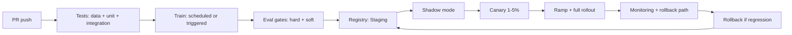

# CI CD for ML

## Beginner-Friendly Intuition

CI/CD for ML extends classical software CI/CD with three new pieces:
the data, the training pipeline, and the model artifact. The frame
that matters: every push triggers tests for code and data; every
trained model goes through validation gates; every deployment is
staged (shadow, canary, full) with a hard rollback path. The team
that runs this loop ships model updates weekly without incidents.
The team that does not ships once a quarter and rolls back half the
time.

The intuition: in classical software, a green build means "code is
correct enough to ship". In ML, "ship" means a different version of
a model is live. The tests must cover code, data, model, and
end-to-end integration; the deployment must be progressive because
no offline test fully predicts online behavior.

This file covers the ML-specific tests, the validation gates that
gate model promotion, the staged-rollout patterns (shadow, canary,
blue-green), and the artifact lifecycle that ties them together.

## Formal Explanation

### Pipelines as code

Three pipelines that need to be in version control:

- **Training pipeline.** Data pull, preprocessing, feature
  engineering, training, evaluation, registration. Reproducible:
  same code + same data inputs => same model.
- **Inference pipeline.** Model loading, preprocessing,
  prediction, postprocessing, response. Tested in CI like any
  service.
- **Deployment pipeline.** Build, validate, deploy, promote,
  rollback. The orchestrator that moves a registered model into
  production.

Each pipeline is code (Airflow DAG, Kubeflow Pipeline, GitHub
Actions workflow, dbt project, etc.); changes go through PR review
and tests like any other code.

### Tests for ML

Classical software tests still apply. Three additional categories:

- **Data tests.** Schema (column names, types), range checks
  (numeric bounds, allowed categories), null rates, duplicate
  rates, distribution checks (PSI vs reference). Run on every
  data refresh; block if violated.
- **Model tests.** Regression on a frozen test set; per-segment
  performance; fairness metrics; calibration; specific behavior
  tests ("the model returns positive on this canonical positive
  case"). Run on every trained model; block promotion if violated.
- **Integration tests.** End-to-end on a small subset; the full
  inference path including preprocessing, model, postprocessing.
  Run on every deployment.

Test pyramid: many cheap data and unit tests; fewer slow model
tests; smallest end-to-end integration tests.

### Validation gates

Before a trained model is registered or promoted:

- **Hard gates.** Block promotion. Examples: regression on a
  critical metric, fairness disparity over threshold, calibration
  error over threshold, feature schema mismatch.
- **Soft gates.** Require human approval. Examples: minor metric
  drop, increased latency, new failure mode in a per-segment test.
- **Pass.** Auto-promote (with optional human ack for production
  systems).

Gates are enforced by the model registry: a model in "Staging"
state can be promoted to "Production" only if gates pass. The state
machine is auditable; every transition has a recorded decision.

### Artifact promotion

A trained model flows through states:

- **Trained.** Just produced; eval results attached.
- **Staging.** Validation gates passed; ready for shadow / canary.
- **Canary.** Live traffic at 1-5 percent.
- **Production.** Full traffic.
- **Deprecated.** Retained for rollback; not serving.
- **Retired.** Removed after the rollback window.

Promotion requires gate passes and (for high-stakes) human approval.
Rollback is a state transition the other direction, with the same
auditability.

### Deployment strategies

Three patterns, often combined:

- **Blue-green.** Two identical environments; one serves; the
  other is the new candidate. Switch the load balancer to flip.
  Fast rollback by flipping back. Cost: 2x infrastructure.
- **Canary.** New version receives a small fraction (1-5 percent)
  of traffic; monitor; ramp to 100 percent gradually. Cheaper than
  blue-green; slower rollback (drain canary traffic first).
- **Shadow / dark launch.** New version receives traffic in
  parallel; outputs are not user-visible; metrics collected. The
  safest way to validate a new model on real traffic; no user
  exposure.
- **Feature-flag.** New model gated by a flag; toggle per user,
  per segment, or globally. Most flexible; requires the toggle
  infrastructure.

Sequence for a high-stakes model: shadow -> canary -> ramp ->
full rollout.

### Rollback design

Every deployment has a rollback plan. Components:

- **Trigger.** Manual or automatic. Automatic on critical metric
  regression; manual on subjective issues.
- **Mechanism.** Flip the load balancer, redeploy the previous
  version, toggle the feature flag.
- **SLA.** P1 rollback in 5 minutes; P2 in 30; P3 in 4 hours.
- **Practice.** Periodic drill: rollback to the previous version,
  verify, redeploy. Without practice, the rollback path
  bit-rots.

### Data pipeline CI

Often forgotten. The training data pipeline needs:

- **Schema validation.** New data conforms to expected schema.
- **Distribution check.** New data does not deviate from
  reference.
- **Sample test.** Run a small training job on a sample to verify
  end-to-end.
- **Reproducibility.** Same data + same code = same trained model.
  Important for audit.
- **Lineage.** Data version recorded with the model artifact.

A change to the data pipeline triggers a re-validation of any
model trained on it; the change cannot ship to training without
passing.

### Continuous training (CT)

Beyond CI/CD, some teams add continuous training: scheduled
retraining triggered by drift, performance regression, or calendar.
Components:

- **Trigger.** Drift threshold, performance regression, calendar.
- **Pipeline.** Same as ad-hoc training; idempotent and
  observable.
- **Promotion gate.** Same as manual training; the new model must
  pass.
- **Approval.** Auto for routine retraining; manual for
  significant changes (architecture, feature set).

CT is what makes a model durable in a non-stationary world; without
it, every retrain is a project.

### LLM and prompt CI/CD

Specific to LLM systems:

- **Prompt tests.** Eval set runs on every prompt change; gate on
  faithfulness / answer relevance / structured output validity.
- **Model upgrade tests.** Vendor model version change runs the
  same eval; canary in production.
- **Cost tracking.** Per-test cost; budget alerts.

The eval harness is the test suite; CI runs it on every PR. See
[../production-ai/10-evaluation-driven-development.md](../production-ai/10-evaluation-driven-development.md).

## Why It Matters in Real Jobs

Three production reasons. First, **the cost of a bad model in
production is high**. Without staged rollout and rollback, a
regression takes hours to detect and longer to revert; users see
the bad version. Second, **velocity matters**. Teams that ship
weekly get more iterations than teams that ship quarterly. Velocity
without safety means breakage; safety without velocity means
falling behind. CI/CD gives both. Third, **regulatory frameworks
require change management**. SR 11-7, EU AI Act each require
documented change procedures. CI/CD is the implementation of
change management for ML systems.

## How It Works Step by Step

1. **Pipeline as code.** Training, inference, deployment.
2. **Tests at three levels.** Data, model, integration.
3. **Validation gates.** Hard and soft, calibrated to risk.
4. **Artifact registry.** State machine for promotion.
5. **Staged rollout.** Shadow -> canary -> ramp -> full.
6. **Rollback plan.** Trigger, mechanism, SLA, drill.
7. **Continuous training.** Where applicable; same gates.
8. **Operate.** Monitoring on every deployment; postmortems on
   incidents.
9. **Iterate.** Tests added from incidents; gates refined.

## Real-World Example

A team operates a recommendation model retrained weekly.

Pipeline:

- **PR check.** Code, data tests, model tests on a frozen subset
  of the eval set. Pre-merge gate; 10-minute target run time.
- **Weekly training.** Airflow DAG: data pull, preprocessing,
  training, evaluation, registration. Auto-runs Sunday 02:00.
- **Validation gates.** Hard gate: NDCG drop > 1 percent; per-
  segment regression > 2 percent; fairness disparity > threshold.
  Soft gate: any single segment minor regression. Pass: auto-promote
  to Staging.
- **Shadow mode.** Monday: new model serves shadow traffic
  alongside production. 24 hours of comparison.
- **Canary.** Tuesday: 5 percent of traffic on the new model.
  Monitored 48 hours.
- **Ramp.** Thursday: 25 percent. Friday: 100 percent if metrics
  hold.
- **Old version retained for 30 days.** Rollback path: feature flag
  flips back to the previous version; SLA 5 minutes.

A real rollback: month 4, Tuesday afternoon, the canary showed a
0.8-point CTR drop on a high-volume segment. Auto-trigger flipped
the flag; canary terminated; investigation found a bug in the
feature pipeline that affected this segment. Bug fix, retrain, redo
the rollout cadence the next week. Total impact: 20 minutes of 5
percent traffic on a slightly degraded model. Without the canary
gate, the bug would have hit 100 percent traffic the next day.

## Common Mistakes

- Pipelines hand-run; not in code. Reproducibility broken.
- Data tests missing. Bad data trains bad models.
- No staging environment. First production traffic = first
  validation.
- Validation gates absent. Bad models promoted.
- Rollback path untested. First rollback fails when it matters.
- Shadow mode skipped because "we have offline eval". Online-
  offline gap missed.
- Canary too short. Slow regressions miss the canary window.
- No artifact lineage. Cannot trace which data/code produced this
  model.
- Old versions deleted too soon. Rollback impossible.
- LLM prompt changes shipped without eval. Silent regression.
- Continuous training without gates. Bad data pipelines auto-
  promote bad models.

## Interview Angle

**Question:** Design CI/CD for an ML model that retrains weekly
and serves online traffic.

**Strong answer:** ML CI/CD is classical CI/CD plus data, model,
and staged-deployment layers.

**Step 1: pipelines as code.** Training, inference, deployment.
Version controlled. PR-reviewed. Testable.

**Step 2: tests at three levels.**

- **Data.** Schema validation, range checks, null rates,
  distribution PSI vs reference. Run on every data refresh; block
  if violated.
- **Model.** Regression on a frozen test set; per-segment
  performance; fairness; calibration; behavior tests. Run on every
  trained model; block promotion if violated.
- **Integration.** End-to-end including preprocessing, model,
  postprocessing. Run on every deployment.
- **Pyramid.** Many cheap; fewer expensive; smallest end-to-end.

**Step 3: validation gates.**

- **Hard gates.** Block promotion. Critical-metric regression;
  fairness threshold; schema mismatch.
- **Soft gates.** Require approval. Minor regressions; new failure
  modes.
- **Pass.** Auto-promote.

The model registry enforces the gates; state machine for
promotion is auditable.

**Step 4: staged rollout.**

- **Shadow.** New model serves alongside; outputs not user-visible;
  metrics compared. 24 hours typical.
- **Canary.** 1-5 percent of traffic; monitored 24-48 hours.
- **Ramp.** 25 percent, 50 percent, 100 percent over days.
- **Old version retained.** 30 days minimum for rollback.

**Step 5: rollback design.** Trigger (auto on critical regression;
manual on subjective issues). Mechanism (feature flag flip, load
balancer, redeploy). SLA (P1 = 5 min). Drill periodically.

**Step 6: continuous training.** Weekly retrain on the same DAG;
same gates. Material changes (architecture, feature set) require
manual review; routine retrain auto-promotes.

**Step 7: monitoring during rollout.**

- **Operational.** Latency, error rate, throughput.
- **Quality.** Per-segment metrics on the canary slice.
- **Drift.** Input and prediction distribution.
- **Business.** Conversion, retention proxies.

**Step 8: artifact lineage.** Every model artifact records: code
version, data version, training-config version, eval results, gate
decisions, deployer. Audit-ready.

**Step 9: rollback drills.** Quarterly: rollback to the previous
version on staging; verify the path. Without drills, the path
bit-rots.

**Specifics for ML.**

- **Reproducibility is a requirement.** Same code + same data =
  same model. Often falls down on Python version, GPU
  nondeterminism, library updates.
- **Continuous training without gates is dangerous.** Bad data
  silently produces bad models that auto-promote.
- **Online-offline gap is real.** Shadow mode is essential before
  canary; canary is essential before full.
- **Old versions matter.** Rollback to a tested artifact is far
  safer than rolling forward with a fix under time pressure.

The senior instinct: **CI/CD for ML is the production contract**.
Without it, model updates are manual events; with it, model
updates are routine. The team that operates the contract ships
weekly safely.

**Weak answer:** "Run tests and deploy." Misses data tests, model
tests, validation gates, staged rollout, rollback. Misses what
makes ML deployment different from web deployment.

**Follow-up questions:**

- What is the difference between blue-green and canary?
- How do you test a model in CI?
- What is shadow mode and when do you use it?
- How do you handle a continuous-training pipeline?

## Mini Exercise

Pick an ML system you have used. Sketch the CI/CD: tests at each
layer, validation gates, staged rollout, rollback. Identify the
weakest link.

## Diagram

---
## Navigation

[⬅ Previous](09-monitoring-drift-and-alerting.md) | [🏠 Home](../README.md) | [➡ Next](11-model-governance.md)
