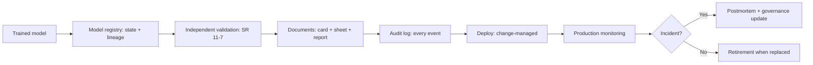

# Model Governance

## Beginner-Friendly Intuition

Model governance is the operational layer that tracks every model
from training through retirement, ensuring it has documentation,
lineage, validation evidence, and a clear owner. The frame that
matters: every model in production has a paper trail. Who built it,
on what data, validated by whom, deployed when, performing how,
retired when. The team that operates this can answer any regulator
question in hours; the team that does not faces months of forensic
work.

The intuition: classical software has source control (git history)
and deployment logs. ML systems need analogous artifacts plus the
data lineage and the model artifact lineage. Model governance is
the discipline of producing and operating those artifacts so the
organization can answer "what is running, why, and is it
acceptable?" at any time.

This file covers the model registry, model cards, lineage tracking,
audit trails, change management, model risk management (SR 11-7),
compliance evidence, and model retirement. Each is engineering
plus process plus documentation.

## Formal Explanation

### The model registry

The single source of truth for trained models. Records per model:

- **Identity.** Name, version, type, intended use.
- **Lineage.** Code version (commit hash), data version (data
  snapshot ID), training config (hyperparameters, environment),
  trainer (CI run, person).
- **Evaluation.** Metrics on the eval set; per-segment; fairness
  analysis; calibration.
- **State.** Trained / Staging / Canary / Production / Deprecated /
  Retired.
- **Approvals.** Who approved each state transition; when.
- **Deployment history.** Where and when each version served traffic.
- **Production performance.** Live metrics; drift; incidents.
- **Documents.** Model card; data sheet; validation report;
  postmortems.

Tools: MLflow Model Registry, Vertex AI Model Registry, SageMaker
Model Registry, custom-built. The choice matters less than the
discipline.

### Model cards

A standardized public-or-customer-facing document. See
[../ethics-safety/06-responsible-ai.md](../ethics-safety/06-responsible-ai.md)
for the full structure. Sections cover model details, intended use,
factors, metrics, evaluation data, training data, quantitative
analyses, ethical considerations, caveats. Versioned alongside
the model.

### Lineage

Data and model lineage, end-to-end:

- **Data lineage.** Each training data record traces to its
  source, transformations, and version.
- **Feature lineage.** Each feature traces to its computation
  pipeline, code version, and source data.
- **Model lineage.** Each model traces to code, data, config.
- **Prediction lineage.** Each prediction traces to model version,
  feature versions, input.

Lineage is the answer to "why does this prediction look this way?"
For high-stakes systems (credit, healthcare, employment), lineage
is mandatory: a regulator may ask why a specific decision was made
about a specific person.

### Audit trails

Immutable logs of every governance-relevant event:

- **Training.** Who trained, what code, what data, what result.
- **Evaluation.** What gates ran, what was the verdict.
- **Promotion.** Who approved, what state transition, when.
- **Deployment.** When deployed, when promoted, when rolled back.
- **Prediction.** Per-prediction (sampled if necessary), input,
  output, model version, timestamp.
- **Incident.** What happened, root cause, remediation.

Retention per regulation: typically 5-7 years for financial,
indefinite for some healthcare. Logs themselves access-controlled;
log access logged.

### Change management

A structured process for introducing changes:

- **Change classification.** Material vs minor.
  - **Material.** New architecture, new feature, new training
    data source, regulatory-classified change. Triggers full
    validation.
  - **Minor.** Routine retrain on same data, hyperparameter
    tweak. Abbreviated review.
- **Approval workflow.** Per change class, the required reviewers
  (engineering, validation, governance, compliance).
- **Documentation.** Each change recorded: what changed, why,
  impact assessment, validation evidence, approver.
- **Rollback plan.** Per change.
- **Communication.** Affected stakeholders notified.

The change log is itself an audit artifact.

### Model risk management (SR 11-7)

Banking framework, but the structure influences other regulated
industries. Three lines of defense:

- **First line.** Builders. Design, train, document, deploy.
- **Second line.** Independent validators. Effective challenge:
  conceptual soundness, ongoing monitoring, outcomes analysis.
  Cannot be the same team that built the model.
- **Third line.** Internal audit. Independent assurance that the
  first two lines operate effectively.

Validation activities:

- **Conceptual soundness.** Is the model approach right for the
  problem? Are the assumptions valid? Are the limitations
  documented?
- **Ongoing monitoring.** Performance and drift over time.
- **Outcomes analysis.** Do model decisions match real outcomes?

The validation report is itself a governance artifact, retained
for the regulatory window.

### Compliance evidence

Different regulations require different evidence:

- **EU AI Act.** Technical documentation, conformity assessment,
  registration in the EU database, post-market monitoring records,
  incident reports for high-risk systems.
- **SR 11-7.** Validation report, ongoing monitoring records,
  governance committee minutes.
- **GDPR.** DPIA, data subject request handling records, breach
  notifications.
- **HIPAA.** Risk analysis, BAA records, audit logs.
- **ISO 42001.** Management system evidence; internal audit
  records; corrective action records.

The evidence package is assembled before the audit; building it
on demand takes weeks. Continuous documentation is the alternative.

### Retirement

Every model eventually retires. Process:

- **Decision.** Replaced, deprecated, sunset for business reasons,
  retired due to risk.
- **Successor.** Identified; transition plan.
- **Communication.** Affected users, customers, regulators.
- **Decommissioning.** Stop serving; archive artifacts; preserve
  audit logs per retention policy; delete training data per
  retention policy.
- **Documentation.** Retirement reason, date, successor.

A model whose retirement is undocumented is a governance gap;
auditors can ask about every model that ever ran.

### Vendor models

Foundation models, embedding services, third-party APIs all need
governance:

- **Vendor due diligence.** Security, privacy, performance.
- **Contract.** SLA, DPA, BAA where required, sub-processor list.
- **Lineage.** Which version of the vendor model is in use; when
  it last changed.
- **Evaluation.** Same gates as in-house models.
- **Termination plan.** What happens if the vendor changes terms.

The buyer's governance includes the supplier's governance. A
vendor model upgrade without re-validation is a change that should
have triggered the change-management process.

### LLM and prompt governance

Prompts, eval sets, guardrail classifiers are all governance
artifacts:

- **Prompt versioning.** Every prompt change tracked; eval
  results recorded; rollback available.
- **Eval set versioning.** The eval set is part of the contract.
- **Guardrail versioning.** Classifier versions tracked.
- **Token-cost tracking.** Per model, per feature, per customer.

Prompt drift over time is a governance issue: the prompt that
worked at launch may not work after model upgrades.

## Why It Matters in Real Jobs

Three production reasons. First, **regulators expect it**.
SR 11-7, EU AI Act, GDPR each require traceable evidence. Audit
without governance is a months-long forensic project; audit with
governance is a 48-hour evidence hand-off. Second, **incident
response depends on it**. When a model produces a bad outcome, the
team must answer: which version was running, on what data, why, and
who approved. Without lineage and audit, the postmortem is
guesswork. Third, **scale demands it**. A team with 10 models can
hold the state in human memory; a team with 100 cannot. Governance
is what makes ML scalable across an organization.

## How It Works Step by Step

1. **Adopt a model registry.** Single source of truth.
2. **Build lineage tracking.** Data, feature, model, prediction.
3. **Operate audit logs.** Every governance event.
4. **Document change management.** Material vs minor; approval
   workflows.
5. **Implement model risk management.** Three lines of defense for
   high-stakes systems.
6. **Maintain compliance evidence.** Per applicable regulation;
   continuous, not on-demand.
7. **Define retirement process.** Successor, communication,
   decommissioning, archive.
8. **Govern vendor models.** Same artifacts; same gates.
9. **Audit periodically.** Internal pre-audit; external as required.
10. **Iterate.** New regulations; new models; new failure modes.

## Real-World Example

A team at a regulated financial services company operates 30
production models including credit scoring, fraud detection,
churn prediction, and several LLM-based assistants.

Governance setup:

- **Registry.** All 30 models in MLflow. State machine for
  promotion. Per-model lineage and evaluation history.
- **Three lines of defense.** Builders, independent validators,
  internal audit. Validation team blocked from being the same
  people as the builders.
- **Material change pipeline.** Architecture changes,
  feature-set changes, training-data-source changes go through
  full validation; routine retrains go through abbreviated review.
- **Audit logs.** All training, evaluation, promotion, deployment
  events logged in an immutable store. 7-year retention.
- **Compliance evidence.** SR 11-7 validation reports per credit
  model; EU AI Act conformity declarations for EU-deployed
  systems; GDPR DPIA per system handling EU personal data.
- **Vendor governance.** Foundation model provider has a DPA, an
  SLA, an annual security audit. Model version is pinned;
  upgrades go through the change management process.
- **Retirement.** A retired credit-scoring model has a documented
  retirement date, successor model, and 7-year audit-log retention.

A regulator audit at month 18: the team produces validation
reports, monitoring records, change logs, incident records within
72 hours. The audit closes with a single recommendation (a minor
documentation gap), not findings. The peer division without the
governance discipline takes 4 months to assemble equivalent
evidence and faces preliminary findings.

A real change-management win: a builder wanted to swap the credit-
scoring model's training data source to a newer dataset. The
material-change pipeline triggered: re-validation by the
independent team caught a fairness regression in one segment that
the builder had not flagged. The change was held; the builder
addressed the regression; the change shipped two weeks later. The
governance prevented a fairness incident.

## Common Mistakes

- Models tracked in spreadsheets. Inevitable drift; audit fails.
- Lineage missing. Cannot answer "why this prediction".
- No audit log. Postmortem is guesswork.
- Builder is also validator. SR 11-7 fails; effective challenge
  absent.
- Change management absent. Ungoverned changes accumulate.
- Compliance evidence assembled at audit time. Months of forensic
  work; preliminary findings.
- Vendor models ungoverned. Vendor upgrade silently changes the
  system.
- No retirement process. Old models linger; audit-questionable.
- Prompts not versioned. LLM drift untracked.
- Governance imposed but not operated. Compliance theater.

## Interview Angle

**Question:** Walk through how you would design model governance
for a regulated AI product.

**Strong answer:** Governance is registry plus lineage plus audit
plus change management plus three lines of defense.

**Step 1: registry.** Single source of truth. Per model: identity,
lineage, evaluation, state, approvals, deployment history,
performance, documents. State machine for promotion.

**Step 2: lineage.** End-to-end from data source to prediction.
Each prediction traces to model version, feature versions, code,
training data, configuration. Necessary to answer "why this
decision".

**Step 3: audit logs.** Every governance event: training, eval,
promotion, deployment, rollback, prediction (sampled), incident.
Immutable store; retention per regulation.

**Step 4: change management.** Material vs minor. Material
changes (architecture, feature set, training data) trigger full
validation. Minor changes (retrain on same data, hyperparameter
tweak) flow through abbreviated review. Each change documented:
what, why, impact, validation, approver, rollback.

**Step 5: three lines of defense.** Builders build. Independent
validators challenge: conceptual soundness, ongoing monitoring,
outcomes analysis. Internal audit assures the first two operate
effectively. Cross-team segregation is the test.

**Step 6: documentation.** Per system:

- Model card with intended use, performance, fairness, limits.
- Data sheet for training data.
- Threat model and security controls.
- DPIA where applicable.
- Validation report.
- Monitoring plan.
- Change log.

The set is the audit evidence package; assembled continuously.

**Step 7: vendor governance.** Foundation models, embedding
services, evaluation tools. Due diligence, DPA, SLA, version
pinning, upgrade in the change-management process.

**Step 8: retirement.** Documented decision; successor identified;
communication to users and regulators; decommissioning;
archive per retention policy.

**Step 9: operate.** Periodic internal audit; external as
required. The team that runs the audit pre-flight catches gaps
before the regulator does.

**Step 10: iterate.** New regulations emerge. New models added.
New failure modes from postmortems update the runbooks. The
governance documentation is itself a living artifact.

**Specific to high-stakes systems.**

- **Credit (US).** SR 11-7, ECOA, FCRA. Validation, fair-lending
  analysis, adverse-action requirements.
- **Health.** HIPAA, FDA SaMD where applicable. PHI handling,
  clinical evidence, post-market monitoring.
- **Employment.** EEOC adverse-impact analysis. EU AI Act high-
  risk categorization.
- **Foundation models / GPAI.** EU AI Act foundation-model
  obligations; documentation; copyright compliance.

The senior instinct: **governance is engineering work and
discipline, calibrated to risk and operated continuously**. The
team that builds the artifacts during development and runs the
controls in production passes audits without forensic projects.

**Weak answer:** "Use MLflow." Tool without process is
insufficient. Misses change management, three lines of defense,
audit, retirement.

**Follow-up questions:**

- What is SR 11-7 and what does it require?
- How do you trace a prediction back to its training data?
- What is the difference between a model card and a validation
  report?
- How do you handle a vendor model upgrade?

## Mini Exercise

Pick an ML system. List the lineage information you would record
to answer "why did this prediction happen". Identify the most
likely missing piece in a typical implementation.

## Diagram

---
## Navigation

[⬅ Previous](10-ci-cd-for-ml.md) | [🏠 Home](../README.md) | [➡ Next](12-ml-system-design.md)
