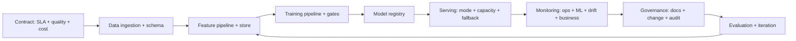

# ML System Design

## Beginner-Friendly Intuition

ML system design is the discipline of mapping a business problem
to a complete production system: contract, data, training,
serving, monitoring, governance. The frame that matters: design
the contract first, then everything else. The team that starts
with "let's train a model" without defining what is being asked of
the system ships something that does not fit; the team that starts
with the contract ships something that does.

The intuition: a model is one component. The system around it is
ten other components: data ingestion, feature pipeline, training
pipeline, model registry, serving infrastructure, monitoring,
governance, evaluation, fallback, observability. Designing only
the model and leaving the rest implicit is the standard failure
mode. Designing the system is the senior skill.

This file covers the end-to-end ML system design template, the
reference architectures for batch and online ML systems, and the
structure of a strong ML system design interview answer (since
this material is also the most-asked interview format).

## Formal Explanation

### The contract first

Before any ML, define the contract:

- **Inputs.** What does the system receive? Schema, expected
  ranges, freshness, source.
- **Outputs.** What does it produce? Type (classification,
  regression, ranking, generation), confidence, structure.
- **Latency.** End-to-end SLA; budget per component.
- **Throughput.** QPS at peak and average.
- **Freshness.** Maximum staleness of features and predictions.
- **Quality bar.** Accuracy / precision / recall / faithfulness
  threshold for acceptable; the threshold is the contract.
- **Failure mode.** What happens when the system cannot answer.
- **Fairness and safety.** Per-group requirements; refusal cases.
- **Cost ceiling.** Per request, per month.

The contract is the document everything else is built against.
Skipping it produces a system that solves an unclear problem.

### End-to-end template

A complete production ML system has these layers:

1. **Data ingestion.** Raw data sources, ETL pipelines, schema
   validation, lineage tracking.
2. **Feature pipeline.** Derived features, batch and streaming,
   stored in a feature store with TTLs.
3. **Training pipeline.** Reproducible: data version + code +
   config -> registered model. Validation gates.
4. **Model registry.** State machine for promotion; lineage; audit.
5. **Serving infrastructure.** Online service or batch job;
   autoscaling; health checks; fallback.
6. **Monitoring.** Operational, ML quality, drift, business.
7. **Governance.** Documentation, change management, audit.
8. **Evaluation.** Eval harness, regression suite, periodic re-eval.
9. **Observability.** Tracing, logging, dashboards, alerting.
10. **Cost tracking.** Per request, per feature, per customer.

Each layer has owners, deliverables, and SLAs. A complete design
addresses each.

### Reference: batch ML system

Use case: nightly recommendation precompute.

```
Sources -> Ingestion -> Warehouse -> Feature pipeline -> Training
  pipeline (scheduled) -> Model registry -> Batch scoring job ->
  Output store -> Online serving (cache lookup) -> Application
```

Characteristics:

- High throughput, no real-time latency requirement on training.
- Online serving = cache lookup; sub-millisecond.
- Freshness = up to 24 hours.
- Cost dominated by the periodic training/scoring job.
- Monitoring includes job duration, output freshness, prediction
  drift.

### Reference: online ML system

Use case: real-time fraud scoring.

```
Streaming events -> Feature pipeline (Kafka + Flink) ->
  Online feature store -> Online inference service (load balanced,
  autoscaled) -> Application -> Outcomes -> Outcome pipeline ->
  Training pipeline (scheduled) -> Model registry -> Online inference
  service deploy
```

Characteristics:

- Sub-second user-facing latency required.
- Features served fresh from a streaming pipeline.
- Online inference service handles peak QPS with autoscaling.
- Fallback to a rule-based score on outage.
- Monitoring includes p99 latency, drift, fairness, business
  metrics.

### Reference: LLM RAG system

Use case: enterprise knowledge assistant.

```
Documents -> Ingestion + chunking -> Embedding pipeline ->
  Vector store (with ACL) -> Query: rewrite -> retrieval ->
  rerank -> generate -> output filter -> Application -> Logs ->
  Eval harness -> Prompt/model iteration
```

Characteristics:

- Latency budget per component; reranker often the longest.
- Faithfulness as the quality bar.
- ACL filter on retrieval is a hard requirement.
- Eval-driven iteration; prompt CI/CD.
- Cost dominated by generation (and reranker).

### Decomposition strategy

A complete design addresses each layer in order:

1. Contract.
2. Data: sources, schema, freshness.
3. Features: derived, batch vs streaming, store.
4. Training: pipeline, validation gates, registry.
5. Serving: mode (online / batch / streaming / async); scaling.
6. Monitoring: operational, quality, drift, business.
7. Governance: documentation, change management, audit.
8. Evaluation: harness, regression, online metrics.
9. Cost: estimate per layer.
10. Failure: per layer.
11. Iteration: how does the team improve over time.

Skipping a layer is the most common interview failure. The
strong answer addresses each.

### Capacity planning

Specific to online ML systems:

- **Peak QPS.** Estimate from traffic patterns; typically 3-5x
  daily average.
- **Latency budget.** End-to-end SLA decomposed: network,
  preprocessing, model, postprocessing, postlogic.
- **Hardware.** GPU vs CPU per model; concurrency per device.
- **Replicas.** Provisioned for peak; autoscaling for bursts;
  reserved for SLA reliability.
- **Cost estimate.** Replica cost per hour x replicas x 24 x 30.

Without capacity planning, the system either drops requests at
peak or pays for idle capacity off-peak.

### Failure modes per layer

A senior design names the failure modes:

- **Data.** Source outage, schema change, distribution shift,
  data quality issue.
- **Features.** Pipeline lag, computation bug, training-serving
  skew.
- **Training.** Reproducibility failure, gate regression, gpu
  shortage.
- **Serving.** Outage, latency tail, capacity miss, version
  mismatch.
- **Monitoring.** Alert fatigue, missed drift, dashboard rot.
- **Governance.** Documentation drift, lineage break, audit
  failure.

Each has a control: backup source, schema validation, drift alert,
fallback model, capacity buffer, on-call rotation.

### Iteration and feedback loops

A production system improves continuously:

- **New training data.** From production outcomes; feedback
  pipeline.
- **New features.** From investigations; A/B tested.
- **New models.** Architecture; vendor upgrade.
- **New evaluation.** From production failures; eval set updated.
- **New monitoring.** From postmortems; surfaces added.

A design without an iteration loop ships a static system that
ages.

## Why It Matters in Real Jobs

Three production reasons. First, **system design is what
distinguishes senior ML engineers from junior**. Anyone can train
a model; few can design the system that ships, monitors, and
maintains it. Second, **the failure modes that kill production
systems are at the system level**, not the model level. Latency
tails, data drift, training-serving skew, lineage gaps, missing
fallback. The system design is what addresses them. Third, **ML
system design is the most-asked senior interview format**. A
strong template plus practice with the layers separates strong
candidates from weak.

## How It Works Step by Step

1. **Define the contract.** Inputs, outputs, latency, freshness,
   quality, failure, cost.
2. **Map data sources.** Available, missing, refresh cadence,
   freshness.
3. **Design the feature pipeline.** Batch vs streaming; feature
   store; lineage.
4. **Design the training pipeline.** Reproducible; validation
   gates; registry.
5. **Pick the serving mode.** Online / batch / streaming / async;
   capacity plan.
6. **Plan the monitoring.** Operational, quality, drift, business.
7. **Build governance.** Documentation, change management, audit.
8. **Build evaluation.** Eval set, regression suite, online
   metrics.
9. **Specify failure modes per layer.** Fallbacks, alerts,
   runbooks.
10. **Estimate cost.** Per layer; total per request.
11. **Define iteration.** Feedback loops; how the system improves.

## Real-World Example

A team designs a recommendation system for a streaming media product.

Contract:

- **Input.** User ID, current context (page, time of day, device).
- **Output.** Top 20 ranked items with scores.
- **Latency.** p99 < 100 ms.
- **Throughput.** 50K QPS at peak.
- **Freshness.** Recommendations reflect activity within the
  last 5 minutes.
- **Quality.** CTR uplift over baseline > 3 percent.
- **Cost ceiling.** $50K/month total.
- **Fairness.** Per-content-creator coverage above floor; no
  systematic suppression of underrepresented categories.
- **Failure mode.** Outage = serve trending items list; degraded
  but not broken.

Architecture:

- **Data.** Click stream from Kafka; user profile from data
  warehouse; content catalog from CMS.
- **Features.** Streaming pipeline maintains per-user recent
  activity in an online feature store (sub-minute freshness);
  batch pipeline updates per-user demographics nightly.
- **Training.** Two-stage: candidate generation (matrix
  factorization, retrained weekly) + ranking (gradient-boosted
  trees, retrained daily). Both pipelines reproducible; gate on
  per-segment NDCG.
- **Registry.** MLflow; state machine; canary policy.
- **Serving.** Online inference service with autoscaling; p95 65
  ms; fallback to trending-items list on outage.
- **Monitoring.** Operational (latency, error rate); ML (CTR,
  per-segment, fairness); drift (PSI on top features); business
  (session duration, retention).
- **Governance.** Model cards per stage; lineage; quarterly
  fairness audit.
- **Evaluation.** Offline NDCG on weekly eval set; online A/B at
  every model change; quarterly user study.
- **Cost.** $35K/month: $20K serving, $10K training/scoring, $5K
  monitoring/observability.
- **Iteration.** Postmortems update runbooks; new features added
  monthly via A/B; new model architecture evaluated quarterly.

A real iteration win: production showed CTR underperforming on
mobile during commutes. Investigation: the ranker was biased
against short-form content. Fix: add a feature for content length
context-weighted; A/B test confirmed CTR uplift; ship. Without
the per-segment monitoring, the team would have missed the
opportunity.

## Common Mistakes

- Starting with "I would train a model". Skips the contract;
  produces a non-fitting system.
- Skipping a layer. The interview answer or the production system
  has a hole.
- Online when batch fits. 100x cost.
- Batch when freshness needed. Stale system.
- No fallback. Outage = user-visible failure.
- Capacity for average, not peak. Drops at peak.
- No monitoring on drift. Silent degradation.
- No governance. Audit fails.
- No iteration plan. Static system ages.
- Cost not estimated. Production budget overrun.

## Interview Angle

**Question:** Design a system for a recommendation feature on a
high-traffic e-commerce site.

**Strong answer:** Walk through the layers in order. Specifics
matter; the strong candidate names tradeoffs.

**Layer 1: contract.** Latency p99 100 ms; throughput 100K QPS
peak; freshness 5 minutes for user activity; quality CTR uplift
over baseline; fairness coverage floor; cost ceiling.

**Layer 2: data.** User click stream (Kafka), user profile
(warehouse), product catalog (CMS), inventory (real-time service).
Schema validation; lineage tracking.

**Layer 3: features.** Streaming pipeline updates user-recent
activity in an online feature store. Batch pipeline updates
demographics nightly. Item features from catalog. Training-serving
parity is non-negotiable.

**Layer 4: training.** Two-stage: candidate generation (vector
similarity), ranking (GBM or neural). Both pipelines reproducible.
Validation gates: per-segment NDCG, fairness disparity threshold,
calibration.

**Layer 5: registry.** State machine; canary policy; rollback
path; lineage.

**Layer 6: serving.** Online for the user-facing path; batch
precompute for cold-start fallback. Microbatching at the GPU
boundary if neural ranker. Autoscaling on QPS. Fallback to a
trending-items list on outage; circuit breaker on the ranking
service.

**Layer 7: monitoring.** Operational (latency, error, throughput);
ML (per-segment CTR, NDCG, fairness); drift (PSI per feature,
prediction drift); business (session, conversion, retention).
Per-segment everything.

**Layer 8: governance.** Model card per stage; lineage; change
management. Material changes (new feature class) trigger
validation; routine retrains abbreviated.

**Layer 9: evaluation.** Offline weekly NDCG; online A/B at every
material change; quarterly user study for slow signals.

**Layer 10: failure.** Per layer.

- Data outage: serve from cache; if cache cold, fall back to
  trending items.
- Streaming lag: serve from feature store with stale features;
  alert.
- Training failure: serve previous version; alert; investigate.
- Serving outage: trending-items fallback; circuit breaker; alert.
- Monitoring outage: shadow path; alert.

**Layer 11: cost.** Estimate per layer. Online dominated by serving
infrastructure; training a fixed cost; batch precompute amortized.
Total checked against ceiling.

**Layer 12: iteration.** Feedback loop: outcomes feed training
data; postmortems update runbooks; A/B test infrastructure for new
features and models. The system improves continuously.

**Tradeoffs to name.**

- **Online vs batch vs hybrid.** Pure online for freshness;
  hybrid for cost; pure batch for very high volume.
- **Single-stage vs two-stage ranking.** Single is simpler; two-
  stage is the production standard for scale.
- **Neural vs GBM.** Neural for richer features; GBM for ease of
  ops and interpretability.
- **Realtime feature pipeline vs feature store snapshots.**
  Realtime for true freshness; snapshots for cheap.

The senior instinct: **the system is more important than the
model**. A great model in a weak system fails; a good model in a
strong system succeeds. Design the system; the model is one
component.

**Weak answer:** "I would train a deep learning model and deploy
it." No contract; no monitoring; no governance; no failure mode;
no iteration. Loses the interview.

**Follow-up questions:**

- How would you handle cold-start users?
- How would you scale to 10x traffic?
- How would you detect bias?
- How would you upgrade the model architecture?

## Mini Exercise

Pick an ML system you have used. Sketch each of the 11 layers in
two sentences each. Identify the layer most likely missing in a
typical first design.

## Diagram



---
## Navigation

[⬅ Previous](11-model-governance.md) | [🏠 Home](../README.md) | [➡ Next](../generative-ai/01-generative-ai-overview.md)
