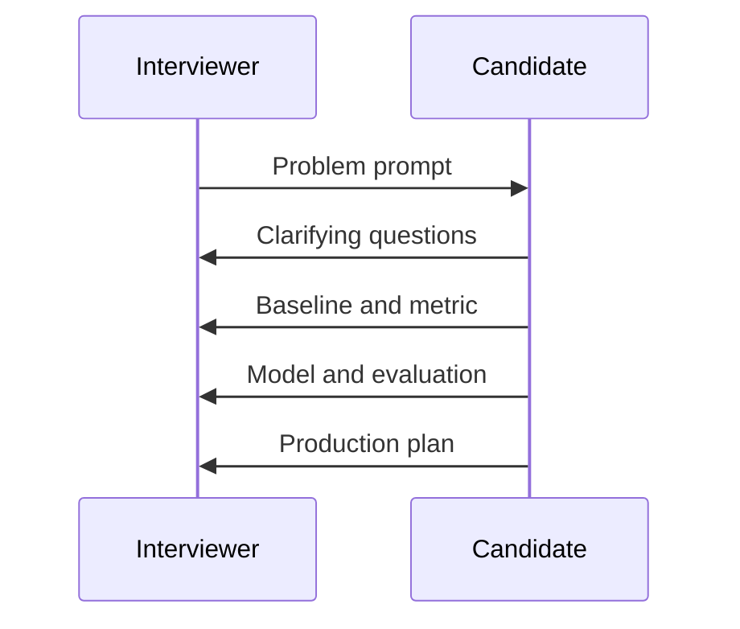

# Full Loop Big Tech AI Mock

## Round Format

This mock interview is a 60-minute loop: 5 minutes of clarification, 20 minutes of technical
fundamentals, 20 minutes of system or project discussion, 10 minutes of debugging tradeoffs, and 5
minutes for questions.

## Interviewer Prompts

1. Describe a realistic problem where this role would use machine learning.
2. Choose a baseline and explain why it is good enough for the first iteration.
3. Design the data split, metric, and evaluation plan.
4. Explain one failure mode and how you would detect it.
5. Describe how you would deploy, monitor, and improve the system.

## Expected Answers

Strong candidates clarify the user action, avoid leakage, compare against a baseline, choose metrics
based on cost of errors, and discuss monitoring. They also communicate tradeoffs: latency versus
quality, precision versus recall, automation versus human review, and short-term metric wins versus
long-term user trust.

## Scoring Rubric

| Area | Strong Signal | Weak Signal |
| --- | --- | --- |
| Problem framing | Clear target, user, and decision | Starts with a model name |
| Data reasoning | Mentions labels, splits, leakage, bias | Assumes data is clean |
| Modeling | Baseline first, complexity justified | Chases complexity |
| Evaluation | Uses task and production metrics | Reports one generic score |
| Operations | Covers monitoring and rollback | Stops at notebook results |

## Red Flags

- Cannot explain why the metric matches the business problem.
- Ignores rare but costly errors.
- Does not ask about labels, latency, privacy, or deployment path.
- Treats LLM fluency or model accuracy as complete proof of quality.

## Improvement Plan

After the mock, write down three missed clarifying questions, one better baseline, one better metric,
and one production risk you forgot. Repeat the same prompt until the answer is structured and concise.

## Diagram

---
## Navigation

[⬅ Previous](09-mlops-mock.md) | [🏠 Home](../README.md) | [➡ Next](../quizzes/01-ml-fundamentals-quiz.md)
