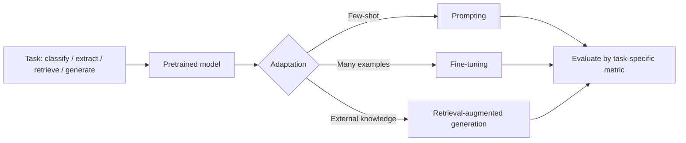

# NLP Overview

## Beginner-Friendly Intuition

Natural Language Processing is the field that teaches computers to handle
human language. The set of tasks is enormous: classify a review as
positive or negative, extract names from a document, search by meaning
rather than keywords, translate one language to another, summarize a long
article, answer a question, generate code from English, hold a
conversation. The unifying challenge is that language is messy: it has
ambiguity, context, idioms, sarcasm, multiple correct answers, and
infinite long-tail edge cases.

The intuition for the modern era of NLP: the field went from carefully
hand-engineered features (1960s-2000s) to learned embeddings of single
words (2013, word2vec) to contextual representations from sequence models
(2017, transformers) to pretraining-then-fine-tuning (2018, BERT) to
large language models that solve many tasks zero-shot (2020+, GPT-3 and
descendants). Each shift made systems more general and reduced the
amount of task-specific engineering required.

## Formal Explanation

### Major NLP tasks

- **Text classification.** Single label per document: sentiment, topic,
  spam, intent. Covered in
  [08-text-classification.md](08-text-classification.md).
- **Token-level classification.** A label per token: named-entity
  recognition, part-of-speech tagging, chunking. Covered in
  [09-named-entity-recognition.md](09-named-entity-recognition.md).
- **Sequence-to-sequence.** Translation, summarization, question
  answering with generated answers. The output is itself a sequence.
- **Span extraction.** Output positions in the input: extractive QA,
  span-based NER.
- **Retrieval.** Given a query, return relevant documents. Covered in
  [10-semantic-search.md](10-semantic-search.md).
- **Language modeling.** Predict the next token given context. The
  pretraining objective for GPT-style models.
- **Masked language modeling.** Predict masked tokens given the rest.
  Pretraining objective for BERT-style models.
- **Dialogue and instruction following.** Multi-turn conversation, tool
  use, agentic workflows.
- **Generation.** Open-ended text production, code generation,
  summarization.

### The eras

1. **Rule-based and statistical (1960s-2000s).** Hand-written grammars,
   feature engineering, hidden Markov models, conditional random fields.
   Worked for narrow domains, did not generalize.
2. **Word embeddings (2013-2017).** Word2vec, GloVe, FastText.
   Pre-computed dense vectors for words capturing distributional
   semantics. Plugged into RNNs, CNNs, and shallow classifiers.
3. **Contextual sequence models (2017-2018).** Bidirectional LSTMs and
   the original transformer paper. The same word gets different
   embeddings depending on context.
4. **Pretrained transformers (2018-2020).** BERT, GPT-2, RoBERTa, T5.
   Pretrain on a massive unlabeled corpus, fine-tune on a small labeled
   set per task. Set state of the art across nearly every NLP task.
5. **Large language models (2020+).** GPT-3, GPT-4, Claude, LLaMA,
   Mistral, Qwen. Sufficient scale produces emergent abilities: zero-shot
   instruction following, in-context learning, chain-of-thought, tool
   use. The shift from "pretrain then fine-tune" to "pretrain then prompt
   and instruct."

### What changed in 2026

In 2026, most non-trivial NLP problems start with a pretrained
transformer and either fine-tuning, prompting, or retrieval-augmented
generation (RAG). The traditional pipeline of preprocess + tokenize +
feature-engineer + train-from-scratch is rare for production systems.
Smaller pretrained models (DistilBERT, MiniLM) still dominate latency-
sensitive applications; large LLMs dominate flexibility-required ones.

### Where classical methods still apply

- **Latency-critical edge devices.** A logistic regression over TF-IDF
  features runs in microseconds; a 1B-parameter LLM does not.
- **Small labeled datasets in narrow domains.** Domain-specific TF-IDF +
  linear model can be competitive with fine-tuned BERT under 1K labels.
- **Interpretability requirements.** Coefficients of a linear text
  classifier are auditable; LLM behavior is not.
- **Privacy and on-premise constraints.** Some industries cannot send
  text to cloud LLMs; smaller open-source models or classical methods
  are the alternative.

## Why It Matters in Real Jobs

NLP is core to search, support, content moderation, code review, voice
assistants, customer-facing chatbots, and the entire generative-AI
product wave. The technical depth of an NLP engineer in 2026 is less
about training models from scratch and more about:

- Choosing the right pretrained model and the right adaptation approach
  (fine-tune, LoRA, prompt, RAG).
- Building retrieval systems with hybrid scoring (BM25 + dense).
- Evaluating generative outputs honestly (exact match, BLEU/ROUGE,
  human eval, calibrated automatic metrics).
- Managing latency, cost, and safety in LLM-based products.
- Diagnosing system failures (hallucinations, refusals, prompt
  injection, stale embeddings).

## How It Works Step by Step

1. **Frame the task.** Classification, extraction, retrieval, generation,
   or some combination.
2. **Decide adaptation strategy.** Fine-tune a small encoder for
   classification or extraction; prompt or RAG with an LLM for open-ended
   generation; mix them in a pipeline.
3. **Pick a model.** DistilBERT/MiniLM for fast classification.
   RoBERTa-large or DeBERTa-v3 for high-accuracy classification.
   Sentence-transformer for embeddings. LLaMA/Mistral/Qwen for
   open-source generation. GPT-4/Claude for hosted generation.
4. **Build the data pipeline.** Tokenization (next file), label format
   (BIO for NER, span indices for QA), deduplication.
5. **Train or prompt.** Standard transformer training recipe (warmup,
   AdamW, cosine LR), or carefully designed prompts and few-shot
   examples.
6. **Evaluate.** Match the metric to the task (next file: tokenization,
   later file: NLP evaluation).
7. **Deploy with care.** Latency budgets, batching, caching, fallback
   paths, monitoring for prompt drift and hallucination.

## Real-World Example

A team builds an internal tool to triage support tickets into 24
categories. Their first attempt: TF-IDF + logistic regression. Macro F1
is 0.71 with 12K training examples. They fine-tune DistilBERT-base for
3 epochs with `lr = 2e-5`. Macro F1 jumps to 0.83 at 18 ms per
inference. They try DeBERTa-v3-large; F1 reaches 0.86 but inference is
85 ms, exceeding their latency budget. They ship DistilBERT. Six months
later, the team adds an LLM-powered fallback: when DistilBERT's top
prediction is below confidence 0.6, route the ticket to GPT-4 with a
few-shot prompt. Confidence-low coverage is 12 percent of traffic but
cuts errors on those tickets by 40 percent. The system is a hybrid:
fast small model on the easy traffic, big model on the hard tail.

## Common Mistakes

- Treating "NLP" as a single technique; it is dozens of distinct tasks
  with different methods.
- Training transformers from scratch on small data; transfer learning
  from a pretrained checkpoint wins.
- Using BLEU or ROUGE on tasks they were not designed for; e.g., using
  BLEU for summarization with a single reference.
- Heavy preprocessing (aggressive lowercasing, stop-word removal,
  stemming) before feeding to a pretrained transformer; modern models
  expect minimally-cleaned text.
- Comparing zero-shot LLM performance to fine-tuned encoder accuracy
  without considering cost and latency.
- Skipping a sparse baseline (TF-IDF + linear); often it is competitive
  on small data and 1000x faster.
- Relying on automatic metrics for generative tasks without human
  evaluation; correlation between automatic metrics and human judgment
  is often weak.
- Forgetting that NLP systems drift: vocabulary, slang, and topics move,
  so retraining cadence matters.

## Interview Angle

**Question:** A team wants to add a text classifier to their product.
They have 5,000 labeled examples, latency budget of 50 ms per request,
and on-premise constraints. What do you recommend?

**Strong answer:** Start with constraints. On-premise rules out hosted
LLM APIs. 50 ms per request rules out large transformers without
quantization or distillation. 5,000 labeled examples is plenty for
fine-tuning a small encoder.

The recommended approach. Establish a TF-IDF + linear baseline as a
sanity check; this takes an hour and may already meet the bar. Fine-tune
DistilBERT-base or MiniLM (66M and 22M parameters respectively). Quantize
to int8 for inference. This typically lands at 10-20 ms per request on a
modern CPU and macro F1 a few points above the TF-IDF baseline. If the
classes are highly imbalanced, add class weights or focal loss. If
accuracy is still insufficient, try DeBERTa-v3-base (slower but stronger)
and decide whether quantization keeps it under the latency budget.

What I would not recommend in this scenario. Training a custom transformer
from scratch (5K examples is too small). Using GPT-4 (cost, latency, and
on-premise constraints). Heavy text preprocessing (modern encoders expect
near-raw text).

What I would also include in the deliverable. Per-class metrics and
confusion matrix (aggregate F1 hides per-class failures). Calibration
analysis if downstream code uses confidence thresholds. A monitoring
dashboard for input distribution drift; classifier accuracy tends to
silently degrade as user vocabulary changes.

**Weak answer:** "Fine-tune BERT" without addressing the latency
constraint or the small-data baseline.

**Follow-up questions:**

- When would you use an LLM zero-shot vs fine-tuning a small encoder?
- What is RAG and when does it help?
- How would you handle class imbalance in text classification?
- What metrics would you report for a sentiment classifier?

## Mini Exercise

Pick a public text dataset (IMDB, AG News, 20 Newsgroups). Build three
baselines: TF-IDF + logistic regression, fine-tuned DistilBERT, prompted
LLM. Compare macro F1, training time, inference latency. Note the
trade-offs.

## Diagram

---
## Navigation

[⬅ Previous](../deep-learning/15-deep-learning-interview-patterns.md) | [🏠 Home](../README.md) | [➡ Next](02-text-preprocessing.md)
