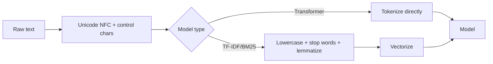

# Text Preprocessing

## Beginner-Friendly Intuition

Text preprocessing is the set of transformations you apply to raw text
before it reaches your model. The classical advice was to be aggressive:
lowercase, remove punctuation, strip stop words, stem or lemmatize, drop
numbers. The modern advice is the opposite: be minimal. Pretrained
transformers were trained on near-raw text, and aggressive preprocessing
removes information they need.

The intuition: every preprocessing step is a destructive transformation.
You delete information that the model might have used. The right amount
of preprocessing depends on the model. Sparse models like TF-IDF benefit
from aggressive normalization (lowercase, stem) because they have no way
to learn that "running" and "ran" are the same. Pretrained transformers
already know it, so cleaning makes them worse.

## Formal Explanation

### Operations and when they help

- **Unicode normalization (NFC).** Always do this. Different byte
  sequences can represent visually identical characters; normalize to a
  canonical form.
- **Lowercasing.** Helps sparse models. Hurts cased pretrained models
  (BERT-cased, RoBERTa) because the case carries information.
- **Accent stripping.** Helps for languages where accents are
  inconsistent in source data. Almost always wrong for languages where
  accents disambiguate words (French, Spanish, German).
- **Punctuation removal.** Removes information about sentence structure,
  emphasis, and emotion. Wrong for sentiment analysis ("amazing!" vs
  "amazing.") and most pretrained models.
- **Stop-word removal.** Removes common words like "the", "and", "is".
  Helps TF-IDF (reduces dimensionality, removes noise). Hurts pretrained
  models because stop words carry context.
- **Stemming.** Cuts words to a stem ("running" -> "run"). Crude.
  Aggressive stemmers (Porter) destroy meaning ("organize" -> "organ").
  Used for TF-IDF and BM25; never for pretrained models.
- **Lemmatization.** Maps words to their dictionary form ("ran" -> "run",
  "better" -> "good"). Smarter than stemming but slower (requires
  POS tagging). Used in some sparse pipelines; not used with modern
  transformers.
- **Number normalization.** Replace numbers with a placeholder, or bin
  them. Useful for some classification tasks; harmful for others (price
  prediction, NER, dates).
- **HTML and emoji handling.** Strip HTML tags. Decide whether to
  preserve, replace, or remove emojis based on the task. For sentiment,
  preserve.
- **Spelling correction.** Helps some short-text classification (search
  queries, tweets). Be careful: correcting "iphone" to "phone" loses
  brand information.

### Modern (transformer-era) preprocessing

For BERT, RoBERTa, GPT, LLaMA, and similar models, do the minimum:

1. Unicode normalize (NFC).
2. Strip control characters and zero-width characters.
3. Optionally: collapse repeated whitespace.
4. Pass to the model's tokenizer (next file).

Do not lowercase, do not remove punctuation, do not strip stop words, do
not stem. The model learned from raw text and expects raw text.

### Classical (TF-IDF / BM25) preprocessing

For sparse models, more aggressive preprocessing helps:

1. Unicode normalize.
2. Lowercase.
3. Tokenize (whitespace + punctuation).
4. Remove stop words for the language.
5. Lemmatize (if accuracy matters and latency permits) or stem (if speed
   matters).
6. Optionally: remove rare tokens (document frequency below 5) and very
   common ones.

The result is a smaller, denser feature space that linear models can
learn from with less data.

### Multilingual considerations

- **Language identification.** Mixed-language corpora need a per-document
  language tag for any language-specific preprocessing.
- **Tokenization for non-space-separated languages.** Chinese, Japanese,
  Thai do not use spaces. Use language-specific tokenizers (Jieba for
  Chinese, MeCab for Japanese) or subword tokenizers (BPE) that handle
  this implicitly.
- **Character vs subword vs word.** For low-resource languages, character
  or BPE tokenization tends to be more robust than word tokenization.

### Domain-specific cleanup

- **Code.** Preserve indentation, capitalization, and punctuation; tokens
  there carry syntax meaning.
- **Email/chat.** Strip signatures, quoted replies, headers. Decide
  whether to keep emojis and URLs.
- **Medical/legal.** Specific terminology requires domain tokenizers
  (BioMedNLP, Legal-BERT). Preserve acronyms and numbers.

## Why It Matters in Real Jobs

Three production reasons. First, **the right amount of preprocessing for
your model**: aggressive cleaning a transformer's input is a common bug
that silently degrades accuracy. Second, **train-serving consistency**:
preprocessing in production must match training byte-for-byte. A
mismatch in normalization between training and inference is a frequent
silent accuracy killer. Third, **multilingual products**: language-
specific preprocessing decisions matter at scale; getting them wrong
breaks accuracy in entire markets.

## How It Works Step by Step

1. **Identify your model class.** Sparse linear or pretrained
   transformer.
2. **Pick the minimal preprocessing for the model class.** Modern
   transformer: NFC + strip control chars. Sparse: lowercase + tokenize +
   stop-word removal + lemmatize.
3. **Inspect samples.** After preprocessing, look at 50 random examples.
   Make sure the result is what you expected.
4. **Verify train and serving match.** Preprocessing code in serving
   must produce byte-identical output to preprocessing in training. Test
   with a unit test on a fixed string.
5. **Handle edge cases.** Empty strings, strings with only whitespace,
   strings exceeding model max length. Decide policy ahead of time, not
   in production.
6. **Log preprocessing artifacts.** If you replaced URLs with `[URL]`,
   log the count; sudden drops or spikes indicate input distribution
   shift.

## Real-World Example

A team migrates from a logistic regression on TF-IDF features to a fine-
tuned RoBERTa for sentiment analysis. The preprocessing pipeline from
the old system is reused: lowercase, remove punctuation, remove stop
words. Validation accuracy on the new model is 78 percent, worse than
the old TF-IDF system. Investigation: RoBERTa was pretrained on cased
text with punctuation. Removing them destroys signal. They strip the
preprocessing back to NFC + whitespace collapse. Validation accuracy
jumps to 91 percent. The lesson: preprocessing must match the model's
pretraining; reusing classical pipelines on modern models often hurts.

## Common Mistakes

- Lowercasing input to a cased pretrained model.
- Removing punctuation from sentiment classification (`amazing!` vs
  `amazing` carry different signals).
- Stop-word removal before a transformer; the model uses them for
  context.
- Stemming or lemmatizing before a transformer; the tokenizer was
  trained on raw word forms.
- Not normalizing Unicode; "café" might be encoded two different ways
  depending on the source.
- Mismatched preprocessing between training and serving; silent accuracy
  drop.
- Stripping URLs when they encode meaning (phishing, spam detection
  should keep them).
- Removing accents in Spanish/French; "más" and "mas" mean different
  things.
- Truncating long inputs without a strategy; the head, the tail, or a
  smarter chunking depends on the task.

## Interview Angle

**Question:** Why do modern transformer-based NLP pipelines do less text
preprocessing than classical pipelines, and where would you still
preprocess heavily?

**Strong answer:** Pretrained transformers (BERT, RoBERTa, GPT, LLaMA)
were pretrained on massive corpora of near-raw text. The tokenizer that
ships with each model expects input that matches the format it saw in
pretraining: cased letters, punctuation, occasional accents and
unusual characters. Preprocessing that destroys this format (lowercasing
a cased model's input, stripping punctuation, removing stop words)
removes information the model knows how to use. The cleaning operation
that helps a TF-IDF model hurts a BERT model because BERT can disambiguate
"Apple" the company from "apple" the fruit, distinguish "amazing!" from
"amazing.", and use stop words for context. TF-IDF cannot do any of those.

So the rule is: match preprocessing to the model.

For modern transformers, the minimal pipeline is NFC normalization, strip
control characters, optionally collapse repeated whitespace, then pass to
the tokenizer. Nothing else.

Where I would still preprocess heavily.

- **Sparse models (TF-IDF, BM25, classical naive Bayes).** Lowercase,
  remove stop words, stem or lemmatize. The model has no way to learn
  these equivalences.
- **Languages without spaces (Chinese, Japanese, Thai).** Need a language-
  specific tokenizer regardless of model class.
- **Domain-heavy text** (medical records, legal documents, source code).
  Domain tokenizers and preserving terminology matter.
- **User-generated text with HTML, emoji, URLs.** Decide explicitly
  whether to keep, normalize, or strip each. Defaults vary by task.

The bigger production issue is consistency. Preprocessing in serving
must exactly match preprocessing in training, byte for byte. A
mismatched normalization between train and serve is one of the most
common silent NLP bugs.

**Weak answer:** "Preprocessing is a thing of the past" without
addressing where it still applies.

**Follow-up questions:**

- What is Unicode normalization and why do you need it?
- How would you preprocess code differently from prose?
- Why does stemming hurt for transformers?
- How do you ensure preprocessing consistency between training and
  serving?

## Mini Exercise

Take a small sentiment classification dataset. Run a fine-tuned BERT
classifier with: (a) raw text, (b) lowercased text, (c) lowercased +
punctuation removed + stop-words removed. Compare validation accuracy.
Note the typical degradation pattern from cleaning.

## Diagram

---
## Navigation

[⬅ Previous](01-nlp-overview.md) | [🏠 Home](../README.md) | [➡ Next](03-tokenization.md)
