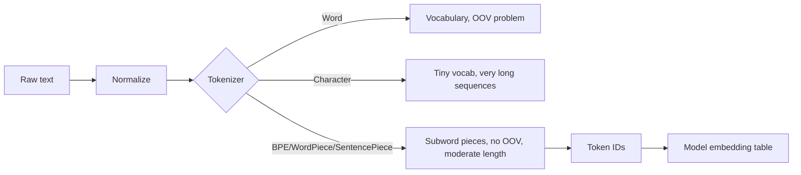

# Tokenization

## Beginner-Friendly Intuition

Tokenization is the step that converts a string of characters into a
sequence of integer IDs that a model can consume. Every NLP pipeline has
this step; the choice of tokenizer determines what the model sees.
Different tokenizers split the same text into different units, with
different vocabularies, different out-of-vocabulary behavior, and
different costs.

The intuition: a tokenizer is a vocabulary plus a deterministic
algorithm for mapping any string into a sequence of vocabulary entries.
Word-level tokenization has a finite vocabulary that breaks on new
words. Character-level tokenization has a tiny vocabulary but produces
very long sequences. Subword tokenization (BPE, WordPiece,
SentencePiece) is the modern compromise: a vocabulary of common subword
pieces that can compose to represent any word, with sequence lengths
roughly the same as word tokenization for common words and proportional
to character count for rare words.

## Formal Explanation

### Word tokenization

Split on whitespace and punctuation. Vocabulary is the set of all unique
words seen in training. Out-of-vocabulary (OOV) words become a special
`<UNK>` token, losing their information.

Pros: simple, interpretable, short sequences. Cons: huge vocabulary
(English Wikipedia has ~5M unique tokens), `<UNK>` is a black hole, no
generalization to misspellings or compounds, breaks on languages without
spaces.

### Character tokenization

Each character is a token. Vocabulary is small (under 200 for English,
larger for Unicode languages). No OOV.

Pros: handles any string, no OOV. Cons: very long sequences (5x to 10x
longer than word tokenization), model has to learn word structure from
scratch, costly for transformers because attention is `O(T²)`.

### Subword tokenization

The dominant approach in modern NLP. Vocabulary contains both common
words and pieces (`-ing`, `un-`, `tion`). Rare words get split into
pieces; common words remain whole.

Three main algorithms:

#### BPE (Byte-Pair Encoding)

Iteratively merge the most frequent pair of adjacent tokens, starting
from characters. After `N` merges, the vocabulary contains the merged
pieces. Greedy merging during tokenization. Used by GPT-2, GPT-3,
LLaMA.

#### WordPiece

Similar to BPE but uses likelihood (instead of frequency) as the merge
criterion. Used by BERT and DistilBERT.

#### SentencePiece (Unigram or BPE)

Operates on raw bytes without pre-tokenizing on whitespace. Handles any
language uniformly. Used by T5, mT5, ALBERT, many multilingual models.
Especially useful for languages without word boundaries (Chinese,
Japanese).

#### Byte-level BPE

A BPE variant that operates on bytes instead of characters. Vocabulary
of 256 starting bytes plus learned merges. Handles any Unicode without
ever producing OOV. Used by GPT-2 onward.

### Vocabulary size trade-offs

- Smaller vocabulary (8K-16K): more pieces per word, longer sequences,
  higher attention cost, but smaller embedding table and better
  generalization on rare words.
- Larger vocabulary (32K-100K): more whole words as single tokens,
  shorter sequences, but larger embedding table.

Modern English transformers typically use 32K-50K vocabularies.
Multilingual models use 100K-250K to cover many languages.

### Special tokens

Most tokenizers add special tokens:

- `[CLS]` (BERT): a classification token at the start, whose embedding
  serves as the sentence representation.
- `[SEP]` (BERT): separator between sentences.
- `<s>`, `</s>` (RoBERTa, others): begin and end markers.
- `[PAD]`: padding for variable-length batches.
- `[MASK]`: the masked token in masked language modeling.
- `<|endoftext|>` (GPT): end-of-document.
- `<|im_start|>`, `<|im_end|>` (chat formats): turn boundaries.

Always use the tokenizer that matches your model. Mismatch is a frequent
bug.

### Tokenization changes the data

Two practical implications.

- **The same text produces different token counts in different
  tokenizers.** A 1000-character document might be 200 tokens in GPT-4's
  tokenizer and 350 in LLaMA's. This affects API costs, context window
  utilization, and latency.
- **Tokenization is part of the training distribution.** A document
  tokenized differently at inference than training produces different
  inputs and different outputs.

### Multilingual and code

- **Multilingual.** Languages with shared scripts (Latin) share many
  tokens; ideographic languages (Chinese, Japanese) get separate
  vocabulary segments. Multilingual tokenizers tend to fragment some
  languages more than others, producing longer sequences and slower
  inference for those languages.
- **Code.** Code tokenizers (used by Codex, Code Llama, GPT-4) include
  tokens for common programming constructs (`def`, `function`, indent,
  newline). General tokenizers fragment code and waste context.

### Tokenization leakage in evaluation

A subtle bug: if your tokenizer is trained on data that includes the
test set, perplexity is artificially low because the tokenizer "knows"
the test vocabulary. Train tokenizers on a corpus that excludes test
data.

## Why It Matters in Real Jobs

Three production reasons. First, **cost and latency**: the tokenizer
choice determines token counts, which directly determines API cost,
context utilization, and inference time. Second, **train-serving
consistency**: the production tokenizer must be exactly the one used in
training, including special tokens, version, and config. Third,
**downstream behavior**: tokenization choices affect everything from
named entity recognition (entity boundaries) to code generation (syntax
preservation). A good NLP engineer can read a tokenizer's output and
spot pathologies (a name fragmented into 7 pieces, a URL exploding into
50).

## How It Works Step by Step

1. **Use the tokenizer that ships with your model.** HuggingFace's
   `AutoTokenizer` loads the right one. Never substitute.
2. **Inspect tokenization on representative samples.** Check that
   important entities, numbers, and code are not pathologically
   fragmented.
3. **Pad and truncate carefully.** Decide max length based on the model's
   context window and your input distribution. Truncating from the head
   loses early context; from the tail loses recent context.
4. **Handle long documents.** Chunk into overlapping windows, or use a
   long-context model, or use hierarchical encoding.
5. **For training a custom tokenizer**: choose vocabulary size, training
   corpus, and algorithm (BPE for general, SentencePiece for
   multilingual). Train on representative data, exclude test sets.
6. **Verify train-serving consistency.** Save the tokenizer config and
   check that production matches training byte-for-byte.

## Real-World Example

A team builds an English support-ticket classifier on RoBERTa-base. They
ship and watch metrics drift down over six months. Investigation: the
incoming tickets started including more product codes (e.g., "A-1234"),
which the RoBERTa tokenizer fragments into 5+ pieces, blowing up
sequence length and pushing relevant content beyond the 512-token
limit. They train a small custom tokenizer on their support corpus that
treats common product codes as single tokens; sequence lengths drop by
40 percent and accuracy recovers. The lesson: tokenizer choice should
match the actual production text, not just the pretraining corpus.

## Common Mistakes

- Using the wrong tokenizer for the model; output is silently terrible.
- Skipping `[CLS]` or `[SEP]` for BERT-style models; the model expects
  them.
- Tokenizing in production with a different version of the tokenizer
  than training; subtle differences in vocabulary or special tokens
  produce wrong inputs.
- Treating "tokens" as words for cost estimation; tokens are smaller, so
  your input is longer than you think.
- Truncating from the front for tasks where the head matters (e.g.,
  the first sentence often holds the topic).
- Picking a small vocabulary for a multilingual model; some languages
  fragment heavily and waste context.
- Tokenizing tabular or numeric data without thinking; long numbers
  fragment into many tokens, which the model has to recompose.
- Ignoring tokenization-induced training-vs-eval differences when adding
  new tokens (e.g., adding a special token after pretraining; the
  embedding for it is initialized randomly and needs fine-tuning).

## Interview Angle

**Question:** Walk through how Byte-Pair Encoding (BPE) tokenization
works and why it became the dominant choice over word-level
tokenization.

**Strong answer:** BPE starts with a vocabulary of all individual
characters (or bytes, in byte-level BPE). It then iteratively finds the
most frequent adjacent pair of tokens in the training corpus and merges
them into a new token, adding it to the vocabulary. After `N` merges,
the vocabulary contains the original characters plus `N` learned merged
pieces. Common words like "the" and "running" end up as single tokens
because their character sequences merge frequently. Rare words like
"hyperparameter" get split into pieces ("hyper", "parameter") that the
model has seen many times, even though it has never seen the whole word.

At inference, BPE applies the same merge rules greedily to the input
text, producing a sequence of token IDs that index into a learned
embedding table.

Why BPE replaced word-level tokenization. First, **no out-of-vocabulary
problem**. Word-level tokenization has a fixed vocabulary; any unseen
word becomes `<UNK>` and the model loses its information. BPE can
represent any string by falling back to character-level pieces, so
unseen words are still represented (suboptimally, but recoverably).
Second, **better generalization on morphology**. The model learns shared
representations for "run", "running", "runs", "runner" because they
share the "run" piece. Word-level treats them as unrelated. Third,
**vocabulary size**. A useful word vocabulary needs millions of entries;
BPE achieves comparable accuracy with 32K to 50K, which means a much
smaller embedding table.

Why not character-level. Character sequences are much longer (5x to 10x
typical), and attention is `O(T²)`, so character-level transformers are
much slower at the same accuracy.

Practical caveats. BPE merges depend on training corpus statistics, so
domain shift produces pathological tokenizations (a programmer's `for x
in range(10):` may become 8 tokens or 25, depending on whether the
tokenizer was trained on code). The fix is to train the tokenizer on
data that resembles the production distribution, or to use a tokenizer
designed for the domain (e.g., Code Llama for code).

**Weak answer:** "BPE merges frequent pairs" without explaining why it
beats word-level or character-level.

**Follow-up questions:**

- What is the difference between BPE, WordPiece, and SentencePiece?
- How would you decide vocabulary size?
- What is byte-level BPE and why does GPT-2 use it?
- How does tokenization affect API cost?

## Mini Exercise

Take 5 sentences in your domain. Tokenize each with three tokenizers:
GPT-4's, BERT's, and LLaMA's. Compare token counts and inspect how
domain-specific terms are split. Note which tokenizer is best matched
to your data.

## Diagram

---
## Navigation

[⬅ Previous](02-text-preprocessing.md) | [🏠 Home](../README.md) | [➡ Next](04-word-embeddings-word2vec-glove-fasttext.md)
