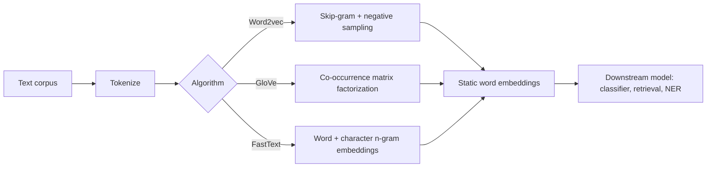

# Word Embeddings: Word2vec, GloVe, FastText

## Beginner-Friendly Intuition

A word embedding is a dense vector representation of a word. Instead of
treating words as one-hot indicators (sparse, no relationships), we
assign each word a 100-300 dimensional vector and arrange the geometry
so semantically related words land near each other. The famous example:
`king - man + woman ≈ queen`. The vector arithmetic captures something
real about word meaning, learned from raw text without any explicit
supervision.

Word embeddings were the breakthrough that started modern NLP. Before
2013, most NLP systems used hand-engineered features. Word2vec (2013)
showed that you could learn meaningful word representations from raw
text by training a tiny model to predict context. The same trick, scaled
up and made contextual, became the foundation of every transformer.

In 2026, word2vec, GloVe, and FastText are largely supplanted by
contextual embeddings from transformers (BERT, sentence-transformers).
But they are still useful for low-latency systems, for understanding
how the field got here, and for problems where pretraining a transformer
is overkill.

## Formal Explanation

### Word2vec (Mikolov et al., 2013)

Two architectures, both simple shallow networks:

- **Skip-gram.** Given a target word, predict its context words. Loss is
  cross-entropy over the vocabulary at each context position.
- **CBOW (Continuous Bag of Words).** Given the surrounding context,
  predict the target word. Faster than skip-gram but produces slightly
  worse representations on rare words.

The output of training is the input embedding matrix `E ∈ R^{V × d}`
where `V` is vocabulary size and `d` is embedding dimension (typically
100, 200, or 300). Each row is a word's vector.

### Negative sampling

Naive skip-gram has a softmax over the entire vocabulary, which is
prohibitively expensive. Negative sampling replaces this with a binary
classification: for each (target, true context) pair, sample `k`
negative context words from a noise distribution and train a logistic
regression to distinguish positives from negatives. Typically `k = 5` to
20.

The loss for one target-context pair `(w, c)` with negatives `n_1, ..., n_k`:

```
log σ(v_w · u_c) + Σ_i log σ(-v_w · u_{n_i})
```

This is the canonical formulation. Negative sampling makes training
linear in `k` instead of `V`, which is what made word2vec practical.

### GloVe (Pennington et al., 2014)

GloVe computes a co-occurrence matrix `X` where `X_{ij}` is the number
of times word `j` appears in the context of word `i`. It then factorizes
this matrix:

```
v_i · u_j + b_i + b_j ≈ log X_{ij}
```

with a weighted least-squares loss that down-weights very frequent and
very rare co-occurrence pairs. The result is a static word embedding
similar in quality to word2vec.

GloVe vs word2vec. Theoretically, both reduce to factorizing similar
matrices. Empirically, they produce vectors of comparable quality.
GloVe trains on the full co-occurrence matrix (global statistics);
word2vec trains on local context windows (local statistics). Pick by
ecosystem fit; the differences are small.

### FastText (Bojanowski et al., 2016)

FastText extends word2vec by representing each word as the sum of
character n-gram embeddings (typically n in [3, 6]) plus the word's own
embedding. The word "running" is represented by embeddings of `<ru`,
`run`, `unn`, `nni`, `nin`, `ing`, `ng>`, etc.

The benefits:

- **Subword information.** "running" and "runs" share many n-grams, so
  their embeddings are similar even if "runs" was rare in training.
- **OOV handling.** Unseen words can be represented as the sum of their
  n-gram embeddings, with no `<UNK>`.
- **Better for morphologically rich languages** (Finnish, Turkish,
  Arabic) where word2vec struggles with the proliferation of word
  forms.

The cost: larger embedding tables (one entry per n-gram in addition to
per word), slightly slower inference.

### Static vs contextual embeddings

The defining limitation of word2vec, GloVe, and FastText is that each
word gets **one** embedding regardless of context. "Bank" the financial
institution and "bank" the river edge get the same vector, averaged
between the two senses. This was acceptable in 2013-2017 but fundamentally
limits what the embeddings can do.

Contextual embeddings from ELMo (2018), BERT, and modern transformers
produce a different vector for each occurrence of a word, depending on
its sentence context. They dominate in 2026.

### When static embeddings still win

- **Latency-bound applications.** Looking up a 300-dim vector is faster
  than running a transformer encoder. For text classification on edge
  devices or in microservices with 1ms budgets, static embeddings can
  still win when accuracy gap is small.
- **Sparse data.** With very small training sets, transformers may not
  fine-tune cleanly; static embeddings as features for a logistic
  regression sometimes work better.
- **Retrieval at scale.** Some retrieval systems average word embeddings
  for cheap document representation. Modern sentence-transformers are
  almost always better, but the simple approach is sometimes "good
  enough".
- **Interpretability.** Word embeddings are easier to inspect and debias
  than transformer outputs.

## Why It Matters in Real Jobs

Word embeddings remain useful as a low-latency, low-cost feature for
many production systems. Three roles. First, **document features for a
linear classifier**: average or weighted-average word embeddings produce
a 300-dim document vector that a logistic regression can use. Often
within a few percent of a fine-tuned transformer at 100x less cost.
Second, **lexicon expansion**: given a seed list of words, find more
similar ones via cosine similarity in embedding space. Used in keyword
expansion for search and content moderation. Third, **debiasing
research**: most fairness-in-NLP work started by analyzing word2vec
embeddings, and that literature is still relevant for modern systems.

For new projects, the question is not "word2vec or BERT?" but "do I
need contextual representations?" If the task is sensitive to context
(disambiguation, syntactic relations, idioms), use BERT. If it is bag-of-
words-ish (topic classification on long documents), static embeddings or
even TF-IDF can be competitive.

## How It Works Step by Step

1. **Pick the algorithm.** Word2vec for general English; FastText for
   morphologically rich languages or when OOV matters; GloVe if you
   already have a co-occurrence matrix.
2. **Tokenize the corpus.** Lowercase, split on whitespace and
   punctuation. Filter very rare words (count < 5) to keep vocabulary
   manageable.
3. **Train.** Skip-gram with negative sampling, dimension 200-300, 5
   epochs over a 1B-word corpus, on a single CPU node in a few hours.
   Or download pretrained vectors (Google News word2vec, Common Crawl
   GloVe, FastText for 157 languages).
4. **Use as features.** Average word vectors per document (with TF-IDF
   weighting if helpful) for a document representation.
5. **Or use as initialization.** Plug pretrained embeddings into the
   embedding layer of a downstream RNN or shallow transformer.
6. **Watch for distribution shift.** Pretrained embeddings reflect their
   training corpus; specialized domains (medical, legal, code) need
   domain-specific embeddings.

## Real-World Example

A team builds a topic classifier for support tickets. 100K labeled
examples, 8 classes. They benchmark three approaches.

- TF-IDF + logistic regression: macro F1 0.72, 0.4 ms per inference.
- Mean of pretrained FastText vectors + logistic regression: macro F1
  0.78, 0.6 ms per inference. The 6-point improvement comes from
  semantic generalization (ticket variants with different vocabulary
  but the same meaning land closer).
- Fine-tuned DistilBERT: macro F1 0.86, 18 ms per inference.

For their latency-critical CPU service (5 ms budget per ticket), they
ship FastText. For the offline batch system (no latency constraint),
they ship DistilBERT. Two systems, two trade-offs.

## Common Mistakes

- Treating static embeddings as causal or directly meaningful; they
  reflect training corpus statistics, including biases.
- Using English pretrained embeddings on a non-English corpus; load the
  language-specific vectors instead.
- Mixing word2vec and GloVe vectors in the same pipeline; they have
  different scales.
- Forgetting that static embeddings cannot disambiguate polysemous words
  ("bank", "spring", "saw").
- Averaging word vectors for very long documents and getting bland
  representations; weight by TF-IDF or pool more carefully.
- Comparing static embeddings to BERT on small data without testing
  TF-IDF too; sometimes the simplest baseline wins.
- Skipping pretrained vectors and training your own on small data;
  training corpus size matters a lot for embedding quality.

## Interview Angle

**Question:** Why did contextual embeddings replace static embeddings
like word2vec for most NLP tasks?

**Strong answer:** The fundamental limitation of static embeddings is
that each word has exactly one vector. Polysemous words ("bank", "bat",
"saw", "spring") get an average of their senses, which is a worse
representation of any individual sense than a contextual one would be.
Syntactic role ("the run" vs "I run") is lost. Idioms and multi-word
expressions lose their phrase-level meaning.

Contextual embeddings (ELMo, BERT, every modern transformer) compute a
different vector for each occurrence of a word, conditioned on its
sentence context. The same word "bank" gets one vector in "river bank"
and a different vector in "investment bank". This dramatically improves
performance on tasks that depend on word sense, syntactic context, or
phrase semantics: question answering, named-entity recognition, semantic
similarity, machine translation.

The other reason contextual embeddings won: they come from pretrained
transformers that capture much more than just word meaning. The
transformer's deeper layers encode syntactic structure, coreference,
discourse cues, and world knowledge. Static embeddings encode only
distributional similarity from co-occurrence statistics.

When static embeddings still earn their place: latency-critical CPU
services where transformer inference is too slow, very small training
sets where transformer fine-tuning is fragile, debiasing research that
benefits from interpretable single-vector representations, and
exploratory analysis on small text corpora. For new production NLP work
in 2026, the default is a transformer; static embeddings are the
fallback for specific constraints.

**Weak answer:** "Transformers are better" without explaining the static-
vs-contextual distinction.

**Follow-up questions:**

- What is the negative sampling trick and why is it needed?
- How does FastText differ from word2vec?
- What do the famous analogy results (king - man + woman ≈ queen) tell
  us, and what are their limitations?
- When would you use static embeddings in 2026?

## Mini Exercise

Download pretrained word2vec or GloVe vectors. Compute similarities for
20 word pairs. Inspect the top-10 nearest neighbors for 5 ambiguous
words ("bank", "spring", "bat"). Note that the nearest neighbors mix
the senses.

## Diagram



---
## Navigation

[⬅ Previous](03-tokenization.md) | [🏠 Home](../README.md) | [➡ Next](05-sequence-modeling.md)
