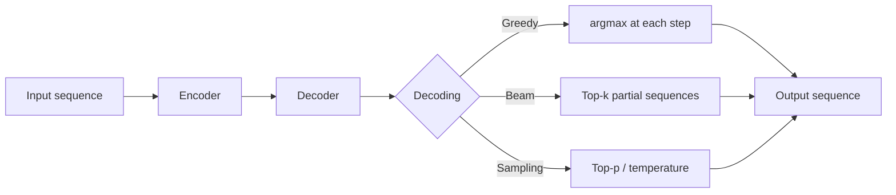

# Sequence Modeling

## Beginner-Friendly Intuition

Sequence modeling is the family of methods that operate on inputs (or
outputs) that have order: words in a sentence, frames in a video,
events in a log, time-series readings. The order matters; shuffling
breaks the meaning. Sequence modeling is what lets a system read a
document, generate a translation, or predict the next event.

The eras: Hidden Markov Models (1960s-2000s) modeled sequences with
discrete latent states and tractable inference. RNNs and LSTMs (1990s-
2017) used differentiable hidden states that scaled with data. The
transformer (2017+) replaced recurrence with attention and dominates
modern sequence work. Beam search remains the standard decoding
algorithm for sequence generation across all eras.

This file covers the structure of the problem (encoder-decoder,
generation, decoding) rather than the specific architectures (covered
in deep-learning files 10-12). The point is to understand the shape of
sequence problems and the algorithms that solve them.

## Formal Explanation

### Sequence problems

A sequence model maps an input sequence (or set) to an output. The
common shapes:

- **Sequence labeling.** One label per input token. NER, POS tagging.
  Output length equals input length.
- **Sequence classification.** One label per sequence. Sentiment, topic.
  Output length is 1.
- **Sequence-to-sequence (seq2seq).** Output is itself a sequence.
  Translation, summarization, code generation. Output length differs
  from input length.
- **Language modeling.** Predict the next token given the prefix.
  Output is a distribution over the vocabulary at each position.
- **Span extraction.** Output is a (start, end) pair indicating a span
  in the input.

### Hidden Markov Models (HMMs)

Generative model with discrete latent states. At each time step, a
state transitions to the next state with probability `P(s_t | s_{t-1})`,
and the state emits an observation with probability `P(o_t | s_t)`.

Inference algorithms:

- **Viterbi.** Most likely state sequence given observations. Dynamic
  programming over a trellis.
- **Forward-backward.** Posterior probability of each state given
  observations.
- **Baum-Welch.** EM algorithm for parameter estimation.

HMMs ruled NLP and speech for decades. Their limitations: discrete
states do not scale (the state space must be small enough to enumerate),
emissions are independent given state (cannot capture rich features),
training requires careful state design.

In 2026, HMMs are mostly historical. Conditional random fields (CRFs)
generalized them with discriminative training and rich features, and
neural sequence models replaced both for almost all production tasks.

### RNNs / LSTMs / GRUs

Cover the same conceptual ground: a hidden state propagates forward,
updated at each step by the current input and the previous state. See
[../deep-learning/10-rnns-lstms-grus.md](../deep-learning/10-rnns-lstms-grus.md)
for details. Strengths: simple, streaming. Weaknesses: sequential
training (no parallelism), vanishing gradients on long sequences.

### Transformers

Self-attention replaces recurrence. The whole sequence is processed in
parallel, with `O(1)` path length between any two positions. See
[../deep-learning/12-transformers.md](../deep-learning/12-transformers.md).
The dominant architecture in 2026.

### Encoder-Decoder Architecture

For seq2seq problems, the encoder compresses the input into a
representation, and the decoder generates the output one token at a
time conditioned on that representation.

- **Encoder.** Reads the input bidirectionally, producing a sequence of
  context vectors.
- **Decoder.** Generates the output autoregressively, attending to the
  encoder output (cross-attention) and to its own previous outputs
  (self-attention).

T5, BART, and the original Transformer use this architecture. For pure
generation (language modeling, completion, chat), decoder-only models
(GPT, LLaMA) skip the encoder and just attend over the prompt.

### Autoregressive Generation

To produce a sequence of tokens, repeatedly call the model:

```
context = prompt
while not done:
    distribution = model(context)
    next_token = pick from distribution
    context = context + [next_token]
```

The "pick" step is **decoding**.

### Decoding strategies

- **Greedy decoding.** Always pick the highest-probability token. Fast
  but produces repetitive outputs and often gets stuck in loops.
- **Beam search.** At each step, keep the `k` (typically 4-8) most
  likely partial sequences. Score each by the cumulative log probability.
  Standard for translation. Better than greedy but tends to produce
  generic outputs.
- **Sampling.** Sample from the model's distribution. Diverse outputs
  but can be incoherent.
- **Top-k sampling.** Sample from the top `k` most likely tokens.
- **Top-p (nucleus) sampling.** Sample from the smallest set of tokens
  whose cumulative probability exceeds `p`. Adapts to local entropy.
- **Temperature.** Divide logits by `T` before softmax. `T < 1`
  sharpens (more deterministic), `T > 1` flattens (more random).

In production, top-p with temperature 0.7-1.0 is typical for chat;
greedy or beam for translation.

### Repetition penalties

Pure greedy and beam decoding often produce repetitions ("the the the").
Repetition penalty divides the logits of recently-generated tokens by a
factor (typical 1.1-1.3) to discourage repeats. n-gram blocking
explicitly forbids repeating any 3- or 4-gram. Both are heuristics; both
help in practice.

### Constrained decoding

Force the output to satisfy constraints:

- **JSON-mode.** Logits are masked so only tokens that keep the output
  valid JSON are allowed.
- **Grammar-based.** A formal grammar (CFG) restricts the next token to
  those that keep the output grammatical.
- **Trie-based.** For closed-set outputs (e.g., the next token must be
  one of a fixed list of product IDs).

### Inference cost

For autoregressive generation of length `T`, naive computation is
`O(T²)` per step due to attending over the growing prefix. **KV
caching** stores the key and value tensors of all previous tokens, so
each new token is `O(T)`. Standard in every LLM serving stack.

## Why It Matters in Real Jobs

Sequence modeling is the foundation of generation, translation,
summarization, dialogue, and any task that produces a structured output.
Three production reasons. First, **decoding strategy directly affects
output quality**: beam vs sampling vs greedy is a real product decision,
not an implementation detail. Second, **inference cost scales with
output length**, and the choice of decoder design (KV caching, batched
generation, speculative decoding) determines whether your generation
service is profitable. Third, **constrained decoding** is increasingly
the way to make LLM outputs reliable for tools and APIs that expect
structured outputs.

## How It Works Step by Step

1. **Identify the problem shape.** Labeling, classification, seq2seq,
   span extraction, or language modeling.
2. **Pick the architecture.** Encoder-only for understanding, decoder-only
   for generation, encoder-decoder for traditional seq2seq.
3. **Choose a pretrained model.** Almost always; training from scratch
   is rare.
4. **Decide decoding strategy.** Beam for translation, sampling with
   top-p for chat, greedy for fast classification.
5. **Implement KV caching for generation.** Standard in HuggingFace
   `generate` and most serving stacks.
6. **Add safety nets.** Maximum length, repetition penalty, n-gram
   blocking, constrained decoding for structured outputs.
7. **Evaluate per task type.** Token-level metrics for tagging,
   sequence-level metrics (BLEU, ROUGE, exact match) for generation.
   See [11-nlp-evaluation.md](11-nlp-evaluation.md).

## Real-World Example

A team builds a translation service. They use a pretrained T5-large
model fine-tuned on a domain corpus. Greedy decoding produces translations
with frequent repetitions and short outputs that miss content. Beam
search with width 4 produces longer, more accurate translations but
sometimes generic ones. Beam search with diverse beam search and length
penalty 1.0 produces the right balance. They quantize to int8 and
batch requests; throughput on a single GPU is 240 sentences per second
at p99 latency 180 ms. For higher-quality offline batches, they bump
beam width to 12 and disable batching.

## Common Mistakes

- Greedy decoding for tasks that benefit from beam (translation).
- Beam decoding for tasks where diversity matters (story generation).
- Forgetting KV caching; inference is 5-50x slower without it.
- Sampling with default temperature 1.0 for instruction-following;
  often produces inconsistent outputs. Lower temperature is usually
  better.
- Pure top-k sampling in low-entropy positions; the truncation forces
  diversity that the model does not want.
- No max-length cap; generation can run forever.
- Forgetting that beam search optimizes log-likelihood, which biases
  toward shorter and more generic outputs. Length normalization helps.
- Treating BLEU/ROUGE as ground truth on generative tasks; they
  correlate poorly with human judgment in many settings.

## Interview Angle

**Question:** Walk through how beam search works and why it usually
beats greedy decoding for translation.

**Strong answer:** Greedy decoding picks the single highest-probability
token at each step. The problem: locally optimal tokens often lead to
globally suboptimal sequences. A token that is best at step `t` might
force the model into a region of vocabulary at step `t+1` that has only
mediocre options.

Beam search keeps the top-`k` partial sequences (the "beams") at each
step. At step `t+1`, it expands every beam by considering every token,
producing `k * V` candidate sequences, scores them by cumulative log
probability, and keeps the top `k`. This way, a sequence that is mediocre
at step `t` can still survive if its continuations are excellent.

Why beam beats greedy for translation. Translation has a strong
sequence-level structure: word choices are highly correlated; one
mistake early forces a cascade of compensations. Beam search explores
multiple parallel hypotheses and lets early-stage uncertainty resolve
later. Empirically, beam width 4-8 produces translations 2-5 BLEU
points better than greedy on standard benchmarks.

Caveats. Beam search has a length bias: cumulative log-probability is
strictly negative, and longer sequences have lower scores. Standard fix:
length penalty `score / length^α` for `α` around 0.6-1.0. Beam search
also tends to produce generic, "safe" outputs because the high-probability
trajectories are often boring. For diverse generation (story writing,
chat), sampling-based methods (top-p, temperature) work better.

In production translation, beam search width is typically 4 (good
quality, low cost). Wider beams produce diminishing returns past width
8 and increase latency proportionally.

**Weak answer:** "Beam search keeps multiple options" without explaining
when it beats greedy or its biases.

**Follow-up questions:**

- What is top-p sampling and when do you use it?
- What is KV caching and why does it matter?
- How would you generate structured outputs reliably?
- What is the difference between encoder-only, decoder-only, and
  encoder-decoder architectures?

## Mini Exercise

Take a small translation dataset (or a small instruction-following
dataset). Generate outputs with greedy, beam (width 4), and top-p
(p=0.9) sampling. Compare BLEU or human-judged quality. Note the
trade-offs.

## Diagram



---
## Navigation

[⬅ Previous](04-word-embeddings-word2vec-glove-fasttext.md) | [🏠 Home](../README.md) | [➡ Next](06-attention-for-nlp.md)
