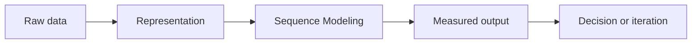

# Sequence Modeling

## Beginner-Friendly Intuition

Sequence Modeling is best learned as a practical lever, not as an isolated definition. In this part of the
curriculum, the goal is to represent language so software can classify, extract, search, summarize, or generate text. Start by asking what input changes, what output or decision
improves, and what mistake becomes easier to catch.

For a beginner, a useful test is simple: explain the concept with one realistic workflow, one
baseline, one metric, and one failure mode. If those four pieces are clear, the formal details have
a place to attach.

## Formal Explanation

Sequence Modeling is a practical concept used to represent and model language so software can search, classify, extract, or generate text in a text product workflow. More formally, the concept should be described by its assumptions, its inputs and
outputs, the objective being optimized or the decision being supported, and the conditions under
which the result can be trusted.

The rigorous version usually includes:

- **Data representation:** what information is available and how it is encoded.
- **Objective or rule:** what the method tries to optimize, estimate, retrieve, or control.
- **Generalization claim:** why performance should hold beyond the examples already seen.
- **Evaluation:** which metric or evidence would convince you the approach is useful.
- **Failure boundary:** where assumptions break, quality drops, or human review is needed.

## Why It Matters in Real Jobs

In real jobs, this concept matters because ML work is judged by useful decisions, not by notebook
complexity. Teams need practitioners who can connect a text product workflow to data quality, metrics, user impact,
latency, cost, privacy, and operational ownership.

This is also why interviewers ask about fundamentals. A strong engineer can explain when the idea is
appropriate, when it is overkill, what baseline should come first, and how the system will be checked
after deployment.

## How It Works Step by Step

1. **Frame the task.** Define the user need, target output, constraints, and cost of mistakes.
2. **Inspect the data.** Check sources, missingness, leakage, distribution shift, and label quality.
3. **Build a baseline.** Use the simplest method that creates a measurable reference point.
4. **Apply the concept.** Implement the method while keeping assumptions and parameters visible.
5. **Evaluate honestly.** Use a split, metric, and error analysis that match deployment.
6. **Decide the next action.** Improve, simplify, monitor, roll back, or ask for more data.

## Real-World Example

Imagine a support platform that needs to reduce response time. The team can apply this concept as
part of a workflow that reads historical tickets, represents each ticket with useful signals, trains
or configures a baseline, and evaluates whether the output improves routing quality. The production
version must also handle new ticket types, missing fields, escalation rules, and monitoring.

The important lesson is that the concept is not isolated. It sits inside a decision loop with data
collection, measurement, deployment, and feedback.

## Common Mistakes

- Starting with a complex model before defining the task and baseline.
- Evaluating on data that is easier than real deployment traffic.
- Forgetting that a high average score can hide severe segment failures.
- Treating the method as correct without checking assumptions.
- Explaining the concept with formulas only and no product or data context.

## Interview Angle

Interviewers often use this topic to test whether you can move between intuition, mechanics,
and production judgment.

**Question:** Explain Sequence Modeling, then describe how you would use it in a real system.

**Strong answer:** Define the concept simply, name the inputs and outputs, state the baseline,
choose a metric, mention a failure mode, and describe what you would monitor.

**Weak answer:** Recite a definition without explaining data assumptions, evaluation, or why the
method fits the problem.

**Follow-up questions:**

- What baseline would you build first?
- What would make the evaluation misleading?
- Which errors are most costly?
- How would the answer change under latency or privacy constraints?

## Mini Exercise

Choose a real product feature such as search, recommendations, fraud review, support routing, or
document assistance. Write five bullets: input data, output, baseline, primary metric, and one
failure mode. Then explain how the concept fits into that system.

## Diagram

---
## Navigation

[⬅ Previous](04-word-embeddings-word2vec-glove-fasttext.md) | [🏠 Home](../README.md) | [➡ Next](06-attention-for-nlp.md)
