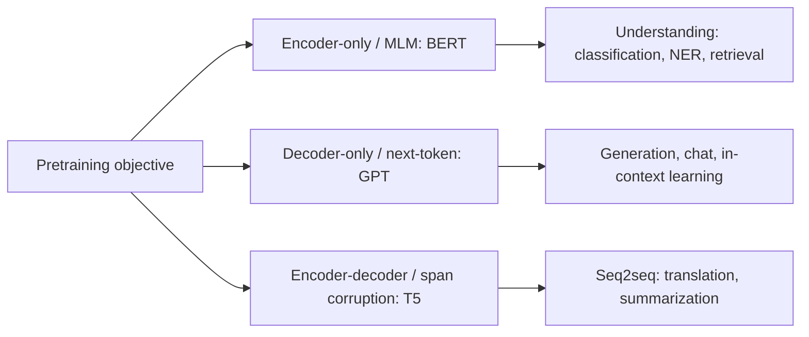

# Transformers for NLP

## Beginner-Friendly Intuition

The transformer architecture (Vaswani et al., 2017) was originally
designed for machine translation. Within five years it became the
foundation of every state-of-the-art NLP system: BERT for understanding,
GPT for generation, T5 for sequence-to-sequence, and every large
language model that followed. The deep-learning file
[../deep-learning/12-transformers.md](../deep-learning/12-transformers.md)
covers the architecture mechanics. This file covers what changed about
NLP because of transformers: the pretraining recipes, the family of
models they spawned, and how to use them in 2026.

The intuition for why transformers won NLP specifically: language has
strong long-range dependencies (subject-verb agreement, anaphora,
discourse), benefits from massive unlabeled data (the internet),
and rewards parallel training (you can scale up). Transformers nail all
three. Pre-transformer, an LSTM trained on 1B tokens was a state-of-the-
art research result. Post-transformer, models train on 1T+ tokens
routinely.

## Formal Explanation

### The pretraining revolution

The 2018-2019 shift was as important as the 2017 architecture: pretrain a
transformer on a huge unlabeled corpus, then fine-tune on a small
labeled dataset per task. Three pretraining objectives matter:

#### Masked language modeling (MLM): BERT

Mask 15 percent of the tokens in the input; train the model to predict
the masked tokens. Bidirectional: the model sees context from both
sides. Used by BERT (Devlin et al., 2018), RoBERTa, DeBERTa, and modern
encoder-only models. Result: a strong representation for tokens given
their full bidirectional context. Use case: classification, NER, QA,
retrieval.

Variants:

- **Whole word masking.** Mask all subword tokens of a word together.
- **Span masking.** Mask contiguous spans (used in SpanBERT).
- **Replaced token detection.** Replace tokens with plausible
  alternatives; train the model to detect which were replaced (ELECTRA,
  more sample-efficient than MLM).

#### Causal language modeling: GPT

Predict the next token given the previous tokens. Unidirectional. Used
by GPT, LLaMA, Mistral, Qwen, and every modern LLM. Result: a strong
generative model that can also be prompted to do classification and
extraction zero-shot or few-shot.

#### Span corruption: T5

Replace contiguous spans with a sentinel token; train an encoder-decoder
to generate the original spans. Used by T5 (Raffel et al., 2020), mT5,
BART (variants). Result: a model that handles both understanding and
generation cleanly through a single text-to-text interface.

### The model families

#### Encoder-only

Bidirectional attention, MLM pretraining. Best for understanding tasks.

- **BERT** (2018). The original. Base and large variants (110M, 340M
  parameters).
- **RoBERTa** (2019). BERT with longer training, larger batches, removed
  next-sentence-prediction. Strictly better than BERT for downstream
  tasks.
- **DistilBERT, MiniLM, ALBERT.** Distilled or parameter-shared smaller
  variants. Used for latency-bound deployment.
- **DeBERTa-v3** (2021). Disentangled attention plus replaced token
  detection. State of the art on GLUE/SuperGLUE for years.
- **ModernBERT** (2024+). Long-context (8192) BERT variant with rotary
  positional encoding and modern training tricks.

#### Decoder-only

Causal attention, next-token pretraining. Used for generation,
in-context learning, instruction following.

- **GPT-2, GPT-3, GPT-4** (OpenAI, 2019-2023).
- **LLaMA, LLaMA-2, LLaMA-3, LLaMA-4** (Meta, 2023-2025). Open weights.
- **Mistral, Mixtral, Mistral Large** (Mistral, 2023+).
- **Qwen, DeepSeek, Yi** (open Chinese models).
- **Claude (Anthropic), Gemini (Google).** Hosted closed-weight LLMs.

#### Encoder-decoder

Bidirectional encoder + causal decoder, span-corruption pretraining.

- **T5** (Google, 2020). The "text-to-text" framing: every task is
  encoded as input text -> output text.
- **BART** (Facebook, 2019). Denoising autoencoder; strong for
  summarization.
- **mT5, M2M-100.** Multilingual variants.

### Scaling laws

Empirical: loss decreases as a power law in parameters, data, and
compute (Kaplan et al., 2020; Hoffmann et al. / Chinchilla, 2022). The
Chinchilla finding: optimal allocation of compute uses roughly 20
training tokens per model parameter. Earlier work undertrained models
relative to compute; more recent models train at higher token-to-
parameter ratios.

Emergent capabilities (chain-of-thought reasoning, in-context learning,
zero-shot instruction following) appear above certain scales (typically
7B-70B parameters depending on the capability). This is the empirical
basis for the 2022-2026 LLM wave.

### Adaptation strategies in 2026

- **Fine-tuning.** Update all parameters on task-specific data. Strong
  but expensive for large models.
- **LoRA / QLoRA / adapters.** Update small parameter-efficient sets;
  freeze the base. Standard approach for adapting LLMs to a domain
  with limited compute.
- **Prompting.** Use the pretrained model zero-shot or few-shot via the
  prompt. No parameter updates.
- **In-context learning.** Provide examples in the prompt; the model
  generalizes pattern.
- **Retrieval-augmented generation (RAG).** Retrieve relevant documents
  at query time and include them in the prompt. Reduces hallucination,
  enables fresh knowledge without retraining.
- **Tool use.** Equip the model with calls to external APIs (search,
  calculator, code execution). Increasingly standard for agentic
  workflows.

### Instruction tuning and RLHF

After pretraining, models undergo additional stages:

- **Supervised fine-tuning (SFT).** Train on (instruction, response)
  pairs to follow human instructions.
- **RLHF (Reinforcement Learning from Human Feedback).** Train a reward
  model on human preference comparisons; optimize the policy with PPO
  or DPO to produce outputs preferred by humans.
- **Direct Preference Optimization (DPO).** Skips the reward model and
  RL; directly optimizes the policy to match preferences. Simpler,
  often as effective.

These stages turn a base model into a usable assistant. Without them, a
pretrained model completes text but does not follow instructions.

## Why It Matters in Real Jobs

Transformer-based NLP is the default in 2026. Three production roles.
First, **fine-tune small encoders** for high-volume, low-latency
classification and extraction (DistilBERT, RoBERTa, DeBERTa-v3-base).
Second, **prompt large models** for flexible, low-volume tasks where
fine-tuning is overkill or labels are scarce. Third, **build RAG and
agent systems** that combine retrieval with LLMs for knowledge-grounded
applications.

The pricing-vs-quality decision is constant. A fine-tuned 100M-parameter
encoder costs ~$0.0001 per inference and beats a $0.01 GPT-4 zero-shot
call on tasks with sufficient labels. The decision depends on label
availability, task variety, and total volume.

## How It Works Step by Step

1. **Frame the task.** Classification, extraction, retrieval, or
   generation.
2. **Pick the model family.** Encoder-only for understanding,
   decoder-only for generation, encoder-decoder for seq2seq.
3. **Pick scale.** DistilBERT/MiniLM for fast inference. BERT/RoBERTa
   for general use. DeBERTa-v3 for max accuracy at moderate cost.
   LLaMA/Mistral/Qwen at 7B-70B for open generation. GPT-4/Claude for
   hosted high-quality generation.
4. **Decide adaptation.** Fine-tune for many examples; LoRA for less
   compute; prompt for zero/few-shot; RAG for knowledge-grounded.
5. **Train or prompt.** Standard transformer recipe (AdamW, warmup,
   cosine LR) or careful prompt engineering with few-shot examples.
6. **Evaluate by task-specific metric.** F1 for classification, exact
   match for span extraction, BLEU/ROUGE/human eval for generation.
7. **Deploy with care.** Quantization (int8 or int4), batching,
   FlashAttention, KV caching, and monitoring for prompt drift.

## Real-World Example

A team needs to build a contract clause classifier (24 classes, 8K
labeled documents). They benchmark.

- DistilBERT-base, fine-tuned: macro F1 0.81, 12 ms per inference.
- RoBERTa-large, fine-tuned: macro F1 0.86, 65 ms.
- DeBERTa-v3-large, fine-tuned: macro F1 0.88, 80 ms.
- GPT-4 with 8 in-context examples: macro F1 0.82, 1500 ms, $0.02 per
  call.
- LLaMA-3-70B with LoRA fine-tuning: macro F1 0.86, 200 ms (on dedicated
  GPU), much higher infra cost.

The team picks RoBERTa-large for production: best F1 within latency
budget, predictable inference cost, on-premise. They keep GPT-4 as a
human-in-the-loop tool for new clause types not seen in training. The
combination handles both stable, high-volume cases (RoBERTa) and the
long tail of novel patterns (GPT-4 with retrieval).

## Common Mistakes

- Defaulting to GPT-4 zero-shot for tasks where a fine-tuned encoder
  would beat it on accuracy, latency, and cost.
- Fine-tuning a 70B-parameter LLM full-rank when LoRA would suffice.
- Using BERT (2018) when DeBERTa-v3 or ModernBERT (2024) would lift
  accuracy 1-3 points for free.
- Skipping the small-data baseline (TF-IDF + linear); sometimes it is
  surprisingly competitive.
- Ignoring tokenization mismatches when porting models across languages
  or domains.
- Treating prompting as deterministic; LLM outputs vary, especially at
  high temperature.
- Forgetting that pretrained models reflect their training distribution
  (English-heavy, internet-text style); domain shift hurts accuracy.
- Skipping evaluation on the long tail; aggregate metrics hide failures
  on rare classes or unusual inputs.
- Using BLEU/ROUGE on generation tasks without human eval.

## Interview Angle

**Question:** Compare BERT, GPT, and T5 in terms of architecture,
pretraining, and best-fit tasks.

**Strong answer:** All three are transformers; they differ in attention
direction, pretraining objective, and consequently which tasks they fit
best.

**BERT** is encoder-only, with bidirectional attention. Pretrained with
masked language modeling: 15 percent of tokens are masked, the model
predicts them given both left and right context. The bidirectional
context makes BERT a strong text-understanding model: each token's
representation is informed by every other token in the sentence. Best
for classification, NER, span extraction, and retrieval (where document
embeddings benefit from bidirectional context). Cannot generate text
naturally because of its bidirectional pretraining.

**GPT** is decoder-only, with causal attention. Each position attends
only to itself and earlier positions. Pretrained with next-token
prediction: given a prefix, predict the next token. Causal attention
naturally fits autoregressive generation, which is why GPT and its
descendants dominate text generation, instruction following, and chat.
Can do classification and extraction via prompting, but a fine-tuned
BERT typically beats few-shot GPT on accuracy when labels exist.

**T5** is encoder-decoder. The encoder has bidirectional attention; the
decoder has causal attention plus cross-attention to the encoder output.
Pretrained with span corruption: replace random spans with a sentinel
token, train the model to generate the spans. Frames every task as
text-to-text: classification is "label this text: {input}" -> "{class
name}", translation is "translate to French: {input}" -> "{translation}",
etc. Strong for traditional seq2seq (translation, summarization) and
for tasks that benefit from a clean text-to-text interface.

In 2026, the encoder-decoder T5 family is less common in cutting-edge
research; decoder-only LLMs handle most generation, and encoder-only
BERT-family models handle most fast classification. T5 still has its
place in production for tasks where the text-to-text framing simplifies
engineering.

The deeper point: pretraining objective matters more than just
parameter count. BERT-large at 340M parameters can outperform a 7B-
parameter decoder-only model on classification, because BERT is
optimized for that representation, while the decoder-only model spent
its compute on generation.

**Weak answer:** "BERT is for understanding, GPT is for generation"
without explaining the attention direction or pretraining differences.

**Follow-up questions:**

- What is RLHF and why is it needed after pretraining?
- What is LoRA and when would you use it?
- How does retrieval-augmented generation (RAG) work?
- What are scaling laws and what do they predict?

## Mini Exercise

Pick a small classification dataset. Fine-tune DistilBERT. Then prompt
an LLM (GPT-4 or LLaMA-3) zero-shot and few-shot on the same task.
Compare accuracy, cost, and latency.

## Diagram

---
## Navigation

[⬅ Previous](06-attention-for-nlp.md) | [🏠 Home](../README.md) | [➡ Next](08-text-classification.md)
