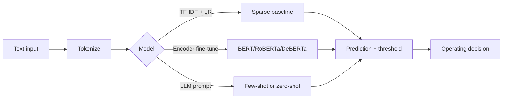

# Text Classification

## Beginner-Friendly Intuition

Text classification assigns a label to a piece of text. Sentiment
(positive/negative), spam (yes/no), topic (one of K), intent (book a
flight, check status, get refund), abuse (allowed/violation). It is the
most-studied and most-deployed NLP task: every search query, support
ticket, social media post, and email gets classified somewhere. The
techniques span from "logistic regression on TF-IDF" (1990s) to "fine-
tune a transformer" (2020s) to "prompt an LLM" (2024+).

The intuition for picking a method: classification accuracy follows a
hierarchy of label budget. With 100 labels, prompt an LLM. With 1,000
labels, fine-tune a small encoder. With 100,000 labels, fine-tune a
larger encoder or train a custom model. With 10M labels, even a TF-IDF
linear model can be competitive. Match the method to the data you have.

## Formal Explanation

### Approaches by data budget

#### TF-IDF + linear (sparse baseline)

- **Vectorize.** Tokenize, remove stop words, optionally stem; compute
  TF-IDF for unigrams and bigrams over the top 50K-200K features.
- **Train.** Logistic regression with L2, or linear SVM, or a small
  feedforward network on the vectors.
- **Calibrate.** Apply isotonic regression on a held-out fold for
  probability calibration.

Strengths: fast, interpretable (one coefficient per feature), no GPU
needed, robust under modest distribution shift. Strong baseline at any
data size; surprisingly hard to beat with under 5K examples on simple
domains.

#### Fine-tuned transformer encoder

- **Tokenize** with the model's tokenizer; truncate or chunk at the
  context limit.
- **Add a classification head** (a linear layer on top of the `[CLS]`
  token's final hidden state, or a mean-pooled representation).
- **Fine-tune.** AdamW with `lr = 2e-5`, 3-5 epochs, linear warmup
  over 500-1000 steps. Standard recipe.
- **Evaluate** with macro F1 (treats classes equally) or weighted F1
  (weights by class support).

Strengths: strong accuracy with 1K-100K labels. Default in 2026 for
high-quality classification.

#### Few-shot LLM prompting

- **Construct a prompt** with the task description and a small number
  of (input, label) examples.
- **Call the LLM** with the new input appended.
- **Parse the response** to extract the predicted label.

Strengths: no training data needed, handles new classes by editing the
prompt. Weaknesses: cost (often $0.001-$0.01 per call), latency, and
brittleness to prompt wording.

#### Zero-shot classification with NLI models

Use a pretrained natural language inference (NLI) model. Frame the
classification as: "premise = input text, hypothesis = this text is
about <label>". The NLI model scores entailment for each label; pick
the highest. Standard technique for classification with no labels.

#### Distillation

Train a small encoder to mimic a large model's outputs. Useful when
the large model is too slow for production but provides high-quality
labels for a distillation set.

### Imbalance

Most real text classification is imbalanced (spam at 1 percent, severe
abuse at 0.01 percent). See
[../data-science/06-handling-imbalanced-data.md](../data-science/06-handling-imbalanced-data.md).
Specifically for text:

- **Class weights.** Set `class_weight='balanced'` or pass
  `pos_weight` in BCE.
- **Threshold tuning.** Tune the decision threshold on validation, not
  on test.
- **Focal loss.** When some classes are rare and hard.
- **Data augmentation.** Back-translation, synonym replacement,
  contextual augmentation with another LLM. Avoid simple operations
  like word deletion that change the semantics for sentiment tasks.

### Multi-label vs multi-class

- **Multi-class** (single label): use softmax + cross-entropy.
- **Multi-label** (potentially multiple labels): use sigmoid + binary
  cross-entropy per class. Tune a threshold per class.

Confusing the two is a common bug; multi-label trained as multi-class
forces the model to pick one when several should fire.

### Hierarchical classification

When classes form a hierarchy (e.g., product taxonomy: Electronics ->
Phones -> Smartphones), train hierarchically: a top-level classifier
plus per-branch sub-classifiers. Or train a single flat classifier with
all leaf classes. The hierarchy adds robustness: an unfamiliar product
classified as Electronics is still useful even if the leaf is wrong.

### Long documents

Transformers have a context limit (typically 512 to 8192 tokens). For
documents longer than the limit:

- **Truncate.** Take the first N tokens. Loses tail content.
- **Chunk and pool.** Split into windows, classify each, aggregate by
  voting or mean. More robust.
- **Hierarchical encoding.** Encode each chunk; encode the sequence of
  chunk embeddings with a second-level model.
- **Long-context model.** Use a Longformer, BigBird, or modern long-
  context transformer.

## Why It Matters in Real Jobs

Text classification powers content moderation, ticket routing, search
intent, fraud detection, ad targeting, sentiment dashboards, and most
NLP-touching backends. Three production reasons. First, **scale**:
classification often runs on every incoming text in the system, so
latency and cost matter. Second, **drift**: the input distribution of
text moves with user vocabulary, slang, and topic shifts; classifiers
need monitoring and periodic retraining. Third, **policy**: many
classifiers (abuse, hate speech, fraud) implement business rules with
real consequences; correctness, calibration, and per-segment fairness
matter.

## How It Works Step by Step

1. **Frame the task precisely.** Single label or multi-label? Hierarchy?
   What does "wrong" cost?
2. **Audit the labels.** Inter-annotator agreement, label noise, class
   imbalance, missing classes.
3. **Build a sparse baseline.** TF-IDF + logistic regression. Often
   surprisingly close to the eventual best.
4. **Fine-tune a small encoder.** DistilBERT, MiniLM, or
   ModernBERT-base. 3-5 epochs, AdamW, `lr = 2e-5`.
5. **Try a larger encoder if accuracy gap matters.** RoBERTa-large,
   DeBERTa-v3-large.
6. **Tune the decision threshold per class.** Match the precision/recall
   trade-off to the business need.
7. **Calibrate.** Isotonic regression on a held-out fold if downstream
   systems consume probabilities.
8. **Per-segment evaluation.** Aggregate accuracy hides failures on
   rare classes or specific user groups.
9. **Deploy with monitoring.** Track per-class accuracy and input
   distribution. Retrain on a schedule.

## Real-World Example

A team builds an abuse classifier for a community platform. Labels are
binary (allowed/violation), 200K labeled examples, 3 percent positive.

- TF-IDF + logistic regression: macro F1 0.61.
- DistilBERT-base, fine-tuned: macro F1 0.79.
- RoBERTa-large, fine-tuned with focal loss: macro F1 0.83.
- Same RoBERTa-large with threshold tuned for precision 0.85: recall
  0.62 at precision 0.85.
- Same model with class-weighted BCE and threshold tuned: recall 0.71
  at precision 0.85.

The team ships RoBERTa-large with class-weighted BCE and a tuned
threshold. They route flagged content to human reviewers; the
moderator's time is the binding constraint, so precision matters more
than recall. They also build a separate, faster DistilBERT classifier as
a triage stage: only content the fast classifier flags goes to
RoBERTa-large for the final decision. Two-stage classification cuts
inference cost by 8x without hurting recall meaningfully.

## Common Mistakes

- Reporting accuracy on imbalanced data (3 percent positive, "all
  negative" gets 97 percent accuracy).
- Default 0.5 threshold without tuning; rarely optimal.
- Forgetting that softmax + cross-entropy assumes mutually exclusive
  classes; use sigmoid + BCE for multi-label.
- Skipping per-class evaluation; one bad class drags down macro F1.
- Heavy preprocessing (stemming, stop-word removal) for transformer
  inputs.
- Truncating long documents from the front when the head is the topic
  sentence.
- Comparing zero-shot LLM vs fine-tuned encoder without considering
  cost and latency.
- Treating prediction confidence as calibrated probability without
  checking; many models produce uncalibrated scores.
- Forgetting to retrain as user vocabulary shifts.

## Interview Angle

**Question:** A team wants a binary text classifier. They have 50K
labeled examples, 5 percent positive class, and need 100 ms p99
latency. Walk through your approach.

**Strong answer:** Start with the constraints. 50K examples is plenty
for fine-tuning a small encoder; 5 percent imbalance is moderate; 100
ms latency excludes the largest models without quantization.

The plan.

1. **Build a sparse baseline first.** TF-IDF + logistic regression,
   class weights for imbalance. This trains in minutes and gives a
   reference number. Often it lands within 5 F1 points of the eventual
   best, telling you whether a deep model is worth the engineering
   effort.

2. **Fine-tune DistilBERT-base or MiniLM.** AdamW with `lr = 2e-5`,
   warmup 500 steps, cosine decay, 3-5 epochs. Use BCE loss with a
   `pos_weight` of approximately 19 (one over the positive rate) to
   compensate for imbalance; or use focal loss with `gamma = 2`. This
   typically lands at decent precision and recall.

3. **Tune the threshold.** The default 0.5 is rarely right. Sweep
   thresholds on validation, plot the precision-recall curve, and pick
   the threshold matched to the business cost ratio of false positives
   vs false negatives.

4. **Quantize to int8.** Cuts inference latency roughly in half on
   modern CPUs with under 1 percent accuracy loss. Critical for the 100
   ms p99 budget.

5. **Calibrate if downstream uses probabilities.** Isotonic regression
   on a held-out fold.

6. **Evaluate honestly.** Report PR-AUC and recall at fixed precision,
   not just F1. Per-segment metrics if any segment matters. Bootstrap
   confidence intervals.

7. **Plan monitoring and retraining.** Track per-segment precision and
   recall in production. Retrain on a quarterly schedule or whenever
   metric drift exceeds a threshold.

What I would not do. Default to GPT-4 zero-shot (cost and latency are
prohibitive at the volume implied by a "real" classifier; also a fine-
tuned encoder beats GPT-4 zero-shot on most binary classification with
50K labels). Use accuracy as the primary metric (it lies on imbalanced
data). Skip the threshold tuning step (a tuned threshold is often the
single biggest accuracy lever).

**Weak answer:** "Fine-tune BERT" without addressing imbalance, threshold,
or latency.

**Follow-up questions:**

- How would you handle class imbalance?
- When would you choose multi-label vs multi-class?
- How do you decide between zero-shot LLM and fine-tuned encoder?
- What metrics would you report?

## Mini Exercise

Take an imbalanced binary text classification dataset. Compare TF-IDF +
logistic regression with `class_weight='balanced'` vs DistilBERT
fine-tuned with `pos_weight`. Report PR-AUC and recall at precision
0.8 for both. Note the gap.

## Diagram

---
## Navigation

[⬅ Previous](07-transformers-for-nlp.md) | [🏠 Home](../README.md) | [➡ Next](09-named-entity-recognition.md)
