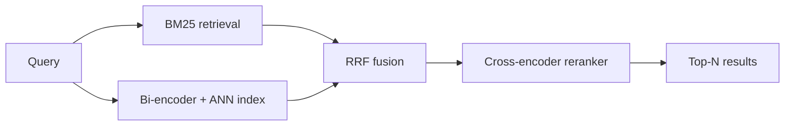

# Semantic Search

## Beginner-Friendly Intuition

Semantic search retrieves documents by **meaning**, not by keyword
match. Traditional search (BM25, TF-IDF) returns documents that share
words with the query: a search for "places to eat" misses a document
that says "good restaurants" because there is no word overlap.
Semantic search uses dense vector representations: embed the query and
all documents into the same space, return the documents whose vectors
are nearest to the query vector.

The intuition: an embedding is a learned summary of meaning. Two
documents about food, regardless of vocabulary, end up close in
embedding space. The search problem becomes a nearest-neighbor problem
in a 384- or 768-dimensional vector space. With the right index (HNSW,
IVF-PQ), this scales to billions of documents at millisecond latency.

In 2026, almost every meaningful search system is **hybrid**: BM25 plus
dense retrieval, with a reranker on top. Pure dense often loses on
exact-match queries and rare terms; pure sparse loses on semantic
matches; the combination is more robust than either alone.

## Formal Explanation

### Bi-encoder vs cross-encoder

- **Bi-encoder.** Encode query and document separately into vectors.
  Retrieval is a fast vector similarity (dot product or cosine). Used
  for first-stage retrieval where you must score against millions of
  documents.
- **Cross-encoder.** Concatenate query and document, run a transformer
  over the combined sequence, output a relevance score. Much higher
  accuracy than bi-encoder; vastly more expensive (must run the
  transformer for every query-document pair). Used for reranking the
  top-k from the bi-encoder.

The standard pipeline:

```
query -> bi-encoder -> top-K candidates from index
candidates -> cross-encoder -> reranked top-N
```

`K` is typically 100-1000; `N` is typically 5-20.

### Bi-encoder training

Train two encoders (often shared weights) on (query, positive_doc,
negative_docs) triples. Loss: contrastive (InfoNCE) or triplet:

```
InfoNCE: -log(exp(sim(q, d+)) / Σ_d exp(sim(q, d)))
```

Negatives can be:

- **In-batch negatives.** Other positives in the same batch are
  treated as negatives. Cheap and effective.
- **Hard negatives.** Mined offline by retrieving documents the model
  ranks high but are actually irrelevant. Boosts accuracy
  significantly.
- **BM25-mined negatives.** Use BM25 to find lexically similar but
  semantically irrelevant documents.

### Sentence transformers

Pretrained sentence-transformer models (Sentence-BERT, MiniLM, MPNet,
E5, BGE, Cohere embed, OpenAI embed) produce off-the-shelf bi-encoder
embeddings. Dimension typically 384 or 768. They are trained on diverse
retrieval tasks and generalize well; fine-tuning on domain data adds
3-10 points of NDCG@10 typically.

### ANN indexing

Brute-force vector search is `O(N · d)` per query. ANN (Approximate
Nearest Neighbor) algorithms achieve `O(log N · d)` or better with
small recall loss.

- **HNSW (Hierarchical Navigable Small World).** Multi-layer graph; at
  query time, navigate through the layers from coarse to fine. Best
  recall-latency trade-off for moderate scale (millions to hundreds of
  millions). Default in many vector databases.
- **IVF-PQ (Inverted File + Product Quantization).** Cluster vectors
  into K cells; only search within the closest cells. Quantize vectors
  for memory efficiency. Used at very large scale.
- **ScaNN, FAISS, Annoy.** Other ANN libraries with various trade-offs.

Tune `efSearch` (HNSW) or `nprobe` (IVF) for the recall-latency
trade-off your application can tolerate.

### Hybrid search

Combine BM25 (sparse) and dense retrieval:

- **RRF (Reciprocal Rank Fusion).** Score by `1 / (k + rank)` from each
  list, sum, sort. Simple, robust, no parameter tuning.
- **Weighted combination.** Linear combination of normalized scores.
  Requires careful score normalization.
- **Learned reranker.** A cross-encoder takes query, document, and
  retrieval scores as features.

Hybrid almost always beats either alone, especially in domains with
lots of rare terms (legal, biomedical, code).

### Evaluation

- **Recall@K.** Fraction of queries where a relevant doc is in top K.
  Measures the bi-encoder's coverage; the reranker can only fix what
  was retrieved.
- **MRR (Mean Reciprocal Rank).** `1 / rank` of the first relevant
  doc, averaged over queries. Sensitive to top-1 quality.
- **NDCG@K.** Position-discounted relevance, normalized by ideal
  ranking. Good when relevance is graded (not just binary).
- **Precision@K.** Fraction of top-K that is relevant. Useful for
  human-evaluation panels.

Each is computed against a labeled dataset with relevance judgments
per query.

### Dense search failure modes

- **Out-of-distribution queries.** Embeddings reflect their training
  distribution; rare domains or novel vocabulary degrade.
- **Exact match.** Pure dense often misses queries like product codes,
  IDs, or very specific phrases. Hybrid retrieval fixes this.
- **Embedding model versioning.** When you re-embed your corpus with a
  new model, old embeddings are incompatible. Plan for re-indexing.
- **Long documents.** Embedding a long document into a single vector
  loses local detail. Chunk into paragraphs and index per-chunk.

## Why It Matters in Real Jobs

Semantic search powers internal knowledge bases, customer support
search, e-commerce discovery, code search, and the retrieval step of
RAG systems. Three production reasons. First, **user expectations have
shifted**: people search by intent ("how do I cancel"), not by exact
keywords. Sparse-only search feels broken in 2026. Second, **scale and
latency**: ANN indexing makes million-document search feasible at
sub-100ms latency. Third, **RAG everywhere**: retrieval-augmented
generation is now the standard way to add knowledge to LLMs, and the
retrieval is dense or hybrid.

## How It Works Step by Step

1. **Frame the retrieval task.** Documents to index, queries to
   support, definition of "relevant".
2. **Build an evaluation set.** 100-1000 queries with relevance
   judgments. Without it, you cannot measure progress.
3. **Pick an embedding model.** A pretrained sentence-transformer
   (E5, BGE, MiniLM) for generic English. A domain-specific model if
   one exists. Hosted embeddings (OpenAI, Cohere, Voyage) for
   convenience.
4. **Chunk documents.** Typical chunk size: 200-500 tokens with 50-100
   token overlap. Long documents become multiple chunks.
5. **Build the index.** HNSW for moderate scale (millions), IVF-PQ for
   large (billions). Test recall-latency trade-off on your eval set.
6. **Add BM25.** Build a sparse index in parallel. RRF the two result
   lists.
7. **Add a reranker.** Cross-encoder over the top 50-100 candidates;
   keep top 10. Adds latency but boosts accuracy.
8. **Evaluate.** Recall@K, NDCG@K. Compare hybrid vs dense-only vs
   sparse-only.
9. **Monitor in production.** Click-through rates, dwell time, query
   reformulation rates. Embedding drift; re-embed on a schedule.

## Real-World Example

A team builds search over an internal documentation corpus (50K
articles, 200K paragraphs after chunking). They benchmark.

- BM25-only: NDCG@10 0.41.
- Dense-only (E5-base, fine-tuned on internal data): NDCG@10 0.49.
- Hybrid (RRF of BM25 and dense): NDCG@10 0.55.
- Hybrid + cross-encoder reranker (MiniLM-cross-encoder): NDCG@10
  0.62.

The team ships the hybrid + reranker system. Latency budget: 200 ms p99.
Bi-encoder retrieval is 5 ms (HNSW with `efSearch = 32`); BM25 is 8
ms; reranker is 70 ms (cross-encoder over top 50). Total p99: 110 ms,
well within budget. Six months later, they switch to a stronger
embedding model (E5-large) and add hard-negative mining; NDCG@10
reaches 0.66 without changing the architecture.

## Common Mistakes

- Skipping hybrid (BM25 + dense). Dense alone misses exact-match
  queries.
- Skipping the reranker. The first-stage retrieval has lower ceiling
  than reranked.
- Using a single big chunk per document; long-document embeddings dilute
  local relevance.
- Not building an evaluation set; you cannot improve what you cannot
  measure.
- Comparing models with different chunking strategies; chunking is part
  of the system.
- Re-embedding all documents synchronously when you upgrade the model;
  plan for incremental migration.
- Using the wrong distance (dot vs cosine) for the embedding model;
  some models are trained for cosine, others for inner product.
- Forgetting to normalize embeddings if the model expects normalized
  inputs.
- Indexing without metadata filters; production search needs language,
  region, freshness, access-control filters.

## Interview Angle

**Question:** Design the retrieval stage of a question-answering system
over a knowledge base of 10M documents. Latency budget 200 ms.

**Strong answer:** First, the architecture choice. Pure dense retrieval
loses on exact-match queries (product codes, names); pure sparse misses
semantic matches. Build a hybrid: BM25 plus dense, RRF-fused, then
reranked with a cross-encoder.

The pipeline.

1. **Chunk the documents.** 300-500 tokens with 100-token overlap.
   Index each chunk separately.
2. **Embed each chunk** with a sentence-transformer (E5-base or
   stronger). Normalize the embeddings if the model expects it.
3. **Build the dense index.** HNSW with `M = 32, efConstruction = 200`.
   At 10M vectors of 768 dim, this fits comfortably in 30-50 GB of RAM.
4. **Build a sparse index.** BM25 with standard parameters
   (`k1 = 1.5, b = 0.75`).
5. **At query time, run both in parallel.** Each returns top 100
   candidates with scores.
6. **Fuse with Reciprocal Rank Fusion.** `score = Σ 1/(k + rank_i)`
   where `k = 60` is standard.
7. **Rerank the top 50** with a cross-encoder (MiniLM-cross-encoder or
   stronger).
8. **Return top 10** to the QA stage.

Latency budget. Dense HNSW at `efSearch = 32`: 5-15 ms. BM25 lookup:
5-15 ms. Cross-encoder over 50 pairs at 384 tokens each: 60-100 ms on
GPU, 200-300 ms on CPU. Total under 200 ms requires GPU reranking or
fewer candidates to rerank.

Evaluation. Build a labeled set of 200-500 query-document pairs.
Measure Recall@100 (does the bi-encoder retrieval find a relevant doc
in top 100?) and NDCG@10 (how good is the final ranking?). Test
hybrid vs dense-only vs sparse-only.

Production concerns. Embedding drift: re-embed on a schedule when the
model improves. Hard-negative mining: use BM25 to find lexically
similar irrelevant docs; fine-tune the bi-encoder with them. Metadata
filters: language, recency, access control. Caching: cache embeddings
for popular queries.

What I would not do. Use only dense retrieval (loses on exact match).
Skip the cross-encoder reranker (large accuracy hit). Use a small
chunk size (under 100 tokens; loses context). Use a single big
embedding per document (loses local detail).

**Weak answer:** "Use a vector database" without addressing hybrid
retrieval, reranking, or evaluation.

**Follow-up questions:**

- Why use a cross-encoder reranker instead of a stronger bi-encoder?
- How does HNSW work?
- What are hard negatives and how would you mine them?
- How would you handle a query for an entity that does not exist in
  your corpus?

## Mini Exercise

Build a small semantic search system on a public corpus (e.g., a Wikipedia
dump or 10K papers). Compare BM25-only, dense-only (sentence-transformer),
hybrid, and hybrid+reranker. Report Recall@10 and NDCG@10 on a small
labeled query set.

## Diagram



---
## Navigation

[⬅ Previous](09-named-entity-recognition.md) | [🏠 Home](../README.md) | [➡ Next](11-nlp-evaluation.md)
