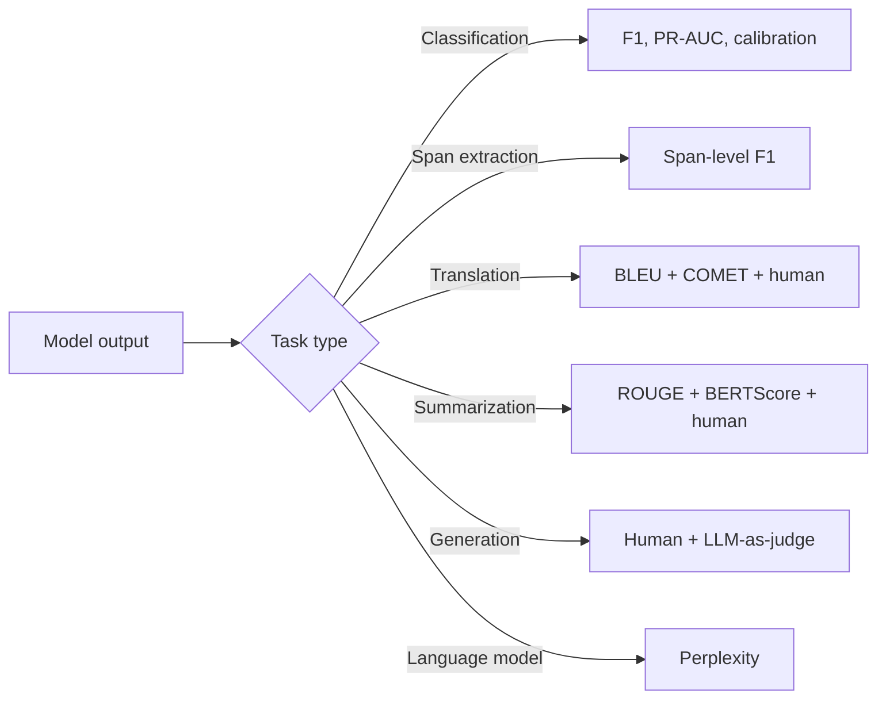

# NLP Evaluation

## Beginner-Friendly Intuition

Evaluating NLP systems is harder than it looks. Classification has a
clean answer ("the predicted label matches or it does not"). Generation
does not: there are usually many correct outputs, paraphrases that
should count as right, and subjective judgments about quality. The
metrics we have (BLEU, ROUGE, perplexity, exact match) are imperfect
proxies for human judgment, and using them blindly leads to systems
that score well and feel wrong.

The intuition: pick the metric that matches the task and the cost of
errors. Classification is straightforward (precision, recall, F1).
Span extraction needs span-level metrics. Translation has BLEU but
also human eval. Summarization has ROUGE plus human eval. Generation
quality needs human or model-based judges. Match the metric to the
deliverable, and report multiple metrics rather than one.

## Formal Explanation

### Classification metrics

Standard binary and multi-class metrics apply (see
[../classical-ml/18-evaluation-metrics.md](../classical-ml/18-evaluation-metrics.md)).
For text:

- **Accuracy.** Fraction correct. Misleading on imbalanced classes.
- **Macro F1.** Mean F1 across classes. Treats every class equally.
- **Weighted F1.** Mean F1 weighted by class support.
- **PR-AUC.** Better than ROC-AUC under imbalance.

### Span extraction (NER, span-based QA)

- **Span-level F1.** A predicted span is correct only if both
  boundaries and type match exactly. Use `seqeval` for NER.
- **Partial match.** Some applications credit partial overlap; rarely
  used in research, sometimes in production where boundaries are noisy.
- **SQuAD F1.** For span-based QA: token overlap between predicted span
  and gold span (with smoothing for normalization).

### Translation metrics

#### BLEU (BiLingual Evaluation Understudy)

n-gram precision (typically n = 1 to 4) of the predicted translation
against one or more reference translations, plus a brevity penalty:

```
BLEU = BP · exp(Σ_n w_n log p_n)
```

where `p_n` is the modified n-gram precision, `BP` is the brevity
penalty.

- Range 0 to 100 (some implementations use 0 to 1).
- Higher is better.
- Strongly correlated with human judgment **on average across many
  systems**, but unreliable for small differences (a 1-point BLEU
  improvement may or may not be perceptible to humans).
- Designed for **multiple references**; with one reference, BLEU
  penalizes legitimate paraphrases.
- Insensitive to word order beyond n-gram windows.

#### chrF (Character-level F-score)

Character n-gram F-score. More robust for morphologically rich
languages where tokenization is fragile. Often reported alongside BLEU.

#### COMET, BLEURT, BERTScore

Learned metrics. Score translations using a fine-tuned model that
predicts human judgment from (source, hypothesis, reference). Correlate
better with human judgment than BLEU on modern systems. Default for
serious translation evaluation in 2026.

### Summarization metrics

#### ROUGE (Recall-Oriented Understudy for Gisting Evaluation)

n-gram recall (and F1) of the predicted summary against one or more
reference summaries.

- ROUGE-1, ROUGE-2: unigram and bigram F1.
- ROUGE-L: longest common subsequence F1.
- Higher is better.
- Like BLEU, weak for paraphrases. Single-reference ROUGE is especially
  unreliable.

#### BERTScore

Embedding-based similarity. For each token in the prediction, find the
most similar token in the reference (by cosine similarity of
contextual embeddings); average. Better correlates with human judgment
than ROUGE for paraphrastic summaries.

#### Human evaluation

For summarization, automatic metrics correlate weakly with human
judgment of quality, faithfulness, and coverage. Production systems
should include human eval for important launches.

### Language modeling

#### Perplexity

`PPL = exp(L)` where `L` is the average negative log likelihood per
token on a held-out set. Lower is better.

- Standard metric for language model quality.
- Comparable only **across the same tokenizer and vocabulary**. PPL
  numbers from different tokenizers cannot be compared directly.
- Imperfect proxy for downstream task quality; a model with lower PPL
  is usually but not always better at fine-tuned tasks.

### Question answering

- **Exact match (EM).** Did the model produce exactly the gold answer?
- **F1.** Token overlap between predicted answer and gold (the SQuAD
  F1). Smoother than EM.
- **BERTScore or BLEURT** for free-form QA where the answer is a
  generated sentence.

### Open-ended generation (chat, story, code)

The hardest evaluation regime. Three approaches:

- **Reference-based metrics (BLEU/ROUGE/BERTScore).** Cheap, fast, but
  often poorly correlated with quality.
- **LLM-as-a-judge.** Use a strong LLM (GPT-4, Claude) to score
  outputs against a rubric. Correlates well with human judgment for
  many tasks, but can have systematic biases (favors longer outputs,
  prefers its own family of models).
- **Human evaluation.** Gold standard. Expensive. Use Likert scales,
  pairwise comparisons, or annotation rubrics.

For code: **execution-based evaluation** (does the code produce the
right output?) is the standard for HumanEval and MBPP-style benchmarks.

### Calibration

For classifiers and probabilistic models, evaluate calibration:

- **Expected Calibration Error (ECE).** Bin predictions by probability,
  compare bin mean prediction to bin actual rate.
- **Reliability diagram.** Plot bin mean prediction vs bin accuracy.

A model with 99 percent accuracy but bad calibration is misleading
downstream systems that use the probability.

### Robustness

- **Adversarial perturbations.** Small changes to inputs (typos,
  paraphrases) that should not change the answer.
- **Distribution shift.** Evaluate on out-of-distribution data
  (different domain, time period, demographic).
- **Counterfactual evaluation.** Change protected attributes; the
  output should be stable.

Robustness metrics often surface failures invisible in IID test
accuracy.

## Why It Matters in Real Jobs

Three production reasons. First, **wrong metric, wrong system**: a
team optimizing BLEU produces translations that hit BLEU but feel
robotic; a team optimizing exact match for QA misses paraphrastic
correct answers. Second, **multiple metrics catch what one misses**:
combining BLEU with COMET, ROUGE with BERTScore, EM with F1, exposes
trade-offs that a single number hides. Third, **regulatory and ethical
constraints** require fairness metrics across user groups; aggregate
metrics hide segment failures.

A senior NLP engineer can defend their evaluation choices, including
why they chose specific metrics and what those metrics do not capture.
A junior engineer reports BLEU and stops.

## How It Works Step by Step

1. **Define the task and the cost of errors.** What does "correct"
   mean? What does a wrong answer cost?
2. **Build a labeled evaluation set.** Distinct from training, large
   enough to detect the smallest effect you care about.
3. **Pick task-appropriate metrics.** Classification: F1 + PR-AUC.
   Span extraction: span-level F1. Translation: BLEU + COMET.
   Summarization: ROUGE + BERTScore + human eval. Generation: human
   eval + LLM-as-judge + reference-based.
4. **Report multiple metrics with confidence intervals.** Bootstrap
   for non-parametric CIs.
5. **Per-segment evaluation.** Aggregate hides per-segment failures.
6. **Compare to baselines.** A baseline that beats your model on a
   simple metric reveals real problems.
7. **Add adversarial and out-of-distribution evaluation.** What does
   the system do on inputs unlike training data?
8. **For production, monitor in real time.** Track input distribution
   drift and per-segment metrics; retrain when they cross thresholds.

## Real-World Example

A team improves their machine translation system; BLEU rises from 31.2
to 32.5. They report the win to the product team. The product team
runs human eval (5 raters, 200 sentences, Likert quality scale); the
new model scores 4.2 / 5 vs 4.4 / 5 for the old one. Human raters
prefer the old translations. Investigation: the new model produces
shorter outputs that hit BLEU but lose subtle nuance. They add COMET
to their evaluation suite; COMET correctly ranks the old model higher.
They roll back the change and rebuild with both BLEU and COMET as
training signals. The lesson: BLEU is necessary but not sufficient;
modern translation evaluation needs learned metrics.

## Common Mistakes

- Reporting a single metric. Combinations expose trade-offs.
- Using BLEU on a task it was not designed for (e.g., chat).
- Comparing perplexity across different tokenizers; they are not
  comparable.
- Using ROUGE to measure summarization quality without checking
  coverage and faithfulness.
- Treating LLM-as-judge as ground truth; it has biases.
- Skipping human evaluation for important generation launches.
- Reporting accuracy on imbalanced data.
- Comparing metrics across datasets and concluding one model is
  "better"; metrics depend on dataset difficulty and reference quality.
- Ignoring per-segment metrics; the worst segment often drives product
  decisions.
- Skipping calibration for classifiers used in downstream systems.

## Interview Angle

**Question:** A team reports their new translation model improved BLEU
from 30 to 33. What questions do you ask before agreeing it is a real
improvement?

**Strong answer:** BLEU is a useful but imperfect metric. A 3-point
BLEU difference is meaningful in aggregate but can hide a regression
in subjective quality. Questions to ask.

1. **How was BLEU computed?** Implementation matters: SacreBLEU is
   standard; ad-hoc tokenizers and case-folding produce non-comparable
   numbers. What was the reference set, the tokenization, the case
   handling?

2. **Is the evaluation set representative of production traffic?** A
   model that improves BLEU on news articles may regress on chat or
   formal documents. What is the input distribution at evaluation
   time vs production?

3. **Did the human evaluation agree?** BLEU correlates with human
   judgment on average across many systems but can disagree for
   specific systems. Did anyone rate the translations? What did they
   prefer?

4. **Were learned metrics also improved?** COMET, BLEURT, BERTScore
   correlate better with human judgment than BLEU. If BLEU went up but
   COMET went down, that is a red flag.

5. **What does the per-segment breakdown look like?** BLEU went up
   overall but did it improve on long sentences? Rare entities?
   Specific languages? Aggregate gains can hide segment regressions.

6. **What does the output length distribution look like?** A model can
   gain BLEU by producing shorter, safer translations that hit n-gram
   precision but miss content. The brevity penalty in BLEU partially
   compensates but not fully.

7. **What is the latency and cost?** A 3-BLEU gain at 5x the latency
   may not be worth shipping.

8. **Did the change touch the training data, the architecture, or
   both?** Knowing the source of the gain matters for risk
   assessment.

If the team can answer all of these and the human eval and learned
metrics agree, the gain is probably real. If they only have BLEU, it
is worth a deeper look before shipping. The cheapest check is a quick
human eval on 100 sentences with a 1-5 quality scale; it takes an hour
and catches most regressions.

**Weak answer:** "Trust BLEU" or "always run human eval" without
giving a defensible diagnostic procedure.

**Follow-up questions:**

- What is COMET and why does it correlate better with human judgment?
- Why is single-reference BLEU unreliable?
- How would you evaluate an open-ended chat assistant?
- What is calibration and why does it matter?

## Mini Exercise

Take a small translation or summarization dataset. Compute multiple
metrics (BLEU, ROUGE, BERTScore) on a baseline and a slightly different
model. Note where they agree and disagree, and explain why.

## Diagram



---
## Navigation

[⬅ Previous](10-semantic-search.md) | [🏠 Home](../README.md) | [➡ Next](../computer-vision/01-computer-vision-overview.md)
