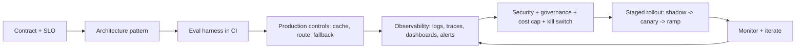

# Production AI Overview

## Beginner-Friendly Intuition

Production AI is the discipline of running AI systems against real users
under hard constraints: latency budgets, cost ceilings, privacy rules, on-call
rotations, and a never-stopping flow of production traffic. The model is
maybe 5 percent of the work. The other 95 percent is the contract,
observability, evaluation harness, fallback path, security boundary,
governance trail, and the on-call playbook for when something is wrong at
3 AM.

The intuition that separates a research demo from a production system: a
demo answers correctly on a curated set of inputs; a production system
answers acceptably on every input under load, and degrades gracefully when
it cannot answer at all. Most of what makes a system "production-grade" is
not the model; it is the surrounding controls.

This file is the entry point for the rest of the folder. The other files
go deep on specific patterns (caching, routing, fallback, human-in-the-loop)
and concerns (security, monitoring, governance). Read this one first to
get the frame, then the others to fill in.

## Formal Explanation

A production AI system is judged on four axes simultaneously: **quality,
latency, cost, reliability**. The art is meeting all four; chasing one
without the others ships a broken product.

### What changes when AI moves to production

- **Service-level objectives (SLOs).** A production system has explicit
  numerical targets per dimension. Typical chat-style RAG SLOs: p95 latency
  under 2 seconds, availability above 99.9 percent, faithfulness above 0.9,
  cost per request under $0.05. SLOs drive every other decision.
- **Error budgets.** The complement of an availability SLO. At 99.9 percent
  uptime, your error budget is 43 minutes per month. The team spends the
  budget on launches, experiments, and migration; it is gone if too many
  incidents occur.
- **Observability over correctness.** You will not catch every wrong
  answer; you must see them when they happen. Tracing, logging, dashboards,
  alerts on threshold breaches, and runbooks are not optional.
- **Evaluation in CI.** Every change (prompt, model, retrieval config) gets
  scored against a regression suite before deploy. Without this, every
  release is a gamble.
- **Fallbacks and graceful degradation.** What happens when the LLM API is
  down? When retrieval times out? When a tool fails? The answer cannot be
  "user gets an error"; it must be a degraded but useful response.
- **Security and governance.** Audit logs, ACL on data sources,
  PII redaction, model-card documentation, change management. Not an
  afterthought; baked in.

### The cost-quality-latency triangle

You cannot maximize all three. Picking two pins the third.

- Maximize **quality**: use the largest model, longest context, deepest
  reranker, longest retrieval pipeline. Latency and cost both rise.
- Maximize **latency** (low time-to-first-token): use small models, cache
  aggressively, skip the reranker. Quality drops on the long tail; cost may
  rise from cache invalidation churn.
- Minimize **cost**: route easy queries to small models, cache outputs,
  trim context. Quality and latency both can suffer.

Production engineering picks the operating point that meets the SLO at
acceptable cost, then iterates. There is no global optimum; the right
point shifts with traffic mix, model price changes, and product priorities.

### Model lifecycle vs deploy lifecycle

A model has a long lifecycle (research, training, evaluation, registration,
canary, ramp, retirement). A deploy has a short lifecycle (build, test,
gate, release, rollback). Both must coexist in the production system. ML
governance treats them as the same; reality treats them as overlapping but
distinct.

### The production checklist

Before a launch:

- SLO defined with numerical targets per dimension.
- Eval harness in CI, gating launches with a regression suite.
- Observability: logs, traces, metrics, dashboards, alerts.
- Fallback ladder for each external dependency (LLM, retrieval, tools).
- Security: ACL on data, PII redaction, secrets vault, audit logs.
- Governance: model card, data lineage, approval trail, retirement
  policy.
- Cost monitoring with per-tenant attribution and hard budget caps.
- Runbook with detection-to-remediation timeline and on-call rotation.
- Kill switch: a way to disable the AI feature in seconds without a
  deploy.
- Capacity plan: peak QPS, autoscaling policy, GPU pool sizing.

If any of these is missing, the system is not production-ready. It may
work; it is not engineered.

## Why It Matters in Real Jobs

Three concrete production reasons. First, **the cost of a wrong launch is
high**: a hallucination on a financial advice product is a regulatory
incident; a P0 outage on a customer-facing chat is escalating to the CEO
within an hour. Second, **AI systems decay silently**: traffic mix shifts,
the model vendor updates, drift accumulates. The team that ships without
monitoring discovers the regression weeks late. Third, **enterprise
adoption depends on operational rigor**: the security review, the
compliance review, the model risk management review all want artifacts
the production checklist produces.

## How It Works Step by Step

1. **Frame the contract.** What does the system do, for whom, with what
   inputs and outputs, at what cost of failure?
2. **Define SLOs.** Numerical targets for quality, latency, cost,
   availability.
3. **Pick the architecture pattern.** Single-call, RAG, agent, multi-stage.
   See [02-ai-architecture-patterns.md](02-ai-architecture-patterns.md).
4. **Build the eval harness in CI.** Without this, every change is a
   gamble. See
   [10-evaluation-driven-development.md](10-evaluation-driven-development.md).
5. **Layer in production controls.** Cache, route, fallback, retry. See
   [04-caching-for-ai-systems.md](04-caching-for-ai-systems.md),
   [05-routing-between-models.md](05-routing-between-models.md),
   [06-fallbacks-and-retries.md](06-fallbacks-and-retries.md).
6. **Add observability.** What is logged at each stage? What dashboards
   exist? What alerts fire? See
   [09-monitoring-llm-apps.md](09-monitoring-llm-apps.md).
7. **Address security and governance.** ACL, PII, audit, model card. See
   [08-security-and-privacy.md](08-security-and-privacy.md) and
   [12-building-enterprise-ai-systems.md](12-building-enterprise-ai-systems.md).
8. **Stage the rollout.** Shadow first, then canary at 1-5 percent, ramp,
   gate on metrics, with a kill switch.
9. **Monitor and iterate.** Drift, regression, incidents, postmortems.

## Real-World Example

A team launches a customer support assistant. The MVP looks great offline:
the model answers 87 percent of held-out tickets correctly. They ship it
without the rest of the production checklist. Three weeks in, three
incidents.

- A retrieval index update introduced silent staleness; users got
  outdated policy answers. Caught only when the support team
  complained. Lost trust.
- Cost spiked 4x because a few bad prompts triggered very long contexts;
  no per-request budget cap.
- A prompt injection from a customer email leaked an internal SLA
  document into another customer's response; no ACL pre-filter on
  retrieval.

The team rebuilds with the production checklist. A faithfulness eval in
CI gates every retrieval-config change. A per-request token cap (32K
in, 1K out) plus alerting on the p99. ACL filters at retrieval time
with audit logs. Time to detect a regression drops from days to
minutes; cost per ticket stabilizes; the security review passes for
the next enterprise customer. The model never changed; the production
controls did all the work.

## Common Mistakes

- Treating the model as the system. The model is a component.
- No SLO defined. Without targets, every change is a gamble.
- No eval harness in CI. Every release is unmeasured.
- No fallback path. The first vendor outage produces a P0 incident.
- No ACL or audit on retrieval. Sensitive content leaks across
  permission boundaries.
- No cost cap. A bad prompt triples the bill in an hour.
- No kill switch. The fastest way to disable the AI is a code deploy,
  which takes 30 minutes when it should take 30 seconds.
- No model card or governance trail. The compliance review blocks the
  launch indefinitely.
- Designing only the happy path. Production traffic includes everything.
- Optimizing one dimension (quality) without measuring the others
  (latency, cost). The system ships and the bill or the SLA breaks.

## Interview Angle

**Question:** A team wants to launch an LLM-powered feature. What is on
the production checklist before launch?

**Strong answer:** The model is 5 percent of the work; the production
checklist is the rest.

- **Contract and SLO.** What does the feature do, for whom, with what
  failure cost? What are the numerical targets for quality, latency,
  cost, and availability?
- **Eval harness in CI.** A regression suite of representative inputs
  with reference outputs, run on every change. Without this, every
  launch is unmeasured.
- **Architecture and patterns.** Single-call, RAG, agent. Pick the
  narrowest one that meets the contract.
- **Production controls.** Caching to cut cost and latency on hot
  paths. Routing to send easy queries to small models. Fallback ladder
  with timeouts and circuit breakers. Idempotency keys on retries.
- **Observability.** What is logged at each stage. Dashboards for
  latency, cost, error rate, abstention rate, faithfulness drift.
  Alert thresholds.
- **Security.** ACL on retrieval pre-filter. PII redaction. Audit logs
  with retention policy. Secrets in a vault. Supply chain (signed
  model artifacts).
- **Governance.** Model card. Data lineage. Approval trail. Retirement
  policy. Compliance evidence.
- **Cost cap.** Per-request and per-tenant budgets. Alerting before
  hard stops.
- **Kill switch.** A way to disable the feature in seconds without a
  deploy.
- **Rollout plan.** Shadow at 0 percent traffic with metric capture,
  canary at 1-5 percent for at least 24 hours, ramp by doubling every
  12 hours with kill criteria.
- **Runbook and on-call.** Detection-to-remediation timeline,
  rotation, page paths, escalation.

If any of these is missing, the launch is risky. A senior engineer's
instinct: the question is not "does it work?" but "what happens when
it does not?". Every item on the list is the answer to a specific
failure mode.

**Weak answer:** "Test it and deploy it." Misses the rest of the
system.

**Follow-up questions:**

- What is an SLO and how do you set one for a generative AI feature?
- How do you design a kill switch for an AI system?
- What goes in a model card?
- How do you monitor for silent regressions?

## Mini Exercise

Pick an AI feature you might build. Write the SLO numerical targets for
quality, latency, cost, and availability. Identify which item on the
production checklist is missing today and what the failure mode would
be when it bites.

## Diagram

---
## Navigation

[⬅ Previous](../agents/13-agent-interview-patterns.md) | [🏠 Home](../README.md) | [➡ Next](02-ai-architecture-patterns.md)
