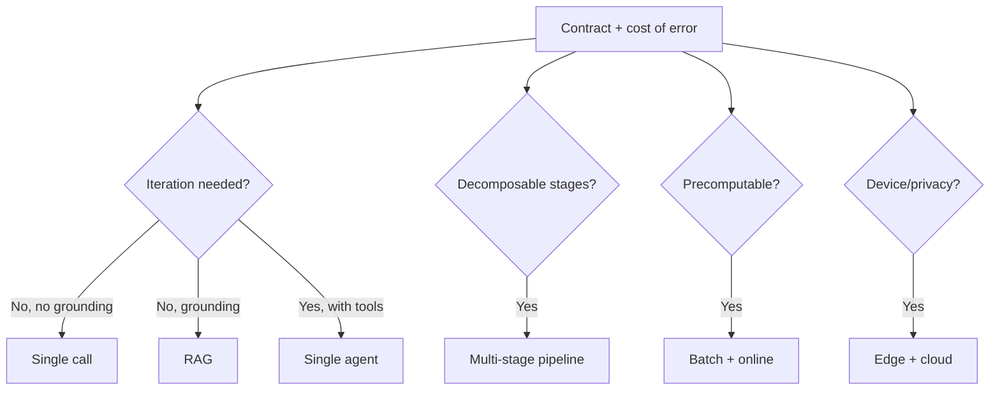

# AI Architecture Patterns

## Beginner-Friendly Intuition

Production AI systems cluster into a small set of architectural patterns.
Knowing them lets you skip "what should I build" and jump to "which
pattern fits, and what are its known failure modes?". Picking the wrong
pattern is the most expensive engineering mistake in AI; the cost of
migration grows with the system's age.

This file catalogs the patterns that actually ship: stateless single-call,
RAG, agent, multi-stage pipeline, batch+online, edge+cloud. For each, the
fit, the strengths, and the failure modes that bite in production. The
right pattern is the simplest one that meets the contract.

## Formal Explanation

### Pattern 1: Stateless single-call

The simplest pattern. Take user input, prompt the LLM, return the
response. No retrieval, no tools, no state across requests.

- **Fit.** Open-ended chat, brainstorming, simple summarization, code
  completion in known context.
- **Strengths.** Lowest latency, lowest cost, simplest to operate, easy
  to evaluate.
- **Failure modes.** Hallucination on facts (no grounding), staleness
  (model knowledge cutoff), no personalization, no traceability.
- **Production controls.** Cite-or-abstain prompt, output validation,
  cost cap.

### Pattern 2: Retrieval-Augmented Generation (RAG)

Single-call plus a retrieval step that grounds the answer in fetched
documents.

- **Fit.** Knowledge-base Q&A, customer support, internal documentation
  search, anything with a corpus that changes faster than the model.
- **Strengths.** Citable answers, fresh knowledge without retraining,
  cleaner failure mode (abstain when retrieval finds nothing).
- **Failure modes.** Bad retrieval (missing context), prompt injection
  via retrieved content, ACL leakage, stale corpus, retrieval latency
  added to LLM latency.
- **Production controls.** Permission filtering before ranking,
  cite-or-abstain contract, retrieval recall monitoring, embedding-
  model versioning, hybrid search to catch exact terms. See the
  [`rag/`](../rag/) folder.

### Pattern 3: Single agent (tool use)

LLM plus a set of tools (functions, APIs) plus a control loop. Each
iteration: model decides what to do, calls a tool, observes the result,
decides again.

- **Fit.** Tasks with multiple steps, real-world side effects (read
  database, send email, run code), open-ended workflows where the
  steps depend on intermediate results.
- **Strengths.** Capability beyond a single call. Tool isolation
  (validate arguments, gate dangerous calls).
- **Failure modes.** Looping without progress, runaway cost,
  unauthorized tool use, prompt injection escalating into tool calls,
  cascading failures across tool errors.
- **Production controls.** Step budget, cost budget, kill switch,
  tool permission audit, idempotency on side-effect tools, structured
  output validation. See the [`agents/`](../agents/) folder.

### Pattern 4: Multi-stage pipeline

A directed graph of LLM and non-LLM stages: extract -> classify ->
retrieve -> generate -> validate. Each stage has a defined contract
and metrics.

- **Fit.** Complex transformations where the work decomposes naturally:
  extracting structured data from documents, multi-step reasoning,
  generation followed by verification.
- **Strengths.** Each stage testable in isolation, smaller models can
  handle simpler stages cheaply, failures localized.
- **Failure modes.** End-to-end latency adds up across stages, error
  propagation between stages, version skew between stages,
  observability across stages requires distributed tracing.
- **Production controls.** Per-stage SLOs, end-to-end tracing with a
  request ID across stages, idempotent stages, retries with circuit
  breakers, schema versioning between stages.

### Pattern 5: Batch + online hybrid

Some predictions computed offline (recommended items, embeddings,
summaries), others computed online at request time. The two share a
data model and meet at serve time.

- **Fit.** Recommendation, personalization, search ranking, content
  moderation: where most predictions can be precomputed but new items
  or new users need fresh inference.
- **Strengths.** Cost amortization (batch is cheaper per prediction),
  predictable latency for the cached path, fresh predictions for the
  long tail.
- **Failure modes.** Stale batch predictions when source data changes,
  online-batch skew (different code paths producing different scores),
  cold start for new entities, data drift between batch and online.
- **Production controls.** Refresh schedule with SLA, online-batch
  parity tests, freshness monitoring per entity, fallback path for
  cold-start.

### Pattern 6: Edge + cloud

Small model on the device or in a CDN, large model in the cloud.
Cheap and fast for easy queries; expensive and slow for hard ones.

- **Fit.** Mobile assistants, voice assistants, anything where
  per-device cost or offline capability matters.
- **Strengths.** Lowest possible latency for the edge path, privacy
  (data does not leave the device), cost.
- **Failure modes.** Capability gap between edge and cloud (silent
  quality drop), version drift, partial offline support, cold-start
  download.
- **Production controls.** Routing logic with explicit fallback to
  cloud, version pinning, on-device telemetry to detect drift,
  graceful degradation when the cloud path is unreachable.

### Choosing among patterns

The defaults, in order of complexity:

1. **Stateless single-call** until grounding or fresh knowledge is
   required.
2. **RAG** when knowledge is in a corpus that changes faster than the
   model.
3. **Multi-stage pipeline** when the work decomposes naturally and
   each stage benefits from a different model size or class.
4. **Single agent** when the task genuinely requires iteration with
   real-world side effects.
5. **Batch + online** when latency or cost requires precomputation.
6. **Edge + cloud** when device or privacy constraints demand it.

Resist escalating complexity until measured failure justifies it.
Many "we need an agent" cases are really "we need RAG plus a clearer
prompt".

## Why It Matters in Real Jobs

Three production reasons. First, **the pattern decides the failure
modes**. An agent's failure modes are entirely different from a RAG
system's; choosing one means signing up for a specific operational
playbook. Second, **the pattern decides the SLO budget split**. RAG
splits latency between retrieval and generation; multi-stage splits
across stages; agent splits across iterations. Third, **migration
between patterns is expensive**. Building RAG when an agent was needed,
or vice versa, often means rewriting the system after months of
investment.

## How It Works Step by Step

1. **State the contract.** What does the system produce, for whom?
2. **Identify the data and freshness needs.** Static, daily, real-time?
3. **Identify whether the task needs iteration.** Single call vs loop?
4. **Map to the simplest pattern that fits.** Default to single-call.
   Escalate only when measured failure justifies.
5. **Identify the failure modes for that pattern.** Use the catalog
   above as the starting point.
6. **Add the production controls** the pattern requires (RAG: ACL
   filter; agent: step budget; pipeline: per-stage SLO; etc.).
7. **Define the rollout plan.** Shadow, canary, ramp.
8. **Monitor.** Watch for drift, regression, and pattern misfit (the
   pattern stops fitting as the product evolves).

## Real-World Example

A team builds an internal documentation assistant. They start with
single-call (just prompt the LLM). Quality is poor because the
documentation has answers the model has not memorized. They migrate to
RAG. Quality jumps; they ship.

Six months later, users start asking multi-step questions: "find the
on-call rotation for the database team this week and tell me their
escalation path". Single-pass retrieval cannot get both answers; the
team adds a single agent with a small toolset (search docs, query the
roster API). Quality recovers on the multi-step queries; cost rises
2x; latency p99 rises from 1.5s to 4s. They split traffic: simple
queries stay on RAG (fast, cheap); multi-step queries route to the
agent (slow, accurate). Two patterns, one product.

The lesson: pattern choice is not permanent. As the product evolves,
the pattern should too. The team that recognized "this is no longer a
RAG problem; it is an agent problem" saved months of trying to make
RAG do something it cannot.

## Common Mistakes

- Defaulting to the most powerful pattern (agent) before measuring
  whether the simpler ones fail.
- Defaulting to the simplest pattern (single-call) when grounding is
  obviously needed.
- Mixing patterns inside a single request without clear boundaries
  (e.g., RAG plus agent plus pipeline all interacting at runtime;
  observability becomes impossible).
- Building RAG when fine-tuning would have shipped a smaller, faster,
  cheaper system. Both are tools.
- Picking the pattern based on what is fashionable, not on the failure
  modes you can absorb.
- Not planning the migration path between patterns. Most real systems
  shift over time.
- Failing to instrument the pattern's specific signals (RAG without
  retrieval recall monitoring; agent without step-budget alerting).

## Interview Angle

**Question:** Walk through how you would choose an architecture
pattern for a new AI feature.

**Strong answer:** The decision flow:

First, **state the contract**. What does the feature do, for whom,
under what cost-of-error?

Second, **map the contract to a pattern in order of complexity**.
Stateless single-call is the cheapest, simplest, most observable. If
the failure mode is hallucinated facts on a corpus that changes,
escalate to RAG. If the work genuinely needs iteration with tool use,
escalate to a single agent. If the work decomposes into stages with
different model needs, use a multi-stage pipeline. If most predictions
can be precomputed, batch + online. If device or privacy constraints
exist, edge + cloud.

Third, **for the chosen pattern, list the specific failure modes**:

- Single-call: hallucination, staleness, no traceability.
- RAG: bad retrieval, ACL leakage, prompt injection via retrieved
  content, stale corpus.
- Single agent: looping, runaway cost, unauthorized tool use, cascading
  failures.
- Multi-stage pipeline: cumulative latency, error propagation,
  version skew across stages.
- Batch + online: stale batch predictions, online-batch skew, cold
  start.
- Edge + cloud: capability gap, version drift, offline degradation.

Fourth, **layer in the pattern's required production controls**.
RAG needs ACL filter and retrieval recall monitoring. Agent needs
step budget, kill switch, tool audit. Pipeline needs per-stage SLOs and
distributed tracing. Each pattern's controls are specific.

Fifth, **plan the migration path**. As the product evolves, the
pattern often must too. The team that designed for "this might become
an agent" pays a smaller cost when it does.

The senior instinct: **resist escalating complexity until the simpler
pattern's measured failure justifies it**. Most "we need an agent"
cases turn out to be "RAG with a clearer prompt", which ships faster
and is cheaper to operate.

**Weak answer:** "Use the most powerful pattern available." Ignores
the failure modes and the operational cost of complexity.

**Follow-up questions:**

- When does an agent beat RAG?
- What are the pattern-specific failure modes?
- How do you decide between batch and online?
- How would you migrate from RAG to an agent without downtime?

## Mini Exercise

Take a feature you might build. Map it through the decision flow:
state the contract, pick the simplest fitting pattern, list the
failure modes for that pattern, and name two production controls the
pattern requires.

## Diagram

---
## Navigation

[⬅ Previous](01-production-ai-overview.md) | [🏠 Home](../README.md) | [➡ Next](03-latency-cost-quality-tradeoffs.md)
