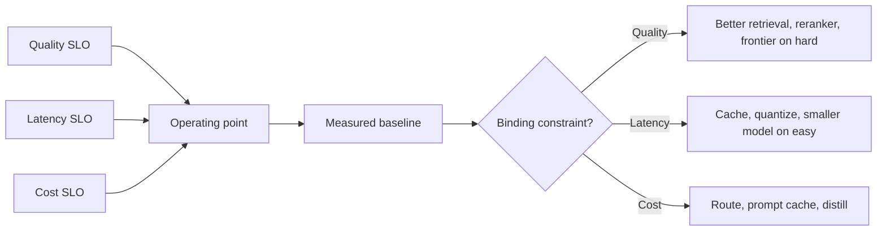

# Latency, Cost, and Quality Tradeoffs

## Beginner-Friendly Intuition

Every production AI system lives at a single point on a triangle: quality,
latency, cost. You can pick two; the third is determined. The only way to
push the frontier is to invest in engineering (caching, routing,
quantization, distillation), which moves the whole curve, not the
operating point on it.

The intuition that matters: there is no globally best system. There is
only the system that meets your SLO at acceptable cost for your traffic
mix. As traffic shifts (more long-context queries, more simple lookups,
more multi-step reasoning), the right operating point shifts too. The
team that keeps measuring and adjusting wins.

This file makes the triangle concrete: model size vs latency vs cost
math, time-to-first-token vs full response, reranker latency budget,
SLO design with numerical targets. Read it before any of the
optimization-pattern files (caching, routing, fallbacks).

## Formal Explanation

### The triangle, with numbers

Typical 2026 hosted LLM tiers, illustrative ranges (vendor- and
moment-dependent):

| Tier | Example models | Cost per 1M input tokens | p95 latency | Quality (rough) |
| --- | --- | --- | --- | --- |
| Frontier | GPT-4 family, Claude top-tier | $5 to $15 | 1-3 s | High |
| Mid | GPT-4 mini class, Claude Haiku class | $0.15 to $1 | 500 ms-1.5 s | Good |
| Small | Llama-3-8B, Phi-3, Mistral-7B (self-hosted) | $0.01 to $0.10 | 100-500 ms | Moderate |
| Embedding | BGE-large, OpenAI text-embedding-3-small | $0.02 to $0.10 per 1M | 5-50 ms | n/a |

These numbers move; treat as illustrative. The pattern is stable:
roughly **30-100x cost gap between small and frontier**, **5-10x latency
gap**, and a measurable but smaller quality gap that is task-dependent.

### Time-to-first-token vs full response

Two latency metrics matter for streaming:

- **TTFT (time to first token).** From request submission to the first
  token appearing. Dominated by prefill (processing the prompt).
- **TPS (tokens per second) during decode.** Steady-state generation
  rate after TTFT.

A typical chat experience feels fast if TTFT is under 1 second; the
total response time can be longer because the user reads as the model
streams. A team that optimizes total latency without splitting these is
chasing the wrong number. Production observability tracks both
separately.

### The reranker latency budget

In RAG, the latency budget breaks down approximately:

- Retrieval (ANN): 10-30 ms.
- Reranking (cross-encoder over top 50): 60-100 ms on GPU; 200-500 ms
  on CPU.
- LLM TTFT: 500 ms-2 s depending on tier and prompt size.
- LLM full response: 1-5 s for typical answers.

A 200 ms reranker is the right call when LLM latency is 1.5 s; it adds
13 percent total latency for a 5-10 NDCG point quality lift. A 200 ms
reranker is the wrong call when LLM TTFT is 100 ms; it doubles the
critical-path latency. Always measure as a fraction of the total, not
in absolute terms.

### Cost math: per-request vs at-scale

For a typical RAG chat:

- Prompt: 3,000 input tokens (system + retrieved context).
- Output: 300 tokens.
- At frontier-tier $10/M in, $30/M out: 0.030 + 0.009 = $0.039 per
  request.
- At mid-tier $0.50/M in, $1.50/M out: 0.0015 + 0.00045 = $0.002 per
  request.
- At small-tier (self-hosted): roughly $0.0001-0.001 per request,
  amortized over GPU spend.

At 1M requests per day, the difference is $39,000 vs $2,000 vs $100.
The 30-100x model cost gap translates directly into a 30-100x
infrastructure bill. Routing easy queries to the small tier and hard
ones to the frontier (see
[05-routing-between-models.md](05-routing-between-models.md)) is one
of the largest cost levers.

### SLO design

A production-quality SLO is numerical, percentile-based, and tied to a
business outcome:

- **Quality SLO:** "Faithfulness above 0.92 on weekly eval; abstention
  rate under 8 percent." Measured weekly on a frozen eval set.
- **Latency SLO:** "p95 TTFT under 1.5 s; p99 full response under 8 s."
  Measured per request.
- **Cost SLO:** "Cost per resolved ticket under $0.10; daily spend cap
  $500 per tenant." Measured per business outcome.
- **Availability SLO:** "99.9 percent of requests succeed (return a
  non-error response)." Measured per request.

Error budgets follow: 99.9 percent gives 43 minutes/month. Burning the
budget on launches and experiments is the deal; if real incidents
exceed it, the team freezes new work and stabilizes.

### Pushing the frontier

The triangle's curve is not fixed. Engineering can move it:

- **Quantization (FP16 -> int8 -> int4).** 2-4x throughput, 1-2 percent
  quality drop. Standard.
- **Distillation.** Train a small model to mimic a large one on
  domain-specific data; 5-10x cheaper at near-equivalent quality on the
  narrow task.
- **Speculative decoding.** 2-3x decode throughput with a small draft
  model verified by a large one.
- **Prompt caching.** 70-90 percent cost reduction on shared prompt
  prefixes (system prompts, few-shot examples).
- **Continuous batching.** 5-20x throughput on hosted serving with
  concurrent requests.
- **Hybrid retrieval + smaller model.** Better retrieval often beats a
  bigger model at lower cost.

Each lever is a multiplicative gain on one axis; stacking them often
produces order-of-magnitude wins.

## Why It Matters in Real Jobs

Three production reasons. First, **picking an operating point without
math is a coin flip**. The team that tracks cost-per-request and
latency percentiles makes informed tradeoffs; the team that does not
discovers them on the bill. Second, **SLOs are the contract with the
rest of the company**. Without them, every regression is a debate
about subjective quality; with them, the regression is detected
automatically. Third, **the pace of change in model pricing is fast**.
A system that was cost-optimal six months ago may now be 10x more
expensive than a tier-shifted alternative. Periodic re-pricing is real
work.

## How It Works Step by Step

1. **Define the SLO.** Quality, latency, cost, availability with
   numerical targets.
2. **Measure baseline performance** on the simplest pattern that meets
   the contract.
3. **Identify the binding constraint.** Quality? Latency? Cost?
4. **Apply the matching lever** (caching for cost, smaller model for
   latency, reranker for quality, etc.).
5. **Re-measure.** Confirm the change moved the binding constraint
   without breaking the others.
6. **Iterate** until all SLOs are met. Stop adding complexity once
   targets are hit.
7. **Monitor in production.** Distribution shifts; the operating
   point may need to move with traffic.

## Real-World Example

A team launches a chat assistant on the frontier model. p95 TTFT is
2.5 s; cost per request is $0.04; quality is excellent. Traffic is
1M requests/day. Bill: $40K/day.

They sweep optimizations.

- **Prompt caching** for the 800-token system prompt: -45 percent
  prefill cost, -300 ms TTFT. Cost down to $0.022; TTFT to 2.2 s.
- **Routing** simple queries (identified by a small classifier, ~60
  percent of traffic) to the mid-tier model: blended cost down to
  $0.012; quality drops 1.5 NDCG on the routed segment, deemed
  acceptable.
- **Reranker quantized to int8**: -35 percent reranker latency, no
  measurable quality drop.
- **Streaming with TTFT optimization**: prefill on dedicated replicas,
  TTFT drops to 800 ms p95.

Final state: cost $0.012/request ($12K/day, a 70 percent reduction),
TTFT 800 ms (3x improvement), quality unchanged on the difficult
segment, slightly lower on the easy segment but still meeting SLO.
The model never changed; the operating point did.

## Common Mistakes

- Picking a model tier without measuring per-request cost at expected
  traffic. The bill surprises everyone.
- Reporting average latency instead of p95/p99. The tail is what users
  feel.
- Optimizing one axis (quality) without measuring the others (cost,
  latency). The bill or the SLA breaks.
- Setting SLOs without an error budget. Every incident is now a
  debate.
- Using the same operating point across all traffic. A small
  classifier separating easy from hard queries unlocks 5-10x cost wins.
- Not re-measuring after vendor price changes. A cheaper tier may
  have shipped without the team noticing.
- Treating optimization as one-shot. Traffic shifts; cache hit rates
  drift; the operating point must move.

## Interview Angle

**Question:** A chat product is too slow and too expensive. Walk
through how you would diagnose and fix it.

**Strong answer:** Diagnose before optimizing. The triangle says
quality, latency, cost; pick which one is binding.

First, **measure the breakdown**. Time to first token vs full
response time. Cost per 1M input tokens vs per 1M output tokens.
p50/p95/p99 latency. Per-request cost at expected traffic.

Second, **identify the dominant cost**. Usually one of: model tier
(too large for the workload), context size (too much retrieved
content), reranker (too slow on critical path), or no caching of
shared prefixes. Profiling tells you which.

Third, **apply the matching lever**:

- Latency: cache the static system prompt, route easy queries to a
  smaller model, quantize the reranker to int8, separate prefill and
  decode replicas.
- Cost: route by classifier, cache outputs (semantic cache for
  paraphrase-similar queries), reduce context size with compression,
  switch to mid-tier where quality permits.
- Quality: keep the frontier model only on hard queries (routing),
  improve retrieval (chunking, hybrid, reranker) so the model has
  better evidence, add cite-or-abstain so wrong answers become
  abstentions.

Fourth, **re-measure**. The triangle is real; moving one axis often
shifts another. Confirm SLO compliance after each change.

Fifth, **stop adding complexity once SLOs are hit**. Optimization
tunnels exist; staying disciplined matters.

The general principle: **the team that knows their cost-per-request,
latency p95/p99, and quality numbers makes informed tradeoffs**. The
team that does not is gambling.

**Weak answer:** "Use a faster model" or "use a cheaper model."
Ignores the workload mix and the levers that move the curve.

**Follow-up questions:**

- What is TTFT and why does it matter for chat?
- How does prompt caching work and when does it win?
- What is the typical cost gap between model tiers?
- How would you decide whether to add a reranker?

## Mini Exercise

Pick a current AI feature (yours or hypothetical). Estimate: tokens
per request, cost per request at the current model tier, p95 latency.
Identify the binding constraint and one lever that would move it.

## Diagram

---
## Navigation

[⬅ Previous](02-ai-architecture-patterns.md) | [🏠 Home](../README.md) | [➡ Next](04-caching-for-ai-systems.md)
