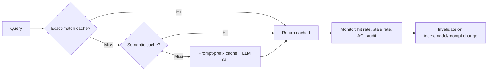

# Caching for AI Systems

## Beginner-Friendly Intuition

Caching for AI systems is the cheapest large-scale optimization
available. Most real traffic includes a long tail of repeated or
near-repeated queries; serving them from cache instead of re-running
the model cuts cost and latency dramatically. A 30 percent cache hit
rate means 30 percent fewer LLM calls, 30 percent of the cost, and
near-zero latency on the hits. Few other optimizations beat that.

The intuition: AI caching is harder than web caching because the same
question can be phrased many ways and the right answer can change
when the underlying data changes. A naive exact-match cache has a low
hit rate; a semantic cache has a higher hit rate but risks serving
near-misses. The cache key design and the invalidation strategy are
where production engineering happens.

This file covers the cache types that matter (exact-match, semantic,
prompt-prefix, embedding, output), hit-rate math, the stale-answer
risk, and the cache key design including ACL.

## Formal Explanation

### Five cache types

#### 1. Exact-match cache

Hash the entire request (model, prompt, parameters, user ACL signature)
and store the response. Hit only on byte-identical inputs.

- **Hit rate.** Low for free-form chat (5-15 percent), high for
  templated workflows (60-90 percent).
- **Stale risk.** None on the hit (deterministic).
- **Use cases.** Idempotent agent tool calls, recomputation of the
  same prompt.
- **Implementation.** Redis, Memcached, or any KV store with a hash
  key.

#### 2. Semantic (embedding-based) cache

Embed the query, retrieve the most similar past query above a
similarity threshold (typical 0.95 cosine), return its cached answer
if within freshness window.

- **Hit rate.** Higher than exact-match for chat (20-50 percent), but
  threshold-dependent.
- **Stale risk.** Real. A query phrased differently may have a
  different correct answer. Mitigation: stricter threshold, freshness
  TTL, periodic re-validation.
- **Use cases.** Customer support FAQ, common documentation queries.
- **Implementation.** Vector DB with TTL, similarity threshold tuned
  per domain.

#### 3. Prompt-prefix cache (KV cache)

Cache the prefill computation for the static prefix of the prompt
(system instruction, few-shot examples). On the next request with the
same prefix, the LLM skips reprocessing the prefix and only computes
the dynamic suffix.

- **Hit rate.** Very high for systems with stable system prompts:
  often 80-95 percent.
- **Cost reduction.** 70-90 percent on prefill cost; some latency
  reduction in TTFT.
- **Stale risk.** None; the cache is just memoized computation.
- **Use cases.** Any chat system with a stable system prompt; any
  RAG system with a stable retrieval template.
- **Implementation.** Hosted: OpenAI's prompt caching, Anthropic's
  prompt caching. Self-hosted: vLLM and SGLang support automatic
  prefix caching.

#### 4. Embedding cache

When the same text is embedded repeatedly (chunks during retrieval,
queries from frequent users), cache the embedding vector keyed by
content hash.

- **Hit rate.** Very high for stable corpora (>95 percent on
  re-indexed content).
- **Cost reduction.** Embedding API cost is small but additive; cache
  hit avoids the call.
- **Stale risk.** None unless the embedding model changes; in that
  case, invalidate.
- **Use cases.** Document re-ingestion, query memoization for popular
  searches.
- **Implementation.** Content-hash key, store the vector.

#### 5. Output cache

Cache the final response keyed by query plus relevant context. Subsumes
exact-match and semantic.

- **Hit rate.** Combines the two above; depends on both query
  repetition and context stability.
- **Stale risk.** High when context changes (retrieval index updated,
  user data changed). TTL plus invalidation on data changes.

### Hit-rate math

A cache with hit rate `h`, cache cost `c_cache` (per hit, including
storage), and origin cost `c_origin` (per miss, the LLM call) gives
total cost per query:

```
total_cost = h · c_cache + (1 - h) · c_origin
```

For h=0.3, c_cache=$0.0001, c_origin=$0.04: total cost $0.028, a 30
percent reduction. For h=0.6: $0.016, a 60 percent reduction. Hit
rate compounds linearly.

Latency follows the same formula with cache and origin latencies.

### Stale-answer risk

Every cache layer has a TTL. Without one, you serve stale answers
forever; with one, the cache hit rate drops.

The right TTL depends on the data:

- **Static documentation:** 24 hours to 7 days.
- **Knowledge base updated weekly:** 1-7 days.
- **Real-time data (stock prices, inventory):** seconds to minutes,
  if cached at all.
- **User-personal context:** invalidate on the user action that
  changes the underlying state.

For semantic caches, **the threshold matters as much as the TTL**. A
threshold of 0.99 cosine gives near-zero stale risk; 0.85 catches
many paraphrases but risks confusing two genuinely different
queries.

### Cache key design including ACL

The single largest risk in production AI caching: cache leak across
permission boundaries. User A asks about their salary; the answer
gets cached; User B asks the same question and receives User A's
salary.

The defense: include all permission-relevant signals in the cache
key.

- **User ID** (or tenant ID for B2B).
- **ACL signature** (a hash of the user's group membership and
  permissions).
- **Embedding model version** (vectors from different models are not
  comparable).
- **Index version** (so cache hits do not span a corpus rebuild).
- **Prompt version** (so prompt updates invalidate stale answers).

The cache key is a composite hash of all these. A change in any
component invalidates the cache for that segment. This is more
invalidation than is convenient, which is the point: better to miss a
cache than leak data.

## Why It Matters in Real Jobs

Three production reasons. First, **caching is the single largest cost
lever for high-traffic AI systems**. A 30 percent hit rate cuts the
LLM bill 30 percent for free. Second, **caching changes the latency
profile**. p99 latency improves disproportionately because the long
tail of slow LLM calls hits cache. Third, **the cache is a source of
silent bugs**. Stale answers, cross-user leaks, and embedding-model
mismatches are all caching failure modes; the team without disciplined
key design discovers them in incidents.

## How It Works Step by Step

1. **Identify the high-frequency, low-variance segment** of traffic.
   FAQs, popular searches, repeated tool calls.
2. **Pick the cache types that match.** Prompt-prefix for stable
   system prompts; semantic for paraphrase-heavy chat; exact-match
   for templated workflows.
3. **Design the cache key.** Include all permission and version
   signals.
4. **Set a TTL** matched to data volatility.
5. **Implement** with a hot store (Redis for exact, vector DB for
   semantic, hosted-vendor caching for prefix).
6. **Monitor.** Hit rate, miss rate, stale-rate (sample
   re-execution), cache-leak audits.
7. **Tune.** Adjust threshold and TTL based on observed quality drift
   and cost savings.

## Real-World Example

A customer support assistant serves 500K queries per day on the
frontier model. Cost is $0.04 per query; total $20K/day.

The team layers caching.

- **Prompt-prefix cache** (1,800-token system prompt with policy
  examples): 85 percent prefix-hit rate, 60 percent prefill cost
  reduction. Total cost drops to $0.028. Daily: $14K.
- **Semantic cache** (cosine threshold 0.97, TTL 24 hours, key
  includes user tenant and ACL hash): 22 percent hit rate. Daily:
  $11K.
- **Embedding cache** for the retrieval step: 95 percent hit rate,
  saves $200/day in embedding API costs.

Total cost drops from $20K to $11K daily, a 45 percent reduction. p99
latency improves from 5.2s to 3.8s on cache misses (cleaner pool) and
to 50ms on hits. Quality unchanged: faithfulness on a weekly eval set
holds at 0.92.

A near-incident: a developer disables the ACL hash in the cache key
during a refactor. Two days later, a tenant reports seeing another
tenant's policy in a response. The team rolls back the change,
audits the cache for cross-tenant leaks, and adds a CI test that the
cache key always includes the ACL hash.

## Common Mistakes

- Caching without an ACL component in the key. Cross-user leak risk.
- Caching without a TTL. Stale answers forever.
- Setting the semantic threshold too low (0.85 cosine). Different
  queries collide.
- Not including the embedding model version in the key. After a
  model upgrade, old vectors mix with new vectors.
- Skipping prompt-prefix caching. The 70-90 percent prefill cost win
  is free; declining it is wasteful.
- Not monitoring the cache. Silent stale-answer rate, silent leak
  rate.
- Treating cache as set-and-forget. Hit rates drift as traffic mix
  changes.
- Caching personal or sensitive responses without per-user keys.
  Compliance incident waiting to happen.

## Interview Angle

**Question:** Design a cache layer for an LLM-powered customer
support assistant.

**Strong answer:** Layered cache with explicit key design.

**Layer 1: Prompt-prefix cache.** The system prompt and few-shot
examples are stable across all requests for a given product. Use the
hosted vendor's prompt caching (OpenAI, Anthropic) or self-hosted vLLM
prefix caching. Hit rate near 100 percent on the prefix; cost reduction
70-90 percent on prefill. No staleness risk.

**Layer 2: Semantic output cache.** A vector store (Redis with vector
support, or a small Qdrant) keyed by `(tenant_id, ACL_hash, model_version,
prompt_version, query_embedding)`. Cosine threshold 0.97. TTL 6 hours
for general FAQ, shorter for tickets that mention specific accounts.
Expected hit rate 20-30 percent on customer support workloads.

**Layer 3: Embedding cache.** Content-hash keyed cache for retrieval
chunk embeddings (during ingestion) and query embeddings. Hit rate near
100 percent on stable corpora; near-zero cost.

**Cache key signals.**

- `tenant_id`: prevents cross-tenant leakage.
- `ACL_hash`: hash of the user's group membership; if permissions
  change, invalidate.
- `embedding_model_version`: vectors from different models are not
  comparable.
- `index_version`: invalidate on corpus rebuild.
- `prompt_version`: invalidate on prompt updates.

**Operational discipline.**

- Monitor hit rate, miss rate, and a sampled stale rate (re-execute
  cached queries periodically and compare).
- Audit the cache for leaks: pull a sample, verify each entry's ACL
  hash matches the user the entry would be served to.
- Test invalidation: prove that a permission change is reflected in the
  cache within seconds.
- Alert on cache-key omissions: a CI test that the key includes all
  required components.

**Stale risk vs cost tradeoff.** Tighter TTL and threshold means
lower hit rate but lower stale risk. For customer support, 6-hour TTL
and 0.97 threshold is the sweet spot. For real-time data
(account balances, order status), do not cache at all; route directly
to the source.

**Failure modes.**

- Cache leak across tenants if ACL hash is missing. Catastrophic.
- Stale answers if TTL too long. Visible in re-validation.
- Embedding model upgrade not invalidating the cache. Silent
  regression. Always include `embedding_model_version` in the key.
- Cache hit rate drops over time as traffic shifts. Periodic
  re-tuning of threshold and TTL.

The senior instinct: **caching is a contract about freshness and
permissions**. The cache key encodes the contract; the TTL enforces
freshness; the audit verifies it. Without all three, the cache will
leak or lie.

**Weak answer:** "Add Redis." Ignores keys, invalidation, and ACL.

**Follow-up questions:**

- How would you choose the semantic threshold?
- How does prompt-prefix caching work?
- What goes in the cache key for a multi-tenant SaaS?
- How would you detect cache leaks in production?

## Mini Exercise

Pick an AI feature you might cache. Write the cache key fields
including all permission and version signals. Pick a TTL and justify
it from the data volatility. Identify the failure mode if any one
field is omitted.

## Diagram



---
## Navigation

[⬅ Previous](03-latency-cost-quality-tradeoffs.md) | [🏠 Home](../README.md) | [➡ Next](05-routing-between-models.md)
