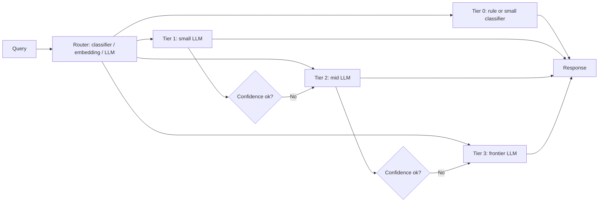

# Routing Between Models

## Beginner-Friendly Intuition

Routing between models is the production engineering pattern of using
different models for different requests, sized to the difficulty. Easy
queries go to a small fast cheap model; hard queries go to a large
slow expensive one; some queries get refused before any model runs.
The result is most traffic served at small-tier cost while quality on
the hard tail matches the frontier-tier baseline.

The intuition: most production traffic is not uniformly hard. A
support assistant gets 70 percent intent-classification questions and
30 percent open-ended reasoning questions. Treating both with the
frontier model is wasteful; treating both with the small model is bad
quality. Routing is the lever that aligns model spend with task
difficulty.

This file covers routing strategies (classifier, embedding-based,
LLM-as-router), the fallback ladder, per-tier SLOs, and the
operational discipline that keeps routing accurate as traffic shifts.

## Formal Explanation

### The fallback ladder

The standard production design has three or four tiers:

- **Tier 0: rule-based or small classifier.** Routes obvious cases
  (intent classification, content moderation, simple Q&A from a small
  closed set) without calling any LLM.
- **Tier 1: small LLM.** Self-hosted Llama-3-8B class, Phi-3, Mistral-
  7B, Qwen-2.5-7B, or hosted small models (GPT-4 mini class, Claude
  Haiku class). Handles 60-80 percent of traffic at <$0.01 per
  request and <500 ms p95.
- **Tier 2: mid LLM.** Hosted mid-tier or larger self-hosted (Llama-
  3-70B). Handles harder queries that the small tier flagged as
  uncertain.
- **Tier 3: frontier LLM.** GPT-4 family, Claude top tier, Gemini
  top tier. Handles the hard tail; expensive per call, used sparingly.

Each tier has its own SLO. Tier 1 might target p95 300 ms at $0.005;
tier 3 might target p95 3 s at $0.04. The router decides which tier
gets each request.

### Routing strategies

#### Classifier-based router

A small fine-tuned classifier (DistilBERT or similar) labels each
query as "easy/medium/hard" or "tier 1/2/3" based on training data of
past queries with known difficulty. Latency 5-15 ms on CPU. Cheapest
and most explicit; needs labeled training data and periodic retraining
as traffic shifts.

#### Embedding-based router

Each tier has a representative set of past handled queries. New query
gets embedded; nearest-neighbor in embedding space picks the tier.
Latency 5-30 ms. No labels needed; relies on the assumption that
similar queries route similarly. Drifts slowly as traffic mix shifts.

#### LLM-as-router

A small LLM call decides the tier for each query. Most flexible
(handles novel patterns, can explain its decision) but costs an
extra LLM call per request and adds 200-500 ms latency. Used for
complex routing decisions where a classifier would underfit.

#### Confidence-driven escalation

Run the small tier first. If its confidence (based on logprobs,
calibration model, or LLM-as-judge confidence) is below a threshold,
escalate to the next tier. Costs an extra small-tier call on the
escalated path but ensures quality on uncertain cases. Common in
production.

### Per-tier SLOs

Each tier has explicit numerical targets. Examples:

- **Tier 1 (small).** p95 latency 500 ms, cost per request $0.005,
  quality (NDCG@10 or task-specific) 0.78.
- **Tier 2 (mid).** p95 latency 1.5 s, cost per request $0.02,
  quality 0.84.
- **Tier 3 (frontier).** p95 latency 3 s, cost per request $0.05,
  quality 0.91.

Per-tier monitoring detects when a tier silently regresses (the small
tier's quality drops 2 points after a model upgrade) or when traffic
mix shifts (suddenly 50 percent of queries hit tier 3 because a new
question type appeared).

### Cost optimization math

For 1M daily requests with mix 65 percent tier 1, 25 percent tier 2,
10 percent tier 3:

- Single-tier (frontier only): 1M * $0.05 = $50K/day.
- Routed: (650K * $0.005) + (250K * $0.02) + (100K * $0.05) =
  $3.25K + $5K + $5K = $13.25K/day.
- Savings: 73 percent.

The blended quality is lower than pure frontier on the routed
segments, but if the routing accuracy is high, the quality drop on
tier-1-routed traffic is small (and the user-perceived experience is
better because of lower latency).

### Operational discipline

- **Per-tier dashboards.** Latency, cost, quality, and traffic share
  per tier. A spike in tier 3 traffic is the first signal that the
  router is misclassifying or that a new query type appeared.
- **Routing accuracy audits.** Sample requests per tier; have humans
  or LLM-as-judge re-tier them; compare. Routing accuracy below 90
  percent means the router needs retraining.
- **Fallback paths.** If a tier is unavailable, route to the next
  higher tier (graceful degradation) or a rule-based response. Do
  not return errors to the user.
- **Periodic re-routing.** As model prices and capabilities change,
  re-evaluate the routing decision. A query that needed tier 3 six
  months ago may now be tier 2 quality.

## Why It Matters in Real Jobs

Three production reasons. First, **routing is the largest cost lever
on heterogeneous traffic**. 50-80 percent cost reductions are
achievable for free if the traffic mix is right. Second, **routing
keeps latency low for the easy 70 percent of traffic**. The user
experience improves even when the bill is the same. Third, **routing
is the natural place to enforce policy**: refuse abusive queries
before they reach any model, route compliance-sensitive queries to a
specific approved-tier model, log per-tier for audit.

## How It Works Step by Step

1. **Profile traffic.** Sample queries; estimate the difficulty
   distribution. Without this, routing is guesswork.
2. **Pick the tiers.** Small (or self-hosted), mid, frontier.
3. **Choose the routing strategy.** Classifier for stable traffic
   types; embedding-based for low-label settings; LLM-as-router for
   complex routing.
4. **Define per-tier SLOs.** Numerical targets per tier.
5. **Implement the fallback ladder.** Each tier's failure path
   escalates or degrades gracefully.
6. **Audit routing accuracy.** Sample, re-tier, compare. Retrain the
   router if accuracy drops.
7. **Monitor.** Per-tier dashboards. Alert on traffic-mix shifts and
   per-tier quality regressions.

## Real-World Example

A team runs a customer support assistant on the frontier model. 800K
requests per day at $0.04 each: $32K/day.

They build a classifier-based router. The classifier (DistilBERT-base,
fine-tuned on 5K labeled queries) labels each query as "FAQ"
(handled by a deterministic lookup), "intent classification" (Tier 1
small LLM), "general Q&A" (Tier 2 mid LLM), or "complex reasoning"
(Tier 3 frontier).

After a week of training and validation, the router achieves 94
percent accuracy. The traffic split is 15 percent FAQ, 50 percent
Tier 1, 30 percent Tier 2, 5 percent Tier 3. Cost per day:
0.15 * 800K * $0.0001 + 0.50 * 800K * $0.005 + 0.30 * 800K * $0.02 +
0.05 * 800K * $0.04 = $12 + $2K + $4.8K + $1.6K = $8.4K/day. A 74
percent reduction.

Quality: blended faithfulness 0.89 vs 0.92 on pure-frontier baseline.
The 0.03 drop is concentrated in misrouted Tier 1 cases (the
classifier sometimes routes a complex query to Tier 1). They add a
confidence-driven escalation: when the small LLM's response confidence
is below 0.7, escalate to Tier 2. Final blended faithfulness
recovers to 0.91; cost drops to $9K/day. The router and the
escalation together unlock the savings without breaking quality.

## Common Mistakes

- Routing without measuring per-tier quality. The cheap tier ships
  bad answers and nobody notices.
- Setting per-tier SLOs without traffic-mix data. The wrong tiers
  get scaled.
- Treating the router as set-and-forget. Traffic shifts; the
  classifier ages.
- No fallback when a tier is down. The first vendor outage triggers a
  P0 incident.
- Routing to the wrong tier on adversarial inputs (a malicious user
  crafts a query that classifies as easy but asks for sensitive
  data). Route policy enforcement at the same layer.
- Skipping the rule-based / classifier tier 0. Many queries do not
  need any LLM.
- Optimizing routing accuracy without measuring user impact. A 92
  percent accurate router that misroutes high-stakes queries is
  worse than an 88 percent accurate router that misroutes low-stakes
  ones.

## Interview Angle

**Question:** Walk through how you would design a routing layer for
a high-traffic AI feature.

**Strong answer:** Routing is the cost-optimization lever that maps
traffic difficulty to model size.

**Step 1: profile traffic.** Sample 1000 representative requests.
Categorize by difficulty: trivial (FAQ-style), simple
(classification, extraction), moderate (single-step reasoning),
complex (multi-step, ambiguous). Without this, every routing
decision is guesswork.

**Step 2: pick tiers.** Three or four tiers typical: rule-based or
small classifier (Tier 0); small LLM (Tier 1, often self-hosted Llama
or Mistral 7-8B class); mid LLM (Tier 2, hosted mid-tier or larger
open-weight); frontier (Tier 3, hosted GPT-4 / Claude top / Gemini
top tier).

**Step 3: choose the routing strategy.**

- **Classifier-based** for stable, well-labeled traffic. Fastest;
  needs training data.
- **Embedding-based** for low-label environments. No training needed.
- **LLM-as-router** for complex novel routing where a classifier
  underfits. Adds latency and cost; use sparingly.
- **Confidence-driven escalation** runs the small tier first and
  escalates on low confidence. Robust to router errors at the cost of
  occasional double-billing.

**Step 4: per-tier SLOs.** Numerical latency, cost, and quality
targets per tier. Per-tier dashboards so traffic-mix shifts are
visible.

**Step 5: fallback ladder.** Each tier's failure escalates to the
next higher tier. The frontier tier's failure escalates to a
rule-based safe response. No error returns to the user from a
serving outage.

**Step 6: monitor and audit.** Routing accuracy via sampled
re-tiering. Quality per tier on a per-tier eval set. Alerts on
traffic mix shifts and quality regressions.

**Cost math.** For 1M requests/day with mix 70/25/5 across tiers,
typical savings are 60-80 percent vs single-tier frontier. Quality
on the routed segments may drop 2-5 points; confidence-driven
escalation recovers most of it.

**Operational gotchas.**

- The router is a model and ages like one. Retrain quarterly.
- Adversarial queries can be misrouted. Apply policy filtering
  separately from routing.
- The bill from Tier 1 can balloon if traffic mix shifts; alert on
  per-tier traffic share.
- Cross-tier evaluation must use the same prompt and reference
  answers; otherwise comparison is invalid.

The senior instinct: **routing is the cheapest 60-80 percent cost
reduction available**. The team that ships it early and audits it
quarterly wins; the team that defers it pays the frontier-tier bill
forever.

**Weak answer:** "Use the cheap model when possible." Misses the
fallback, the per-tier SLO, the audit, and the failure modes.

**Follow-up questions:**

- How would you handle a query that the router classifies wrong?
- What is confidence-driven escalation?
- How do you detect that the router has aged?
- How would you route adversarial inputs?

## Mini Exercise

Take a feature you might build. Sample 20 queries; classify each by
difficulty. Sketch the fallback ladder (rule-based, small, mid,
frontier). Estimate cost-per-request at each tier and the blended
cost given your traffic mix.

## Diagram

---
## Navigation

[⬅ Previous](04-caching-for-ai-systems.md) | [🏠 Home](../README.md) | [➡ Next](06-fallbacks-and-retries.md)
