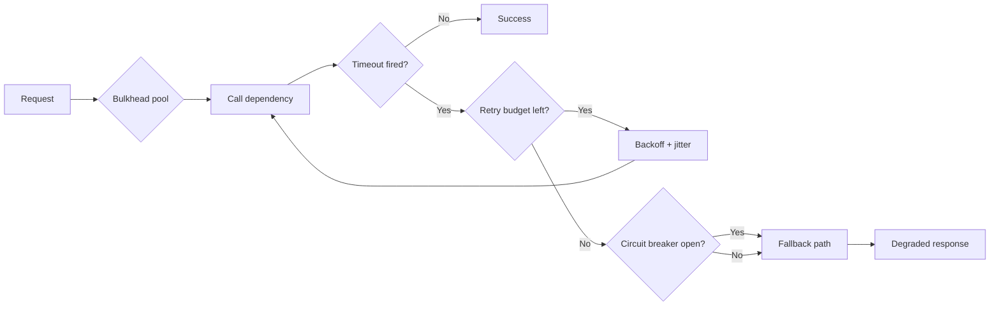

# Fallbacks and Retries

## Beginner-Friendly Intuition

Production AI systems depend on external services that fail. The LLM
API has a 5xx burst. The vector DB times out. The retrieval embedding
service is slow. A naive client returns an error to the user; a
production-grade client retries with backoff, falls back to a
different path, or degrades gracefully. The user sees a slightly worse
answer instead of a broken page. Engineering this layer is the
difference between an SLO that holds and one that does not.

The intuition: every external dependency is a failure surface.
Treating each one with explicit retry and fallback policy turns "the
system is unreliable" into "the system is engineered for the
reliability of its weakest dependency, plus a margin". The hard part
is doing this without breaking other guarantees (idempotency, cost
caps, latency budgets).

This file covers retry policies (jitter, exponential backoff,
idempotency), circuit breakers, timeout budgets, and fallback
strategies. The goal is reliability without retry storms or
unbounded latency.

## Formal Explanation

### Retry policies

Retries handle transient failures (network blip, momentary 5xx, queue
backpressure). Five rules:

1. **Cap the retry count.** Typically 2-3 retries. Beyond that, the
   failure is not transient; trying again wastes capacity.
2. **Use exponential backoff with jitter.** Wait `base * 2^attempt +
   jitter` ms between retries. Jitter prevents thundering-herd
   recovery storms.
3. **Set a total budget.** Across all retries, do not exceed a wall
   clock budget (e.g., 5 seconds). The user experience matters more
   than the retry policy.
4. **Use idempotency keys for state-changing calls.** Without them,
   a retry can double-charge or double-write. The idempotency key is
   the request fingerprint; the server returns the cached response
   on repeat.
5. **Distinguish retryable from non-retryable errors.** 4xx errors
   (bad request, auth) are not retryable; retrying wastes capacity.
   5xx and timeouts are retryable.

### Circuit breakers

A circuit breaker tracks failure rate per dependency and trips when
the rate exceeds a threshold (typical 50 percent of last 100 calls in
the last minute). Once tripped, requests skip the failing dependency
and fall through to the fallback for a cool-down period (typical 30
seconds), then probe with a single request to test recovery.

The pattern prevents **retry storms**: when a dependency is failing,
retries make it worse by adding load; the breaker stops the bleeding.
Standard library: Hystrix-style or modern Resilience4j patterns.

### Timeout budgets

Each external call has a timeout. The total request timeout budget is
distributed across the calls. A 10-second total budget for a
RAG call splits roughly: 30 ms retrieval, 100 ms reranker, 8 s LLM,
and ~1.5 s margin for orchestration and retries.

Timeouts must be **shorter than the user's tolerance** and longer than
the dependency's typical p99. A timeout shorter than p99 burns the
budget on retries that would have succeeded; a timeout longer than
the user's tolerance produces hung requests.

### Fallback strategies

When a dependency is unavailable or the timeout fires, the system
falls back. Common patterns by dependency:

- **LLM unavailable.** Fall back to a smaller LLM (the next tier in
  the routing ladder), or to a rule-based response for known intents,
  or to a "we are experiencing issues, please try again" message
  without taking a request as failed.
- **Retrieval unavailable.** Fall back to LLM without RAG (with a
  warning to the user that fresh data is unavailable), or to a cache
  of recent answers, or to a rule-based intent handler.
- **Reranker unavailable.** Fall back to retrieval-only ordering; the
  quality drops slightly but the system continues.
- **Tool unavailable.** Skip the tool call and return a partial
  answer with a clear "I could not access X" message.

The principle: **graceful degradation, not complete failure**.

### Idempotency keys

For any state-changing call (sending email, updating a database,
creating a record), the client supplies an idempotency key (typically
the request hash plus a UUID). The server stores `(key, response)` for
24 hours; on a retry with the same key, returns the cached response
instead of re-executing.

Without idempotency, a retry on a partially-completed write can produce
duplicate side effects. With it, the retry is safe.

### Bulkheading

Isolate dependencies into separate connection pools or thread pools so
a single slow dependency cannot exhaust the system's capacity. If the
LLM is slow, the embedding service still has capacity; if the vector
DB is slow, other queries do not back up behind it. Standard pattern
in resilient systems.

### Retry storms and how to avoid them

The classic failure pattern: dependency D is slow; clients retry; the
retries overload D; D fails harder; clients retry more. Mitigations:

- **Jitter** prevents synchronized retries.
- **Circuit breakers** stop retrying when the failure rate is too high.
- **Token-bucket rate limits** cap the retry-to-original ratio (e.g.,
  no more than 30 percent of traffic can be retries).
- **Adaptive retries** reduce the retry count under high failure rates
  (Google SRE-style).

The pattern is so common that "retry storm" has its own postmortem
template at most companies that have lived through one.

## Why It Matters in Real Jobs

Three production reasons. First, **AI systems are deeply
dependency-bound**. Every request touches a model API, a vector DB, a
tool. Failures compound. Without explicit retry and fallback, the
system's availability is the product of all dependency
availabilities. Second, **graceful degradation is what makes the
SLO**. 99.9 percent availability cannot be achieved if any single
dependency goes below 99.99 percent without graceful degradation.
Third, **idempotency is non-negotiable for side-effecting calls**. A
retry storm without idempotency keys is how customers get
double-charged.

## How It Works Step by Step

1. **List every external dependency.** LLM API, vector DB, embedding
   service, tools, databases.
2. **For each, classify the call type.** Read-only (idempotent by
   nature), write (needs idempotency key), critical-path (must
   succeed) vs nice-to-have.
3. **Set per-dependency timeout, retry policy, and circuit breaker
   threshold.** Calibrate to that dependency's p99 latency and
   typical failure rate.
4. **Design the fallback path.** What happens when this dependency is
   unavailable? Smaller model? Cached response? Rule-based path?
5. **Implement bulkheading.** Separate connection pools per
   dependency so one failure does not exhaust capacity.
6. **Add idempotency keys** to every state-changing call.
7. **Test failure scenarios.** Chaos engineering: kill the LLM API
   during a load test; verify the system degrades gracefully.
8. **Monitor.** Per-dependency error rate, retry rate, circuit-breaker
   state, fallback rate. Alert on retry rate above threshold or
   sustained circuit-breaker open state.

## Real-World Example

A team runs a chat assistant. Per-request flow: retrieve, rerank,
call LLM, return.

The first incident: LLM API has a 15-minute degradation. p99 latency
spikes from 2s to 30s; retries multiply the load on the API; latency
gets worse; users see timeouts.

Postmortem changes:

- **Per-dependency timeout** for LLM call set to 8s. Beyond that,
  return a fallback.
- **Circuit breaker** for the LLM API at 50 percent error rate over
  100 calls; once tripped, fall back to the smaller model for 30
  seconds, then probe.
- **Retry policy:** 2 retries with exponential backoff and jitter,
  total budget 12s.
- **Bulkhead:** LLM API gets a dedicated connection pool of 100
  concurrent requests. Beyond that, queue up to 10 with a 1s wait
  timeout, then drop with a fallback.
- **Fallback ladder:** LLM unavailable -> smaller model with
  cite-or-abstain -> rule-based intent response.

Three months later, a similar LLM API degradation hits. The circuit
breaker trips after 30 seconds; users see slightly slower responses
from the smaller model for the duration of the incident; no
timeouts; SLO holds. The blended cost rises 5 percent during the
incident (more small-model calls); the engineering value is the
incident not being an incident.

## Common Mistakes

- No retry budget. Retries cascade until the user gives up.
- No jitter. Synchronized retries cause thundering-herd recovery
  storms.
- No circuit breaker. The failing dependency gets hammered when it
  most needs to recover.
- No idempotency on state-changing calls. Double-writes,
  double-charges.
- Timeouts set too high. Hung requests block the connection pool.
- Timeouts set too low. Successful requests get killed mid-flight.
- No fallback path. The first vendor blip becomes a P0 incident.
- Treating retries as free. Each retry costs LLM tokens and capacity.
- No chaos testing. The fallback path is theoretical until exercised.

## Interview Angle

**Question:** A production AI feature has 99.5 percent availability,
but the team needs 99.9 percent. The bottleneck is the LLM API's 99.7
percent SLA. Walk through your fix.

**Strong answer:** The bottleneck is dependency availability. The fix
is graceful degradation, not begging the vendor for a higher SLA.

**Step 1: measure the baseline.** Per-dependency error rate, p99
latency, fallback rate. Identify which calls are critical-path.

**Step 2: timeout discipline.** Set the LLM timeout based on the
vendor's p99 latency plus a small margin (e.g., 6s if their p99 is
4s). Beyond timeout, fall back rather than retry.

**Step 3: retry with jitter and budget.** 2 retries at 200ms,
1000ms, 4000ms with full jitter. Total budget 8s. Idempotency keys on
any state-changing call.

**Step 4: circuit breaker.** Trip at 50 percent error rate over 100
calls in last minute. Once tripped, all calls fall back for 30
seconds, then a single probe tests recovery.

**Step 5: fallback ladder.** When the frontier LLM is unavailable
(timeout, 5xx, breaker open), fall back to:
- A smaller LLM (next tier down) with cite-or-abstain.
- If smaller LLM also fails, fall back to rule-based or templated
  responses for known intents.
- Worst case, return "we are experiencing issues" rather than an
  error page; this preserves the SLO definition (the request
  succeeded; the answer was degraded).

**Step 6: bulkhead.** Dedicated connection pool to the LLM API. Other
dependencies (vector DB, embedding) have their own pools so a slow
LLM does not block them.

**Step 7: chaos test.** Inject failures (10 percent random 5xx,
artificial 30s latency) in staging. Verify the fallback fires, the
breaker trips and resets, and the user-facing experience degrades
gracefully.

**Step 8: monitor.** Per-dependency error rate, retry rate, breaker
state, fallback rate, cost (fallback paths often have different
cost). Alert on sustained breaker-open or fallback-rate spikes.

The SLO math: if the LLM API has 99.7 percent availability and the
fallback path has 99.95 percent, the combined availability is roughly
99.7 + 0.3 * 99.95 = 99.85 percent (the fallback only matters during
the 0.3 percent failure window). A second fallback to rule-based
brings it above 99.9 percent. Without the fallback ladder, you cannot
exceed the LLM API's SLA.

The senior instinct: **availability is engineered, not negotiated**.
The fallback ladder, the circuit breaker, and the bulkhead are the
levers; the team that ships them runs at 99.95 percent regardless of
what any vendor offers.

**Weak answer:** "Add retries." Misses the rest of the resilience
toolkit.

**Follow-up questions:**

- What is a circuit breaker and when does it help?
- Why is jitter important?
- How do you test the fallback path?
- What is bulkheading and why does it matter?

## Mini Exercise

Pick an AI feature with at least three external dependencies. For
each, define: timeout, retry policy, circuit breaker threshold, and
fallback path. Estimate the combined availability if each dependency
is 99.7 percent and the fallback chain works.

## Diagram

---
## Navigation

[⬅ Previous](05-routing-between-models.md) | [🏠 Home](../README.md) | [➡ Next](07-human-in-the-loop.md)
