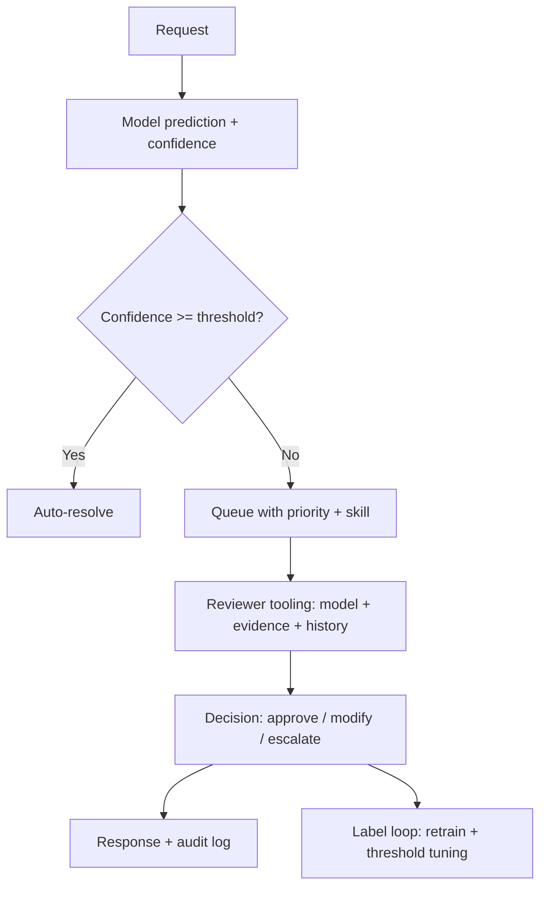

# Human in the Loop

## Beginner-Friendly Intuition

Human in the loop (HITL) is the production pattern of inserting human
review at specific points in an AI system's flow: before a high-stakes
action, after a low-confidence prediction, on a sample of all
predictions for quality monitoring. The goal is not to replace
humans; it is to use humans where they add the most value, and to
build a feedback loop that makes the model better over time.

The intuition: a 95 percent accurate model with no human review and a
99 percent accurate model with human review on the bottom 10 percent
ship at very different quality. The first ships at 95 percent; the
second ships at near-100 percent. The cost is the reviewer time,
which is bounded if the routing is good.

This file covers the HITL patterns that matter: confidence-driven
routing, queue design, reviewer SLAs, the label loop back to the
model, and the operational discipline that keeps reviewer time
bounded as traffic scales.

## Formal Explanation

### When HITL is required

HITL is the right pattern when:

- **The cost of a wrong answer is high** (medical, legal, financial,
  irreversible actions, customer-facing safety).
- **The model is not yet good enough for autonomous operation.**
  Production deployment with HITL collects real labels for the next
  model.
- **The decision affects the user experience materially.** A bad
  answer is recoverable with a fast review; an irrecoverable bad
  answer is not.
- **Compliance requires it.** Regulators in finance, healthcare, and
  hiring often require human oversight for specific decisions.

HITL is the wrong pattern for:

- **High-volume low-stakes decisions** (search ranking, content
  recommendation). The cost of human review per decision is too high.
- **Decisions where the reviewer cannot do better than the model.**
  Reviewer fatigue, novel queries, expert-only judgments. Reviewers
  introduce their own errors.

### Confidence-driven routing

The default HITL pattern: run the model; if confidence is above a
threshold, ship the prediction; if below, route to human review.

Sources of confidence:

- **Model logprobs** for a specific output token (e.g., the
  probability of the chosen class label).
- **LLM-as-judge** confidence on the answer's faithfulness.
- **Calibrated classifier** trained to predict whether the model's
  output is correct.
- **Retrieval score margin** in RAG (top-1 score minus top-2 score;
  small margin = uncertain).
- **Multiple-sample agreement** (run the model 3 times; if they
  agree, high confidence; if they disagree, low).

The threshold is tuned to match reviewer capacity. If reviewers can
handle 10 percent of traffic, set the threshold at the 10th
percentile of confidence. Per-class thresholds can balance precision
and recall.

### Queue design

Reviewer queues need engineering:

- **Priority.** High-stakes decisions get priority over low-stakes.
  An LLM judgment on a refund request beats one on a typo
  classification.
- **SLA per priority.** "Fraud reviews answered within 5 minutes; FAQ
  reviews within 24 hours."
- **Capacity.** The expected review rate must match staffing. A queue
  growing faster than reviewers can clear is unbounded latency.
- **Routing.** Skill-based routing (medical reviewers see medical
  cases; English reviewers see English content). Avoid the wrong
  reviewer making a wrong decision.
- **Deduplication.** Identical or near-identical queries do not need
  separate reviews. Cluster, review once, cache the decision.

### Reviewer SLAs and burnout

Reviewers are humans; they fatigue, they make mistakes when rushed,
they cannot scale linearly. Production HITL design:

- **Realistic per-reviewer rate.** 30-100 reviews per hour for
  moderate complexity; 10-30 for high complexity. More than that
  burns out reviewers and degrades quality.
- **Quality monitoring.** Sample a percentage of reviewer decisions;
  have a senior reviewer or LLM-as-judge audit. Reviewer accuracy
  drift is real and tracked.
- **Rotation.** Reviewers handle a mix of cases (including positive
  cases, not just rejections) to prevent confirmation bias.
- **Decision support.** Show the reviewer the model's prediction, its
  confidence, retrieved evidence, similar past decisions. Do not make
  them start from scratch.

### Label loop back to the model

HITL is most valuable when the human decisions feed back into model
improvement:

- **Disagreements with the model become training data.** Reviewer
  override = labeled hard negative.
- **Pattern detection.** A spike of overrides on a specific query
  type signals a model gap; investigate and add to the regression
  suite.
- **Calibration.** Compare reviewer decisions to model confidence to
  recalibrate thresholds.
- **Active learning.** Prioritize reviewing cases the model is least
  confident about; their labels improve the model fastest per labeled
  example.

The loop only works if the path from review to retrain is actually
implemented; many teams build the queue and forget to ship the
labels back.

### Escalation patterns

Tiered escalation:

- **Tier 1: front-line reviewer.** Standard cases.
- **Tier 2: senior reviewer or specialist.** Edge cases, ambiguous
  decisions.
- **Tier 3: human expert (lawyer, doctor, executive).** High-stakes,
  novel, or policy-defining cases.

Each tier has its own SLA and escalation criteria. Escalation
percentages are monitored: a sudden rise in Tier 3 traffic signals a
gap in the model or in the policy.

## Why It Matters in Real Jobs

Three production reasons. First, **HITL is how high-stakes AI ships at
all**. Without it, the failure cost prevents launch; with it, the
system can ship at the model's current quality. Second, **HITL data
is gold**. Reviewer overrides are labeled hard cases that improve
the model fastest; teams that lose this signal lose the cheapest
quality lever. Third, **reviewer cost scales linearly with traffic**.
A poorly-designed HITL system at 10x traffic needs 10x reviewers;
the cost can dominate the budget. Confidence routing, queue design,
and the label loop are how teams keep this bounded.

## How It Works Step by Step

1. **Identify the decisions that need HITL.** High-stakes, low-
   model-confidence, compliance-required.
2. **Design the confidence signal.** Logprobs, LLM-as-judge,
   calibrated classifier, retrieval margin, sample agreement.
3. **Set the threshold to match reviewer capacity.** Per-class if
   necessary.
4. **Build the queue.** Priority, SLA, capacity, skill-based routing,
   deduplication.
5. **Build reviewer tooling.** Show the model prediction, confidence,
   evidence, similar past decisions.
6. **Implement the label loop.** Reviewer decisions become training
   data; spike detection on overrides; periodic retraining.
7. **Monitor.** Reviewer accuracy, queue depth, SLA compliance,
   override rate per query type, escalation share.
8. **Iterate.** Retrain the model; recalibrate thresholds; raise the
   bar for autonomous handling.

## Real-World Example

A bank runs an AI assistant for customer service. High-stakes
queries (refunds, account changes, dispute filings) cannot be
auto-resolved.

The HITL design:

- **Confidence signal.** A combination of LLM-as-judge faithfulness
  and a calibrated intent classifier. Below 0.85 confidence, route to
  human.
- **Queue.** Priority 1 (refunds, fraud disputes) targets 5-minute
  SLA; Priority 2 (account changes) 30-minute SLA; Priority 3
  (general questions) 4-hour SLA. Skill-based routing: bilingual
  reviewers for non-English cases.
- **Reviewer tooling.** Each case shows the user's question, the
  model's draft response, confidence score, the retrieved evidence,
  and 3-5 similar past decisions for context.
- **Label loop.** Reviewer decisions are stored. Weekly retraining
  uses them as labels; daily monitoring detects override-rate spikes
  per query type.
- **Capacity.** 20 reviewers handling 60 cases/hour each; total
  capacity 1200/hour. Routing threshold tuned so the queue stays at
  80 percent capacity (room for spikes).

After 6 months: model accuracy on the refund query type rose from 82
to 91 percent, driven by reviewer-labeled hard cases. The queue
threshold raised from 0.85 to 0.90 confidence; auto-resolution rate
rose from 40 percent to 65 percent. Reviewer headcount stayed flat
while traffic grew 3x. The HITL infrastructure plus the label loop
unlocked the scaling.

## Common Mistakes

- HITL with no label loop. Reviewer effort is spent; the model
  never improves; queue grows with traffic.
- Confidence threshold set without measuring reviewer capacity.
  Either the queue floods or the model auto-resolves cases it
  should have escalated.
- No SLA per priority. High-stakes cases sit behind low-stakes ones;
  customers escalate.
- Reviewer tooling that does not show the model's prediction. The
  reviewer effectively re-does the work from scratch.
- No quality audit of reviewers. Reviewer accuracy drifts silently;
  the labels feed bad data back to the model.
- Reviewer rotation ignored. Burnout, fatigue, confirmation bias.
- Treating HITL as transitional ("we will remove it once the model
  is better"). High-stakes decisions often stay HITL forever; design
  for it.
- No escalation tiers. Front-line reviewers make decisions outside
  their authority.
- No deduplication. The same FAQ-like question is reviewed 50
  times.

## Interview Angle

**Question:** Design a human-in-the-loop system for an AI feature
that handles user refund requests.

**Strong answer:** Refunds are high-stakes (irrecoverable, compliance-
sensitive, customer trust). HITL is mandatory.

**Step 1: confidence signal.** Combine the model's predicted refund
amount, an LLM-as-judge faithfulness on the reasoning, and a
calibrated classifier trained on past reviewer decisions. Threshold
tuned so above-threshold cases match the model's measured accuracy
on the audit set (e.g., above 0.92 confidence).

**Step 2: queue design.** Priority 1 (large amounts > $500): 5-minute
SLA. Priority 2 (small amounts, common reasons): 1-hour SLA.
Priority 3 (FAQ, policy questions auto-resolved): no SLA. Skill-
based routing if the case touches a regulated jurisdiction.

**Step 3: reviewer tooling.** Each case shows the user's request, the
model's draft decision and reasoning, the confidence score, the
account history, the policy text retrieved, similar past decisions.
Reviewer can approve, modify, reject, or escalate.

**Step 4: capacity planning.** Estimate review rate (40-60 per hour
for moderate complexity), staff to handle peak load with margin.
Auto-resolution rate target: above 60 percent (so reviewers handle
the hard 40 percent).

**Step 5: label loop.** Reviewer decisions stored with the model's
prediction; retraining uses them weekly. Daily monitoring detects
override-rate spikes per category (e.g., "international refunds
override rate jumped from 20 to 40 percent" suggests a model gap).

**Step 6: escalation.** Tier 1 reviewers handle standard cases. Tier
2 senior reviewers handle ambiguous or large refunds. Tier 3 (legal
or compliance) for novel or policy-defining cases. Escalation share
per tier monitored.

**Step 7: monitoring.** Reviewer accuracy via sampled audit
(senior reviewer or LLM-as-judge). Queue depth and SLA compliance.
Override-rate trends. Reviewer fatigue (drop in agreement with
audit).

**Step 8: governance.** Audit log of every decision (model + human).
Retention: 7 years for financial. Compliance reports quarterly.

The senior instinct: **HITL is the difference between launch and
not-launch for high-stakes AI**. The team that designs the queue,
the tooling, the label loop, and the escalation tiers ships and
improves; the team that adds "human review" without engineering it
ships slowly, expensively, and gets no quality improvement over time.

**Weak answer:** "Send everything to human review." Ignores
confidence routing, capacity, and the label loop.

**Follow-up questions:**

- How would you choose the confidence threshold?
- What goes in the reviewer tooling?
- How do you detect reviewer accuracy drift?
- When does HITL become permanent vs transitional?

## Mini Exercise

Pick a high-stakes AI feature. Design the HITL flow: confidence
signal, threshold, queue priority, reviewer tooling, label loop. Name
one metric you would monitor for reviewer quality and one for queue
health.

## Diagram

---
## Navigation

[⬅ Previous](06-fallbacks-and-retries.md) | [🏠 Home](../README.md) | [➡ Next](08-security-and-privacy.md)
